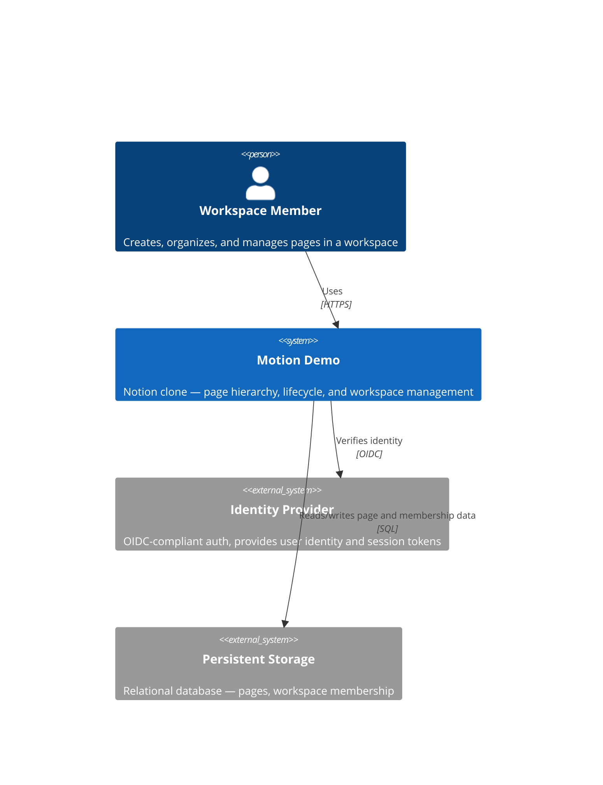
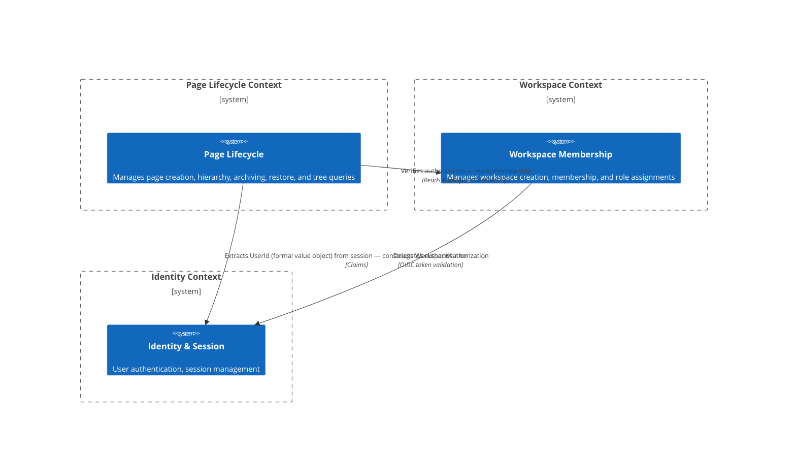

# PT-01: System Context and Bounded Contexts

## Purpose

This document defines the system-level actors, external dependencies, and bounded contexts relevant to the Page Tree + Page Lifecycle slice. It establishes ownership boundaries and conceptual invariants that every downstream design artifact respects.

---

## C4 System Context

The Page Tree + Page Lifecycle slice depends on exactly two external systems:
- **Identity Provider** — authenticates the workspace member; the system trusts the identity token and extracts `UserId` (a formal value object — see [02-domain-model.md](./02-domain-model.md)) from it.
- **Persistent Storage** — stores all page and workspace membership data. No caching layer is assumed in this slice.

---

## Bounded Context Map

Three bounded contexts exist for this slice. The **Page Lifecycle Context** is the primary focus; it depends on the **Workspace Context** for authorization and the **Identity Context** for user identification.

---

## Key Design Decisions

| Decision | Rationale |
|----------|-----------|
| Page Lifecycle is a separate bounded context from Workspace Membership | Page lifecycle invariants (tree consistency, cascade behavior) are orthogonal to membership invariants (role assignments, workspace quotas). Separating them keeps each context's cohesion high and prevents coupling between hierarchy rules and access rules. |
| Page does not reference User as an entity; only UserId as a value object | The Page context does not own user-profile data. Referencing `UserId` (a formal value object — see [02-domain-model.md](./02-domain-model.md)) rather than a `User` entity avoids coupling to the Identity context's entity model and keeps the Page aggregate self-contained. `UserId` is composed with `WorkspaceId` into a single `WorkspaceAuthorization` value object for all authorization checks — see [02-domain-model.md](./02-domain-model.md) Design Rules. |
| No future contexts introduced | This slice does not introduce contexts for Search, Permissions (beyond basic membership), Collaboration, or Version History. These are excluded to avoid speculative generalization. |
| No caching or read-model context | The slice assumes direct reads from Persistent Storage. A separate read-model/query context (e.g., CQRS query side) is not introduced until performance measurements justify it. |
| PageId, WorkspaceId, and UserId are structurally identical but kept as separate value objects (no extracted base type) | The three IDs serve distinct domain roles (page identity, workspace scoping, user identity). Extracting a shared `TypedId<T>` or `GuidId` base would introduce speculative generality across classes that may diverge in behavior (e.g., format validation). Structural duplication is accepted; `UserId` was formalized from an implicit primitive per issue #257. If four or more Guid-wrapping IDs emerge in future slices, extraction will be revisited. See [02-domain-model.md](./02-domain-model.md) Design Rules. |

---

## Ownership Boundaries

- **Page Lifecycle Context** owns: `Page` aggregate, `PageId`, `SortOrder`, `ILifecycleState` state pattern (concrete states `ActiveState`, `ArchivedState`), page hierarchy invariants, lifecycle transition rules, tree query semantics.
- **Workspace Context** owns: `Workspace` entity, `WorkspaceMembership` entity, role assignments, workspace-level quotas (e.g., max pages per workspace — if applicable).
- **Identity Context** owns: `User` entity, authentication tokens, session state, OIDC flows.

---

## Invariants (Conceptual)

These invariants hold across all contexts at all times. They are conceptual constraints — the precise enforcement locus is specified in [02-domain-model.md](./02-domain-model.md).

1. A `Page` always belongs to exactly one `Workspace`. No orphan pages exist.
2. A `Page` has at most one parent `Page`. A null parent means the page is a root-level page within its workspace.
3. No `Page` is an ancestor of itself — the hierarchy is acyclic (a directed acyclic graph of single-parent chains).
4. Archiving a `Page` **cascades to all descendants** — no descendant may remain in the Active state while its ancestor is Archived.
5. Restoring a `Page` does **not** cascade to descendants — children remain in their current lifecycle state.
6. A `Page` title is non-empty and trimmed of leading/trailing whitespace.
7. A workspace member can only see and act on `Page` records within workspaces they belong to.
8. Permanent deletion of a `Page` with descendants is **blocked** — the user must first move or delete all children (defend against accidental data loss).
