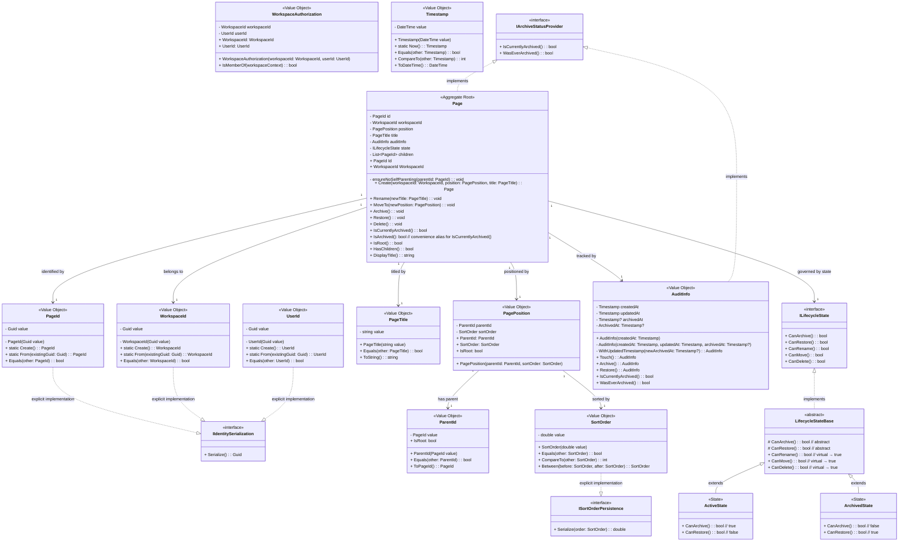

# PT-02: Domain Model — Page Lifecycle

## Purpose

This document defines the **canonical domain model** for the Page Tree + Page Lifecycle slice. It is the **single source of truth** for every entity, value object, enumeration, and relationship. Every other document in this planning baseline links here rather than redefining types. This model is a **target design** — no codebase implementation exists yet for these types (the current `src/Web/src/modules/workspace/entities/model/types.ts` contains prototype task/kanban types unrelated to page lifecycle). **However, those prototype types exhibit the same primitive obsession that the target model resolves — see [Design Rules: Row.id / TaskId](#rowid--taskid-known-primitive-obsession-in-prototype-types) for the documented gap and planned resolution.**

---

## Domain Model Overview



---

## Domain Concepts

| Concept | Type | Description |
|---------|------|-------------|
| `PageId` | Value Object | Uniquely identifies a page. Resolves **primitive obsession** — prevents accidental `Guid` swapping between page IDs and workspace IDs. **Immutable** — once created the value never changes. Constructor is **private** — all creation goes through one of two static factories: `PageId.Create()` (generates a new Guid internally) for domain-controlled creation, or `PageId.From(Guid existingGuid)` for deserialization from storage (which applies validation/future rules). Serialization uses an explicit `IIdentitySerialization` interface — domain consumers have no access to the raw Guid. See [Design Rules](#design-rules) for pattern details. |
| `WorkspaceId` | Value Object | Scopes a page to its workspace. Resolves **primitive obsession** — type-safe workspace identification prevents passing a `PageId` where a `WorkspaceId` is expected. Constructor is **private**; creation uses `WorkspaceId.Create()` or `WorkspaceId.From(Guid existingGuid)`. Serialization through `IIdentitySerialization` interface. Structurally identical to `PageId`; see [Design Rules](#design-rules) for rationale on keeping them separate and the static-factory pattern. |
| `UserId` | Value Object | Uniquely identifies a workspace member. Resolves **primitive obsession** — type-safe user identification prevents passing a `Guid`, `string`, `PageId`, or `WorkspaceId` where a `UserId` is expected. Constructor is **private**; creation uses `UserId.Create()` or `UserId.From(Guid existingGuid)`. Serialization through `IIdentitySerialization` interface. Structurally identical to `PageId` and `WorkspaceId`; see [Design Rules](#design-rules) for rationale and factory pattern. Immutable — internal `Guid value` is private. |
| `WorkspaceAuthorization` | Value Object | Encapsulates the identity context for all authorization decisions. Composes `WorkspaceId` and `UserId` into a single cohesive unit, resolving the **data clump** (issue #257) — these two values always travel together and are always used together across every authorization boundary. Conveys intent: \"This represents the authorization context for a workspace operation.\" Delegates membership verification via `IsMemberOf(workspaceContext)`. Reduces every authorization-aware handler from two parameters (`WorkspaceId + UserId`) to one (`WorkspaceAuthorization`). |
| `ParentId` | Value Object | Wraps the optional parent reference. Provides `IsRoot` semantics instead of forcing null checks throughout the codebase. **Encapsulates** the invariant that a root page has no parent — callers query `IsRoot` rather than testing null. Exposes `ToPageId(): PageId` to extract the wrapped `PageId` for navigation, breadcrumbs, or existence validation. `ToPageId()` throws `InvalidOperationException` when `IsRoot` is true (following the standard .NET pattern of `Nullable<T>.Value`), so callers must check `IsRoot` first. Internal `value` is private. |
| `PageTitle` | Value Object | Encapsulates the page title with all validation in its constructor. Resolves **primitive obsession** (issues #208, #212) — prevents raw `string` titles from being passed without validation. Constructor validates non-empty after trim, max 500 characters, and stores the trimmed value. This centralizes three previously scattered rules (invariant section, rename flow, max-length constant) into one type. |
| `PagePosition` | Value Object | Groups a page's `ParentId` and `SortOrder` into a single cohesive concept. Resolves the **data clump** (issue #216) — these two values always travel together, are mutated atomically in `MoveTo()`, and together define "where a page lives in the hierarchy." Delegates `IsRoot` to `ParentId.IsRoot`. Reduces `Page.Create()` from 4 to 3 parameters. |
| `SortOrder` | Value Object | Positions a page among its siblings using a fractional-indexing scheme (double-precision floating point). Exposes a `Between()` factory method for inserting between two existing siblings **without reindexing** all siblings. Resolves **primitive obsession** on raw doubles — internal `value` is private (issue #217); callers use `CompareTo()` for comparison. Serialization is exclusively handled through the `ISortOrderPersistence` interface, which is explicitly implemented to hide `Serialize()` from domain consumers — infrastructure code must cast to `ISortOrderPersistence` to access the underlying double. Prevents callers from supplying arbitrary sort values or performing arithmetic on the raw double. |
| `Timestamp` | Value Object | Wraps a `DateTime` value and enforces UTC on construction (always converts to `DateTimeKind.Utc`). Resolves **primitive obsession** on raw `DateTime` — prevents callers from passing local time (`DateTime.Now`), default `DateTime`, or untrusted timestamps into domain types. Provides `Equals()` and `CompareTo()` for value equality and ordering semantics, and `ToDateTime()` for serialization. Immutable. The static factory `Timestamp.Now()` returns a `Timestamp` set to `DateTime.UtcNow`, centralizing the UTC convention at the type level. |
| `AuditInfo` | Value Object | Encapsulates the timestamp triplet (`createdAt`, `updatedAt`, `archivedAt`) as a single cohesive unit. Resolves the **data clump** (issues #214, #218) and eliminates **primitive obsession** on raw `DateTime` by using the `Timestamp` value object (which enforces UTC on construction). A pure data container with three public factory methods (`Touch()`, `Archive()`, `Restore()`) that each set `UpdatedAt = Timestamp.Now()` — delegated through a single private `WithUpdatedTimestamp()` method to eliminate duplication of the temporal invariant. Additionally implements `IArchiveStatusProvider` to expose `WasEverArchived` (derived from `archivedAt != null`) and `IsCurrentlyArchived()` (delegated to the same `archivedAt` field — true when non-null). The `ArchivedAt` property and the underlying `archivedAt` field are **private** — external callers must use `IArchiveStatusProvider` query methods (`IsCurrentlyArchived()`, `WasEverArchived()`) to inspect archive status, eliminating the dual-path to state that `IArchiveStatusProvider` was designed to resolve. All lifecycle transition policy resides in the `Page` aggregate. Centralizes the UTC convention via `Timestamp`'s constructor, which always converts to `DateTimeKind.Utc`. |
| `IArchiveStatusProvider` | Interface | Defines a shared contract for archival-status queries, resolving the split-brain query surface between `Page` and `AuditInfo`. Two query methods: `IsCurrentlyArchived(): bool` (answers "is this entity in the archived state right now?") and `WasEverArchived(): bool` (answers "has this entity ever been archived historically?"). Implemented by both `Page` (which delegates `IsCurrentlyArchived()` to the `ILifecycleState` object) and `AuditInfo` (which derives both from the `archivedAt` timestamp). Provides a single, unambiguous API surface that prevents developers from accidentally using `WasEverArchived` as a current-state check. See [IArchiveStatusProvider](#iarchivestatusprovider-shared-archive-status-contract) for design rules. |
| `ILifecycleState` | Interface (State Pattern) | Defines the transition contract for page lifecycle. The interface declares all five query methods (`CanArchive()`, `CanRestore()`, `CanRename()`, `CanMove()`, `CanDelete()`), but the invariant methods (`CanRename()`, `CanMove()`, `CanDelete()`) have default implementations in the `LifecycleStateBase` abstract class — all returning `true`. Concrete states (`ActiveState`, `ArchivedState`) extend `LifecycleStateBase` and only override the two genuinely state-specific methods: `CanArchive()` and `CanRestore()`. This eliminates the DRY violation where every concrete state previously duplicated the same three `true`-returning methods. Resolves **primitive obsession on enumeration switching** — the `Page` aggregate delegates transition queries to its current state object rather than switching on an enumeration value. This centralizes transition rules in the state classes (Open/Closed Principle) and makes adding a new state a matter of adding one new class that inherits from `LifecycleStateBase` and overrides only the methods that differ — typically just `CanArchive()` and `CanRestore()`. Eliminates the "is this page active, archived, or deleted?" ambiguity that a single `isArchived` boolean creates. `CanRename()`, `CanMove()`, and `CanDelete()` are invariant across all current states; if a future state needs different behavior (e.g., a `SoftDeletedState` where `CanDelete()` returns `false`), it overrides the virtual method in `LifecycleStateBase`. |
| `Page` | Aggregate Root | The central entity. Owns all lifecycle and hierarchy operations. **Encapsulates invariants** — external callers cannot put the page into an invalid state by setting properties directly; all mutations go through named methods (`Archive()`, `MoveTo()`, etc.). Features a **narrowed public API**: only `Id` and `WorkspaceId` are exposed as properties; `Title`, `Position`, `State`, `AuditInfo`, and `Children` are kept private. Callers query lifecycle via `IsCurrentlyArchived()` (with `IsArchived()` as a convenience alias), hierarchy via `IsRoot()`/`HasChildren()`, and retrieve the title string via `DisplayTitle()`. Implements `IArchiveStatusProvider` — `IsCurrentlyArchived()` delegates to the current `ILifecycleState` object, while `WasEverArchived()` delegates to `AuditInfo.WasEverArchived`. Transition validation is delegated to the current `ILifecycleState` object — `Page.Archive()` calls `state.CanArchive()` rather than switching on an enumeration, centralizing transition rules in the state classes. Children are encapsulated entirely within the aggregate — external code can neither iterate nor mutate them directly (resolves the **anemic model** smell from issue #211 and the **speculative generality** of a separate `ChildrenCollection` wrapper from issue #215). |

---

## Key Relationships

- **Workspace → Page**: `1 : many` — A Workspace contains zero or more Pages. Ownership is referential (Workspace is in a separate bounded context; Page holds a `WorkspaceId` value, not a reference to a Workspace entity).
- **Page → Page (parent/child)**: `0..1 : many` — A Page has at most one parent. A Page has zero or more children. Self-referencing hierarchy via `ParentId` pointing to another `PageId`.
- **Page → PageId**: `1 : 1` — Each Page is uniquely identified by exactly one `PageId`.
- **Page → PagePosition**: `1 : 1` — Each Page carries exactly one `PagePosition` that bundles its parent reference and sibling ordering.
- **Page → ILifecycleState**: `1 : 1` — Each Page is governed by exactly one `ILifecycleState` at any time, delegating transition queries to the concrete state object.
- **Page → AuditInfo**: `1 : 1` — Each Page carries exactly one `AuditInfo` tracking creation, modification, and archival timestamps.
- **Page → PageTitle**: `1 : 1` — Each Page has exactly one `PageTitle`.

---

## Invariants Expressed in Model

1. **Page title is non-empty, trimmed, and ≤ 500 characters** — Enforced by the `PageTitle` constructor. Rejects empty/whitespace-only strings and strings exceeding 500 characters. Trims the stored value.

2. **`SortOrder` value is finite and unique among siblings** — Enforced by `SortOrder` constructor (rejects `NaN`, `Infinity`). Uniqueness is validated at the aggregate/application level before `MoveTo()` completes.

3. **`ParentId` cannot reference the page's own `PageId` (no self-parenting)** — Enforced by `ensureNoSelfParenting()` called from `Page.Create()` and `Page.MoveTo()`, which rejects `newParentId == this.Id`.

4. **`ParentId` cannot create a cycle** — Enforced by `Page.MoveTo()`: walks the ancestor chain to ensure `newParentId` does not descend from this page.

5. **Archiving transitions `Active → Archived` only if currently `Active`** — Enforced by the `LifecycleStateBase` class hierarchy: `ActiveState` overrides `CanArchive()` to return `true`, while `ArchivedState` overrides it to return `false`. The other three permission methods (`CanRename()`, `CanMove()`, `CanDelete()`) are inherited from `LifecycleStateBase` with their default `true` implementations — concrete states only override the two state-specific archive/restore methods. `Page.Archive()` delegates the guard check to `state.CanArchive()` and throws `InvalidOperationException` if the transition is not allowed.

6. **Restoring transitions `Archived → Active` only if currently `Archived`** — Enforced by the `LifecycleStateBase` class hierarchy: `ArchivedState` overrides `CanRestore()` to return `true`, while `ActiveState` overrides it to return `false`. `Page.Restore()` delegates the guard check to `state.CanRestore()` and throws `InvalidOperationException` if the transition is not allowed.

7. **Timestamp ordering consistency** — Enforced by `AuditInfo` factory methods (which delegate to the private `WithUpdatedTimestamp()`): `createdAt ≤ updatedAt` always holds; `archivedAt ≥ createdAt` when non-null. Each factory method validates these invariants when returning the new instance.

8. **`Archive()` sets both `updatedAt` and `archivedAt`** — Enforced by `Page.Archive()`: replaces `this.auditInfo` with `this.auditInfo.Archive()`, which internally calls `WithUpdatedTimestamp(archivedAt: Timestamp.Now())`, setting `UpdatedAt = Timestamp.Now()` and `ArchivedAt = Timestamp.Now()` in a single step.

9. **`Restore()` sets `updatedAt` and clears `archivedAt`** — Enforced by `Page.Restore()`: replaces `this.auditInfo` with `this.auditInfo.Restore()`, which internally calls `WithUpdatedTimestamp(archivedAt: null)`, setting `UpdatedAt = Timestamp.Now()` and clearing `ArchivedAt` in a single step.

10. **`MoveTo()` and `Rename()` update `updatedAt`** — Enforced by `Page.MoveTo()` and `Page.Rename()`: replace `this.auditInfo` with `this.auditInfo.Touch()`, which internally calls `WithUpdatedTimestamp(archivedAt: null)` — the `null` is replaced by the existing `archivedAt` value, leaving `ArchivedAt` unchanged while setting `UpdatedAt = Timestamp.Now()`.

11. **`Delete()` on a page with children is blocked** — Enforced by `Page.Delete()`: checks `HasChildren()` (equivalent to `Children.Count > 0`) and throws if true. Children must be moved or deleted first.

12. **Children are never accessed or mutated directly by external callers** — Enforced by removing the public `Children` property from `Page`. The only behavioral check on children is `HasChildren()`, used in `Delete()` validation. Mutations happen exclusively through aggregate-level operations (`Create()` adds a child, `MoveTo()` reparents, `Delete()` removes). If collection iteration is genuinely needed in a future slice, a dedicated `PageTree` read-model object will be introduced at that point.

13. **`IArchiveStatusProvider.IsCurrentlyArchived()` is the sole behavioral check for lifecycle state** — Enforced by removing the public `ILifecycleState` getter from `Page`. External callers query `IsCurrentlyArchived()` (via the `IArchiveStatusProvider` interface) rather than inspecting the state object directly; callers should not switch on concrete state classes — the state object's query methods (`CanArchive()`, etc.), `IsCurrentlyArchived()`, and its convenience alias `IsArchived()` are the intended interaction model. The entire `ILifecycleState` object (including which concrete state is active) is an internal implementation detail of the aggregate. This rule eliminates the dual-path ambiguity between a `State` property and a lifecycle check — `IArchiveStatusProvider` unifies the query surface and ensures that `WasEverArchived` (historical) is never confused with `IsCurrentlyArchived()` (current state).

---

## Design Rules

### PageId, WorkspaceId, and UserId: Accepted Structural Duplication with Encapsulated Construction

`PageId`, `WorkspaceId`, and `UserId` are structurally identical value objects — each wraps a private `Guid`, exposes `Equals()`, and serializes through an explicit `IIdentitySerialization` interface. Constructors are **private** — all creation goes through static factory methods. This is a conscious acceptance of **sibling class duplication** (issues #204, #257), combined with the **Replace Data Value with Object** refactoring to establish domain-controlled creation paths (issue #258):

| Aspect | `PageId` | `WorkspaceId` | `UserId` |
|--------|----------|---------------|----------|
| Domain meaning | Identifies a specific page | Identifies a workspace | Identifies a workspace member |
| Creation | `PageId.Create()` (new Guid) or `PageId.From(Guid)` (deserialization) | `WorkspaceId.Create()` or `WorkspaceId.From(Guid)` | `UserId.Create()` or `UserId.From(Guid)` |
| Serialization | `IIdentitySerialization.Serialize(): Guid` (explicit interface) | Same | Same |
| Usage scope | Page Lifecycle Context | Referenced from Page (via `WorkspaceId`) | Referenced from authorization boundaries (via `WorkspaceAuthorization`) |
| Future reuse | May gain scoped validation (e.g., format rules) | May gain validation (e.g., workspace ID format) | May gain validation (e.g., user ID format constraints) |

**Rules:**
1. **No extracted base type** — A generic `TypedId<T>` or `GuidId` base class is not introduced. The structural duplication is accepted to keep each type independently evolvable (NFR-09: no speculative abstractions). If any type gains unique behavior (custom equality, format validation), the duplication cost is repaid.
2. **No copy-paste propagation** — Any **new** ID type (e.g., future `TemplateId`, `CommentId`) must NOT copy this pattern. Each new ID type must be independently designed. `UserId` is an exception to this rule: it formalizes an existing concept that was previously left as an implicit primitive, and its structural consistency with `PageId`/`WorkspaceId` is intentional — the three types form a stable set of identity primitives for this slice.

   **Reindex trigger:** Because three structurally identical Guid-wrapping IDs already exist in this slice, the threshold has been met. If any **additional** Guid-wrapping ID type emerges in a future slice (bringing the total to four or more), extraction of a shared base becomes **mandatory** — not merely "revisited." The extraction target (the `IIdentifier` interface) is defined in the following subsection. The distinction between "three" (documented threshold) and "four" (mandatory extraction) accounts for the current stable set being intentional per `UserId`'s inclusion; a fourth type would indicate a pattern, not an exception.
3. **Private constructor + static factories** — The constructor accepting `Guid` is `private`. Domain-controlled creation uses `PageId.Create()`, which internally generates a new `Guid`. Deserialization from storage uses `PageId.From(Guid existingGuid)`, a secondary path that can apply validation in the future (e.g., "must be a version-7 UUID"). This prevents any code outside the domain from fabricating arbitrary `PageId` values — every creation path is explicit and auditable. The same pattern applies to `WorkspaceId` and `UserId`.
4. **Serialization through explicit interface** — `ToGuid()` is removed from the public API. Serialization is handled through the `IIdentitySerialization` interface (defined in the persistence layer, not the domain), which each ID type explicitly implements. This mirrors the `ISortOrderPersistence` pattern used for `SortOrder` (issue #256). Domain and application-layer code never access the raw `Guid` — infrastructure code casts to `IIdentitySerialization` to call `Serialize()`. If the internal representation changes (e.g., from `Guid` to a string-based ULID), only the persistence layer needs updating.

### RowId / TaskId: Known Primitive Obsession in Prototype Types

The prototype types in `src/Web/src/modules/workspace/entities/model/types.ts` define a `Row` interface with `id: number` — a raw numeric identity value that exhibits the **same primitive obsession** that `PageId`, `WorkspaceId`, and `UserId` resolve in the target model:

```typescript
// Current prototype — primitive obsession on identity
export interface Row {
  id: number                // raw number — no type safety, no identity semantics
  name: string
  status: string
  tags: string[]
  dueDate: string
}
```

This is the identical anti-pattern that the target model's value objects are designed to prevent:
- **Accidental ID swapping** — Nothing prevents passing a `Row.id` value where a `PageId`, `WorkspaceId`, or unrelated numeric concept (sort order, count, progress percentage) is expected.
- **Arithmetic on identities** — Subtracting, incrementing, or comparing `id` values numerically is syntactically valid but semantically meaningless.
- **Inconsistent creation** — Raw `number` IDs can be fabricated anywhere with no audit trail, no validation, and no controlled factory path.
- **Migration friction** — If the system later adopts UUIDs or distributed ID schemes, every `number` type annotation for IDs must be found and updated. A typed `RowId` value object limits the migration surface to the type definition.

These prototype types are **outside the scope** of the Page Lifecycle slice (they belong to a task/kanban domain). However, the architectural decision to resolve primitive obsession on identity types applies universally. When the task/kanban types are formalized in their own bounded context (whether in this project or a future slice), the ID must follow the same **Replace Data Value with Object** pattern:

```typescript
// Target — typed value object (TypeScript branded type for zero runtime overhead)
export type RowId = number & { readonly __rowId: unique symbol }
export function createRowId(value: number): RowId {
  if (!Number.isInteger(value) || value <= 0)
    throw new Error('RowId must be a positive integer')
  return value as RowId
}
```

Alternatively, a full value-object class (mirroring the `PageId`/`WorkspaceId`/`UserId` pattern) is acceptable if the task/kanban bounded context requires richer behavior:

```typescript
export class RowId {
  private constructor(private readonly value: number) {
    if (!Number.isInteger(value) || value <= 0)
      throw new Error('RowId must be a positive integer')
  }
  static create(): RowId { return new RowId(generateId()) }
  static from(value: number): RowId { return new RowId(value) }
  equals(other: RowId): boolean { return this.value === other.value }
  toNumber(): number { return this.value }
}
```

**Rules:**
1. **No raw `number` IDs in formalized types** — When `Row` (or any equivalent task/kanban entity) is formalized, its identity field must use a typed value object (`RowId` or equivalent), never a raw `number`.
2. **The factory pattern applies** — The constructor must be private. All creation goes through static factories (`RowId.create()` for new IDs, `RowId.from(value)` for deserialization), ensuring every identity value has a validated, auditable creation path.
3. **The naming choice (`RowId` vs `TaskId`)** is deferred — The formalization of the task/kanban bounded context will determine whether the entity is called `Row`, `Task`, `Card`, or something else. The type name follows the entity name (`Row` → `RowId`, `Task` → `TaskId`). This document records the **principle** (typed identity) without pre-committing to a naming convention that belongs to a future design decision.
4. **This gap is a tracking item** — Until the task/kanban types are formalized, the `Row.id: number` in the prototype file is a **known primitive-obsession gap**. It is intentionally out of scope for the Page Lifecycle slice but must be resolved when the owning bounded context is designed.
5. **The same `number`→typed-ID migration applies to any other prototype ID** — If other prototype interfaces in the codebase follow the same pattern (`KanbanCard`, `KanbanColumn`, etc., all currently lack identities), they must receive typed IDs when formalized. The principle is: every identity-bearing entity in the system has a typed identity value object.

### KanbanCard.progress / Progress: Known Primitive Obsession on Percentage Values

The prototype types in `src/Web/src/modules/workspace/entities/model/types.ts` define a `KanbanCard` interface with `progress?: number` — a raw numeric value that semantically represents a progress percentage (0–100), but provides no range validation, no unit semantics, and no distinction from other numeric values in the system:

```typescript
// Current prototype — primitive obsession on percentage value
export interface KanbanCard {
  title: string
  tags: string[]
  progress?: number         // raw number — no range validation, no unit semantics
}
```

This exhibits the same class of anti-pattern that `SortOrder`'s finite-number validation and `PageTitle`'s length/emptiness validation resolve in the target model:

- **No range validation** — A value of `150` or `-10` would render a progress bar that overflows its container or has negative width, representing an impossible state. The consumer (`KanbanBoard.vue`) blindly interpolates the value into a CSS width: `card.progress + '%'`.
- **No unit semantics** — The raw `number` provides no indication that it represents a percentage (0–100) rather than a fraction (0.0–1.0), a pixel value, or any other numeric concept. A consumer dividing by 100 would produce a collapsed progress bar.
- **No distinction from other numeric values** — Nothing prevents passing `Row.id`, `KanbanColumn` ordering, or a page count where a progress percentage is expected.
- **Scattered interpretation** — Every consumer rendering a progress bar must independently decide how to interpret the raw number. If the representation changes (e.g., from 0–100 to 0.0–1.0), every consumer must be found and updated.

This is the identical design failure that the target model's value objects (`SortOrder` validates finiteness, `PageTitle` validates length/emptiness, `Timestamp` enforces UTC) are designed to prevent — a raw primitive that should carry its own validation and semantics.

When the kanban types are formalized in their own bounded context (whether in this project or a future slice), the `progress` field must follow the same **Replace Data Value with Object** pattern:

```typescript
// Target — value object with encapsulated range validation
export class Progress {
  private constructor(private readonly value: number) {
    if (value < 0 || value > 100)
      throw new Error('Progress must be between 0 and 100')
    if (!Number.isFinite(value))
      throw new Error('Progress must be a finite number')
  }

  static fromPercent(value: number): Progress { return new Progress(value) }
  toPercent(): number { return this.value }
  toFraction(): number { return this.value / 100 }
}
```

A branded-type alternative (for zero runtime overhead) mirrors the `RowId` pattern:

```typescript
// Target — branded type for zero runtime overhead
export type Progress = number & { readonly __progress: unique symbol }
export function createProgress(value: number): Progress {
  if (value < 0 || value > 100 || !Number.isFinite(value))
    throw new Error('Progress must be a finite number between 0 and 100')
  return value as Progress
}
```

**Rules:**
1. **No raw `number` for progress in formalized types** — When `KanbanCard` (or any equivalent kanban entity) is formalized, its progress field must use the `Progress` value object (or branded type), never a raw `number`.
2. **Constructor encapsulation** — The constructor must be private. All creation goes through `Progress.fromPercent(value)`, ensuring every progress value is validated on construction (0–100 range, finite number).
3. **Consumers use semantic accessors** — `toPercent()` returns the 0–100 integer for percent-display contexts; `toFraction()` returns the 0.0–1.0 float for CSS width, SVG dashoffset, or canvas rendering. This eliminates the scattered interpretation problem — a future representation change updates only these two accessors.
4. **This gap is a tracking item** — Until the kanban types are formalized, the `KanbanCard.progress?: number` in the prototype file is a **known primitive-obsession gap**. It is intentionally out of scope for the Page Lifecycle slice but must be resolved when the owning bounded context is designed.
5. **The same `number`→value-object migration applies to any other prototype percentage** — If other prototype interfaces in the codebase follow the same pattern (raw numeric scores, completion ratios, weights), they must also receive typed value objects with range validation when formalized. The principle is: every semantically constrained numeric value in the system has a typed value object that encapsulates its validation and interpretation.

### IIdentifier: Extraction Target for Future Consolidation

The `IIdentifier` interface is the **defined extraction target** — the shared contract that `PageId`, `WorkspaceId`, and `UserId` will implement when the reindex trigger (a fourth structurally identical Guid-wrapping ID in a future slice) makes extraction mandatory. It is **not implemented today** (per NFR-09: no speculative abstractions), but its shape and semantics are specified here to avoid design-by-committee when extraction is triggered.

```csharp
// Defined at the domain layer — shared contract for all identity value objects.
// Not implemented until threshold is reached (fourth Guid-wrapping ID).
public interface IIdentifier
{
    /// <summary>Value equality across identity types for serialization and comparison.</summary>
    bool Equals(IIdentifier? other);

    /// <summary>Exposes the underlying Guid for persistence and serialization.
    /// Domain consumers should NOT call this — it exists for the persistence layer
    /// and for polymorphic operations that treat all identities uniformly.</summary>
    Guid ToGuid();
}
```

| Aspect | Detail |
|--------|--------|
| **Location** | Domain layer — unlike `IIdentitySerialization` (persistence-layer serialization contract), `IIdentifier` is a domain concept that enables polymorphic identity handling. |
| **Scope** | `Equals()` covers cross-type equality comparison (is this `PageId` equal to that `WorkspaceId`? — likely `false` by value unless the Guids happen to match). `ToGuid()` provides a uniform way to extract the underlying Guid for persistence, logging, and serialization without per-type reflection. |
| **Relationship to `IIdentitySerialization`** | Separate concerns. `IIdentitySerialization` is a persistence-layer interface for infrastructure code to serialize the value. `IIdentifier` is a domain-layer interface for uniform identity treatment. When extraction is triggered, each ID type will implement BOTH `IIdentifier` (domain contract) and `IIdentitySerialization` (persistence contract) — they are orthogonal. |
| **Backward compatibility** | Adding `IIdentifier` to an existing ID type is a non-breaking additive change — all existing method signatures (`PageId Create()`, `Equals(PageId)`, implicit `IIdentitySerialization` implementation) remain unchanged. The new interface is implemented alongside existing members. |
| **Concrete base vs. interface** | An interface is chosen over a `GuidId` base class because the ID types may eventually diverge in internal representation (e.g., `PageId` migrates to ULID while `WorkspaceId` stays on Guid). An interface accommodates divergent internals; a base class couples them. A generic `TypedId<T>` base is another valid option but introduces generic complexity that is not warranted until at least four types exist. |

**Extraction procedure (when triggered):**
1. Define `IIdentifier` in the domain layer (namespace: `MotionDemo.Domain.Common`).
2. Add `IIdentifier` to each existing ID type's class declaration: `public sealed class PageId : IIdentifier`.
3. Move the existing `Equals()` and `ToGuid()` implementations behind the interface members — no behavioral change, only a type-system contract.
4. Verify that no domain or application-layer code relies on `ToGuid()` (it should already be inaccessible to domain consumers per Rule 4 above — only infrastructure code casts to `IIdentitySerialization`). If any domain code accesses `ToGuid()`, it is a pre-existing encapsulation violation that must be fixed before extraction.

### PagePosition integrates ParentId and SortOrder

`ParentId` and `SortOrder` were previously independent attributes on `Page`. They are now grouped into `PagePosition` because they:

| Aspect | Before (separate) | After (PagePosition) |
|--------|-------------------|----------------------|
| Mutated together in `MoveTo()` | Two separate parameters | Single `PagePosition` parameter |
| Define "where a page lives" | Two independent fields | One cohesive concept |
| Null semantics for root | `ParentId.IsRoot` | `PagePosition.IsRoot` (delegates) |

**Rules:**
1. `ParentId` and `SortOrder` remain independent value objects — `PagePosition` composes them without merging their invariants.
2. `MoveTo()` now takes a single `PagePosition newPosition` parameter, reducing cognitive load and preventing parameter misordering between parent and sort values.
3. New entities (if introduced in future slices) extend independently. The `PagePosition` type is specific to the `Page` aggregate.

### Children encapsulated, not exposed

The earlier model exposed `Children` as a public `IReadOnlyList<PageId>` property. Per issue #244, this has been narrowed: `Children` is now fully private to the `Page` aggregate. External callers use `HasChildren()` for existence checks and rely on aggregate methods for mutations.

| Aspect | Before (public Children) | After (private Children) |
|--------|--------------------------|--------------------------|
| Collection exposure | `IReadOnlyList<PageId> Children` (public) | Private field — no public getter |
| Behavioral check | `HasChildren()` + full iteration | `HasChildren()` — only the needed check |
| External coupling | Any consumer could iterate children, coupling to collection structure | Zero external coupling to children internals |
| Maintenance surface | All iteration-dependent consumers break if collection representation changes | Only `Page` itself manages children — no indirection |

**Rules:**
1. `Children` is a private `List<PageId>` field — no public getter exists.
2. `HasChildren()` is the canonical (and sole) public check for child existence (used in `Delete()` validation).
3. If collection-level behavior is genuinely needed in a future slice (e.g., iteration, `First()`, `Last()`, `MoveBefore()`), introduce a dedicated `PageTree` or `PageChildren` read-model object at that point — not speculatively now.

### AuditInfo: pure data container for timestamps

`AuditInfo` is a pure data container — it holds the three timestamp fields (`createdAt`, `updatedAt`, `archivedAt`) as `Timestamp` value objects (which enforce UTC on construction) and exposes three public factory methods. The `UpdatedAt = Timestamp.Now()` temporal invariant is enforced in a single place: the private `WithUpdatedTimestamp()` helper, which all three public methods delegate to. This eliminates intra-class duplication (the same timestamp-update logic appearing in every mutation path) and prevents "shotgun surgery" if the timestamp policy changes.

| Method | Sets UpdatedAt | ArchivedAt behavior | Use case | Delegates to |
|--------|----------------|---------------------|----------|--------------|
| `Touch()` | `Timestamp.Now()` | Unchanged (passed as `null`, resolved to existing value via `??`) | Rename, Move | `WithUpdatedTimestamp(newArchivedAt: null)` |
| `Archive()` | `Timestamp.Now()` | `Timestamp.Now()` | Archive | `WithUpdatedTimestamp(newArchivedAt: Timestamp.Now())` |
| `Restore()` | `Timestamp.Now()` | `null` (cleared) | Restore | `WithUpdatedTimestamp(newArchivedAt: null)` |

The private helper method:
```csharp
private AuditInfo WithUpdatedTimestamp(Timestamp? newArchivedAt) {
    return new AuditInfo(
        this.createdAt,
        Timestamp.Now(),
        newArchivedAt ?? this.archivedAt
    );
}
```

**Rules:**
1. Every mutation on `Page` replaces the entire `AuditInfo` instance — no field-level mutation. All three public factory methods (`Touch()`, `Archive()`, `Restore()`) enforce this.
2. `AuditInfo` has no public getter on `Page` — neither the value object itself nor any of its internal timestamps are exposed. The canonical lifecycle check is `IArchiveStatusProvider.IsCurrentlyArchived()` which queries the current `ILifecycleState`. `AuditInfo` implements `IArchiveStatusProvider` itself for cases where historical archive status is needed independently (e.g., in read models or projections that do not have access to the full `Page` aggregate).
3. The `WithUpdatedTimestamp()` private method is the single enforcement point for the "every mutation updates `UpdatedAt`" temporal invariant. Any change to timestamp policy (e.g., switching to `DateTimeOffset` inside `Timestamp`, adding an `UpdatedBy` field) requires editing only this one method.

### IArchiveStatusProvider: Shared Archive Status Contract

`IArchiveStatusProvider` defines a unified contract for archival-status queries, resolving the split-brain query surface described in issue #262. Both `Page` (aggregate root) and `AuditInfo` (value object) implement this interface, but with different internal derivations:

| Method | `Page` implementation | `AuditInfo` implementation |
|--------|----------------------|---------------------------|
| `IsCurrentlyArchived(): bool` | Delegates to `this.state` — returns `true` when state is `ArchivedState` | Returns `this.archivedAt != null` |
| `WasEverArchived(): bool` | Delegates to `this.auditInfo.WasEverArchived` | Returns `this.archivedAt != null` |

**Semantic boundary:** `IsCurrentlyArchived()` answers "is this entity in the archived state right now?" — it is the correct check for behavioral gating (e.g., blocking `Rename()` on an archived page). `WasEverArchived()` answers "has this entity ever been archived historically?" — it is the correct check for audit trails, display indicators, and filtering. A page restored from archive has `IsCurrentlyArchived() == false` but `WasEverArchived() == true`.

**Rules:**
1. **`IArchiveStatusProvider` is the canonical archival-status query surface** — External callers that need archive status should code against `IArchiveStatusProvider` rather than accessing `Page` or `AuditInfo` directly. This eliminates the dual-path ambiguity where a developer could accidentally use `AuditInfo.WasEverArchived` as a state check.
2. **`IsCurrentlyArchived()` is the behavioral gate** — All lifecycle-transition guards (`CanArchive()`, `CanRestore()`, etc.) and conditional logic that depends on the current lifecycle state must use `IsCurrentlyArchived()`. `WasEverArchived()` must never be used for behavioral gating (it remains `true` for restored pages).
3. **`Page.IsArchived()` is a convenience alias** — Retained for call sites where the brevity of `page.IsArchived()` reads naturally and the context makes it clear this is a current-state check. The canonical name is `IsCurrentlyArchived()`; new call sites should prefer the canonical name unless brevity is justified.
4. **`AuditInfo` derives both methods from the same field** — Both `IsCurrentlyArchived()` and `WasEverArchived()` check `archivedAt != null` on `AuditInfo`. This is correct because `AuditInfo` is a pure data container: when `archivedAt` is non-null, the page either *is* archived or *was* archived. The behavioral distinction resides at the `Page` level (which knows its current `ILifecycleState`).
5. **Parallel evolution requirement** — If the lifecycle state expands (e.g., adding a "SoftDeleted" state), the `IArchiveStatusProvider` interface must be extended with new query methods (e.g., `IsSoftDeleted()`), and both `Page` and `AuditInfo` must be updated in tandem. The interface contract ensures neither implementor is overlooked.

### WorkspaceAuthorization: Encoding the Authorization Data Clump

`WorkspaceAuthorization` composes `WorkspaceId` and `UserId` into a single value object, resolving the **data clump** (issue #257) — these two values always travel together and are always used together across every authorization boundary in the slice.

| Aspect | Before (two separate parameters) | After (single WorkspaceAuthorization) |
|--------|----------------------------------|----------------------------------------|
| Handler signatures | `Handle(command, WorkspaceId, UserId)` | `Handle(command, WorkspaceAuthorization)` |
| Parameter ordering risk | Caller could swap `WorkspaceId` and `UserId` positions | Impossible — single object with named fields |
| Authorization check | Ad-hoc membership check in each handler | Delegated to `WorkspaceAuthorization.IsMemberOf(workspaceContext)` |
| Intent communication | Implicit: "these are two IDs" | Explicit: "this is an authorization context" |
| Extension point | Adding a third parameter (e.g., `TenantId`) changes every handler signature | Adding a field to `WorkspaceAuthorization` requires no signature changes |
| Future-proofing | Introducing a `SessionContext` object later would require updating every handler | `WorkspaceAuthorization` can evolve into a richer authorization context |

```csharp
// Before: every handler receives two separate parameters
public async Task<PageTreeResponse> Handle(
    GetPageTreeQuery query,
    WorkspaceId workspaceId,
    UserId userId,
    CancellationToken ct)
{
    // Ad-hoc authorization — each handler duplicates this logic
    if (!await membershipService.IsMember(workspaceId, userId))
        throw new ForbiddenException();
    // ...
}

// After: single WorkspaceAuthorization value object
public async Task<PageTreeResponse> Handle(
    GetPageTreeQuery query,
    WorkspaceAuthorization auth,
    CancellationToken ct)
{
    // Authorization encapsulated — delegate to the value object
    if (!auth.IsMemberOf(workspaceContext))
        throw new ForbiddenException();
    // ...
}
```

**Rules:**
1. `WorkspaceAuthorization` is a pure **value object** — it is immutable, defined by its field values, and has no identity of its own. Two instances with the same `WorkspaceId` and `UserId` are equal.
2. `WorkspaceAuthorization` is **not** an entity — it does not have its own ID, lifecycle, or repository. It is created at the application layer from the session/request context and passed through to handlers.
3. The `IsMemberOf(workspaceContext)` method delegates to the Workspace Context (via a repository or service interface). The value object itself does not contain infrastructure logic — the `workspaceContext` parameter is an abstraction that the application layer injects.
4. Every authorization-aware handler or query in this slice accepts a single `WorkspaceAuthorization` parameter instead of separate `WorkspaceId` + `UserId` parameters. This rule is enforced consistently across the Read, Mutation, and Event boundaries defined in [04-page-tree-and-navigation.md](./04-page-tree-and-navigation.md).

### SortOrder: Encapsulated Serialization via Explicit Interface

`SortOrder` wraps a private `double value` and exposes domain-meaningful operations (`CompareTo()`, `Between()`). The raw double is never exposed through a public method — `ToDouble()` has been removed per issue #256. Serialization for persistence is handled through an explicitly implemented `ISortOrderPersistence` interface, keeping the serialization concern out of the domain API.

| Aspect | Before (ToDouble) | After (Explicit Interface) |
|--------|-------------------|----------------------------|
| Domain API | `ToDouble(): double` (public) | No serialization method visible to domain consumers |
| Serialization | Any consumer could call `.ToDouble()` | Infrastructure code casts to `ISortOrderPersistence` and calls `Serialize()` |
| Encapsulation | Raw double leaked — callers could perform arithmetic or `<`/`>` comparisons | Double fully hidden — callers must use `CompareTo()` or `Between()` |
| Future-proofing | Changing internal representation (e.g., rational/string indexing) requires updating every `ToDouble()` call site | Only the `ISortOrderPersistence` implementation needs updating |

```csharp
// Public domain API — no ToDouble()
public sealed class SortOrder : IComparable<SortOrder>, ISortOrderPersistence
{
    private readonly double value;

    public SortOrder(double value)
    {
        if (double.IsNaN(value) || double.IsInfinity(value))
            throw new ArgumentException("SortOrder value must be a finite number.", nameof(value));
        this.value = value;
    }

    public int CompareTo(SortOrder? other) => value.CompareTo(other?.value);

    public static SortOrder Between(SortOrder before, SortOrder after) { /* fractional indexing logic */ }

    // Explicit interface implementation — hidden from domain consumers
    double ISortOrderPersistence.Serialize() => value;
}

// Defined in the persistence layer, not the domain layer
public interface ISortOrderPersistence
{
    double Serialize();
}
```

**Rules:**
1. `SortOrder` has **no** public `ToDouble()` or `Serialize()` method — the only way to access the raw double is through an explicit interface implementation of `ISortOrderPersistence`.
2. Domain and application-layer code must use `CompareTo()` for ordering and `Between()` for fractional-index insertion. Arithmetic on raw doubles is never allowed.
3. If the internal representation changes (e.g., from `double` to a rational-based fractional indexing scheme), only the `ISortOrderPersistence.Serialize()` implementation in the persistence layer changes — every domain consumer is unaffected.

### Timestamp Reference Rule: Cross-Document Convention

The `Timestamp` value object (defined above) is the single source of truth for all time-related domain operations. Its static factory `Timestamp.Now()` returns a `Timestamp` set to `DateTime.UtcNow`, centralizing the UTC convention at the type level. All behavioral specifications across the planning baseline MUST reference `Timestamp.Now()` rather than raw date-time expressions.

| Expression | Status | Rule |
|------------|--------|------|
| `Timestamp.Now()` | ✅ Canonical | Use in all behavioral specifications |
| `DateTime.UtcNow` | ❌ Prohibited | Replaced by `Timestamp.Now()` |
| `DateTime.Now` | ❌ Prohibited | Local time — no UTC guarantee |
| `UTC now` | ❌ Prohibited | Ambiguous — no type-level enforcement |
| Any raw `DateTime` expression | ❌ Prohibited | Bypasses the value object |

**Affected documents:**
- `03-page-lifecycle-state-machine.md` — All temporal side effects (`UpdatedAt`, `ArchivedAt`, `CreatedAt`) use `Timestamp.Now()`
- `04-page-tree-and-navigation.md` — Any temporal expressions in navigation flows MUST use `Timestamp.Now()`
- `05-user-journey-and-behavior.md` — Temporal updates in Archive/Restore operations use `Timestamp.Now()`

**Enforcement:** If the timestamp policy changes (e.g., switching to `DateTimeOffset` inside `Timestamp`, or adding NTP-synchronized clock abstractions), only the `Timestamp` value object and its internal factory need updating. All behavioral specifications are already decoupled from the raw `DateTime` type. The five occurrences in `03-page-lifecycle-state-machine.md` that previously referenced `DateTime.UtcNow` have been migrated to `Timestamp.Now()` as part of issue #285.

This rule is a direct application of the **Replace Data Value with Object** refactoring — the `Timestamp` value object replaces raw `DateTime` at the type level, and all planning documents must use the object's canonical factory rather than the underlying primitive.
