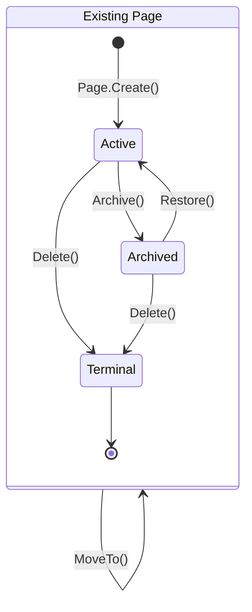

# PT-03: Page Lifecycle State Machine

## Purpose

This document defines the full lifecycle state machine for the `Page` aggregate root. Every state, transition (including self-transitions), cascade rule, validation precondition, and failure guarantee is specified here. Cascading behavior is stated **once** per transition and is not duplicated elsewhere in the planning baseline.

> **Note:** The `Page` entity, its `ILifecycleState` interface and concrete state classes (`ActiveState`, `ArchivedState`), and all enforcement methods are defined in [02-domain-model.md](./02-domain-model.md). This document specifies behavioral semantics — the *what* and *why* of each transition.

---

## State Machine

**Notes:**
- The `ExistingPage` composite state groups all non-terminal lifecycle states. Transitions on `ExistingPage` itself (self-loops) represent operations valid in **any** non-terminal sub-state — they are not repeated per sub-state.
- Inside the composite state, `[*]` represents entry to and exit from the `ExistingPage` lifecycle. `Create()` enters the `Active` sub-state; `Delete()` transitions through `Terminal` to exit the lifecycle entirely.
- `Terminal` is a pseudo-state that explicitly models the unified Delete behavior: `Delete()` behaves identically from both `Active` and `Archived` sub-states. Any future divergence between the two paths would require splitting `Terminal`, forcing the developer to consciously decide if the behavior should differ.
- `Rename()` and `MoveTo()` are modeled as self-transitions on the `ExistingPage` composite state, making their state-agnostic nature explicit. They are valid in both `Active` and `Archived` and do not change lifecycle state.
- There is no intermediate "Trash" or "Soft-Deleted" state. Permanent deletion is the only terminal transition and is immediate. Archive is the reversible lifecycle state.

---

## Cross-Cutting Validation Rules

The following invariant applies to **every** lifecycle transition defined below, regardless of the specific state or operation. It is specified once here and referenced in each transition table rather than duplicated.

| Invariant | Enforcement Layer | Specification |
|-----------|-------------------|---------------|
| **Authorization** | Application Service / Command Handler — before the domain aggregate is loaded | Every lifecycle operation SHALL verify the requesting user is an active member of the target workspace. The check is performed at the application layer, not inside the domain aggregate, so that authorization is enforced in **one code location** (a shared guard) rather than sprinkled across every command handler. |

## Transition Details

### Create (`[*] → Active`)

| Aspect | Detail |
|--------|--------|
| **Trigger** | User creates a new page at root level or as a child of an existing page |
| **Side effects** | `AuditInfo` initialized (via `AuditInfo` constructor — sets `CreatedAt = Timestamp.Now()`, `UpdatedAt = Timestamp.Now()`, `ArchivedAt = null`). `state = Active`. If parent is specified, the page is appended as the last child of the parent. |
| **Validation** | Workspace exists (lookup against Workspace context). Parent exists if specified (unless root). Title valid per `PageTitle` constructor (non-empty after trim, ≤ 500 chars). SortOrder finite. [Cross-Cutting Authorization](#cross-cutting-validation-rules). Enforced by `Page.Create()` factory method. |
| **Failure** | User sees a descriptive error: "Could not create page. Please try again." On validation failure, specific message: "Page title cannot be empty." No partial state — creation is atomic. |

### Rename (self-transition on `Active` or `Archived`)

| Aspect | Detail |
|--------|--------|
| **Trigger** | User edits the page title |
| **Side effects** | `title` updated via `PageTitle` constructor, `auditInfo = auditInfo.Touch()` (sets `UpdatedAt = Timestamp.Now()`). Lifecycle state unchanged. Sort order and parent unchanged. No cascade to descendants. |
| **Validation** | New title valid per `PageTitle` constructor (non-empty after trim, ≤ 500 chars). Page exists. [Cross-Cutting Authorization](#cross-cutting-validation-rules). Enforced by `Page.Rename()`. |
| **Failure** | User sees: "Could not rename page. Title cannot be empty." On authorization failure: "You do not have permission to modify this page." No partial state — rename is atomic. |

### Move (self-transition on `Active` or `Archived`)

| Aspect | Detail |
|--------|--------|
| **Trigger** | User drags a page to a new position in the tree (reparent and/or reorder) |
| **Side effects** | `position = newPosition` (replaces entire `PagePosition`), `auditInfo = auditInfo.Touch()` (sets `UpdatedAt = Timestamp.Now()`). Lifecycle state unchanged. **No cascade** — moving an archived page keeps it archived; moving an active page keeps it active. |
| **Validation** | New parent exists (or null for root). New parent is not this page (no self-parenting). **New parent is not a descendant of this page** (no cycle — walks ancestor chain). SortOrder positions correctly among siblings. [Cross-Cutting Authorization](#cross-cutting-validation-rules). Enforced by `Page.MoveTo()`. |
| **Failure** | User sees: "Could not move page." On cycle detection: "A page cannot be moved into its own subtree." On authorization: "You do not have permission to modify this page." No partial state — rollback if any validation fails. |

### Archive (`Active → Archived`)

| Aspect | Detail |
|--------|--------|
| **Trigger** | User archives a page |
| **Side effects** | `state = Archived`, `auditInfo = auditInfo.Archive()` (sets `UpdatedAt = Timestamp.Now()` and `ArchivedAt = Timestamp.Now()`). **Cascade: all descendants are also archived** recursively, with their `state = Archived` and `auditInfo.Archive()` applied. The cascade covers the full descendant subtree regardless of depth. Archived pages are **hidden** from the default tree view (see [04-page-tree-and-navigation.md](./04-page-tree-and-navigation.md)). |
| **Validation** | Page is in `Active` state. Page exists. [Cross-Cutting Authorization](#cross-cutting-validation-rules). Enforced by `Page.Archive()` at the aggregate root. Cascade enforcement is at the application layer (the aggregate sets its own state; the application iterates descendants). |
| **Failure** | User sees: "Could not archive page." If already archived: "This page is already archived." On authorization: "You do not have permission to modify this page." **Guarantee: no partial cascade** — if archiving any descendant fails, the entire operation is rolled back. All pages in the subtree remain Active. |

### Restore (`Archived → Active`)

| Aspect | Detail |
|--------|--------|
| **Trigger** | User restores an archived page |
| **Side effects** | `state = Active`, `auditInfo = auditInfo.Restore()` (sets `UpdatedAt = Timestamp.Now()` and `ArchivedAt = null`). **No cascade** — descendants remain in their current lifecycle state (individually Archived or Active if previously restored). |
| **Validation** | Page is in `Archived` state. Page exists. [Cross-Cutting Authorization](#cross-cutting-validation-rules). Enforced by `Page.Restore()`. |
| **Failure** | User sees: "Could not restore page." If already active: "This page is already active." **Guarantee: restore is an aggregate-level operation only** — no descendant state is touched. If the parent of the restored page is still archived, the page becomes active but appears in the tree under its archived parent (which remains hidden). The user must restore the parent to see it. |

### Delete (`Active` or `Archived → [*]`)

| Aspect | Detail |
|--------|--------|
| **Trigger** | User permanently deletes a page |
| **Side effects** | Page record is permanently removed. `updatedAt` timestamp frozen as deletion timestamp. **Blocked if page has children** — user must move or delete descendants first. |
| **Validation** | Page exists. Page has zero children (`HasChildren() == false`). [Cross-Cutting Authorization](#cross-cutting-validation-rules). Enforced by `Page.Delete()`. |
| **Failure** | User sees: "Could not delete page. Remove all sub-pages first." On authorization: "You do not have permission to delete this page." **Guarantee: deletion is permanently destructive** — no undo or trash recovery. The archive operation is the intended reversible alternative. |

---

## Product-Level Failure Expectations

| Scenario | Expected Behavior |
|----------|-------------------|
| Network error during create/move/archive/restore/rename/delete | The application shows a generic error toast: "Something went wrong. Please try again." **No optimistic UI that assumes success** — the tree reverts to the previous stable state. The user can retry the operation. |
| Concurrent operation: two users move the same page simultaneously | Last write wins. The page ends up at the position of whichever `MoveTo()` commits last. **No data corruption** — invariants (no cycles, no self-parenting) are enforced at the aggregate level and are immune to concurrent writes. The losing user sees the page at the new position on next refresh. |
| Concurrent operation: user A archives a page while user B moves a child of that page | Archive succeeds (it operates on the parent). The child's move is evaluated against the now-archived parent. **The child remains archived** because the cascade set its state. The child's move is rejected or becomes a no-op. User B sees: "Could not move page. The target parent has been archived." |
| Restore a page whose parent was permanently deleted | Restore succeeds — the page becomes Active but has a dangling `ParentId` referencing a deleted page. **The page is treated as root-level** (its `ParentId` is cleared to null at the application layer before restore completes). The UI shows it as a root page. |
| Delete a page while offline | Blocked. The delete button is disabled or the action is queued and executed on reconnect. **No cascade from offline operations** — the system does not accept offline mutation commands. |
| Bypass client validation (e.g., send empty title via API) | Server-side validation in `Page.Rename()` catches the violation. **No empty titles are persisted.** The API returns 422 with the validation error. The client displays the error message. |
| Archive cascade interrupted by a database error partway through | **Full rollback.** No page in the subtree has its state changed. Application-level transaction ensures atomicity of the cascade. User sees the generic error toast and retries. |
