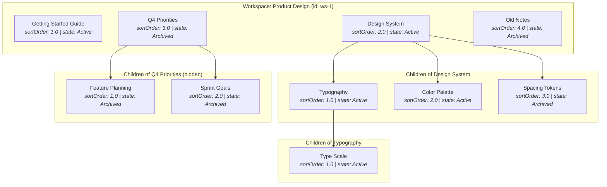
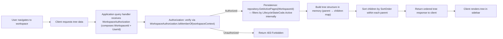
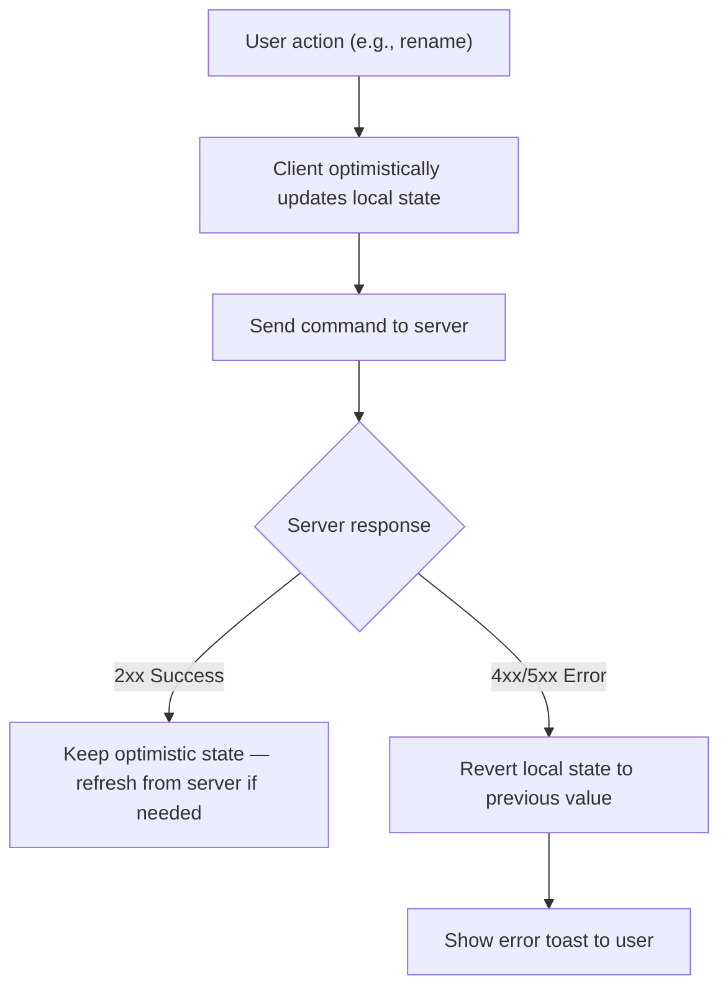

# PT-04: Page Tree Structure and Navigation

## Purpose

This document defines the structural model of the page hierarchy (the tree), ordering semantics, structural rules, navigation flows decomposed across architecturally distinct layers, and every view state a user can encounter. The page tree is a **read model** — it reflects the current persistent state of the `Page` aggregate's hierarchy — not a separate domain concept.

> **Note:** The canonical definition of `Page`, `PagePosition`, `ParentId`, `SortOrder`, and `AuditInfo` is in [02-domain-model.md](./02-domain-model.md). This document references those types without redefining them.

---

## Structure Diagram

This example shows a workspace with four root-level pages. Two are Active, two are Archived (grayed/hidden in the default tree view). The `Design System` page has three children; `Typography` has one child. The `Q4 Priorities` subtree is entirely archived (parent + descendants).

---

## Ordering / Positioning Semantics

The `SortOrder` value object uses a **fractional-indexing scheme** (double-precision floating point) to position pages among siblings. This avoids reindexing all siblings when a page is inserted between two existing pages.

> **Note:** The canonical `SortOrder` definition is in [02-domain-model.md](./02-domain-model.md).  
> Key properties: Serialization is handled via the `ISortOrderPersistence` explicit interface (infrastructure code only); domain consumers use `CompareTo()` for ordering and `Between()` for fractional-index insertion.  
> Internal `value` is private — callers use `CompareTo()` for comparison, not raw arithmetic.

**Semantics:**
- Pages at the same hierarchy level (same parent or root) are ordered by `SortOrder` ascending.
- When a new page is created, its `SortOrder` is `lastSiblingSortOrder + 1.0`.
- When a page is moved between two siblings, its `SortOrder` is `Between(before, after)` which computes the midpoint of the two adjacent sort values.
- If the midpoint loses precision (approaches the limit of double precision), the application layer may trigger a **reindex** of all siblings, reassigning integer-spaced sort values (1.0, 2.0, 3.0…).

---

## Rules Table

| Rule | Enforcement |
|------|-------------|
| Sibling pages are ordered by `SortOrder` ascending | Enforced at query time: tree query `ORDER BY sort_order ASC` within each parent group. |
| Root pages are ordered by `SortOrder` ascending | Same enforcement as sibling rule — root is simply `parent_id IS NULL`. |
| A page cannot be its own parent | Enforced by `Page.MoveTo()` — invariant #3 in [02-domain-model.md](./02-domain-model.md). |
| A page cannot be moved into its own descendant subtree | Enforced by `Page.MoveTo()` — walks ancestor chain; invariant #4. |
| A page cannot have more than one parent | Enforced by the data model — `ParentId` is a single nullable value. No multi-parent support. |
| Archived pages are excluded from the default tree view | Enforced at query time by the repository's `GetActivePages(WorkspaceId)` method, which filters by the Active state discriminator (encapsulated in `LifecycleStateCode`). Concrete `ILifecycleState` states are defined in [02-domain-model.md](./02-domain-model.md); the internal `LifecycleStateCode` enum maps domain state singletons to their stored discriminator value. |
| Deleting a page with children is blocked | Enforced by `Page.Delete()` — invariant #11 in [02-domain-model.md](./02-domain-model.md). |
| Maximum tree depth is unbounded (subject to practical limits) | No hard depth limit enforced in this slice. Performance guidance in [06-requirements.md](./06-requirements.md). |

---

## Navigation / Interaction Flows

### Read Path: Building the Tree

> **Boundary:** The query handler knows nothing about UI state (expanded/collapsed nodes, scroll position). It returns a flat list with parent references; the client builds the visual tree. The query handler ensures authorization and lifecycle filtering only.

### Mutation Flow: Move Page

```mermaid
flowchart LR
  subgraph "Client Layer"
    A["User drags page to new position"] --> B["Update local state optimistically"]
    B --> C["Dispatch MovePage command"]
  end

  subgraph "Transport Boundary"
    C -->|"JSON over HTTPS"| D["POST /api/pages/{id}/move"]
  end

  subgraph "Application Layer"
    D --> E["Command handler receives MovePage command"]
    E --> F["Authorize via WorkspaceAuthorization.IsMemberOf(workspaceContext)"]
    F --> G["Load Page aggregate from persistence"]
    G --> H["Call Page.MoveTo(newPosition: PagePosition)"]
    H --> I["Validate invariants (no cycle, no self-parent)"]
    I -->|"Valid"| J["Persist updated Page"]
    I -->|"Invalid"| K["Return validation error"]
    J --> L["Publish PageMoved domain event"]
  end

  subgraph "Event Boundary"
    L --> M["Event handler rebuilds tree read model"]
    M --> N["Push update to connected clients (if real-time)"]
  end
```

> **Boundary:** The client layer knows nothing about persistence, validation logic, or the aggregate model. It sends a command (structured data) and receives success or failure. The application layer knows nothing about UI animation, drag gesture handling, or optimistic UI. The event boundary knows nothing about HTTP transport.

### Optimistic UI and Rollback

---

## Expectations Table

| Expectation | Detail |
|-------------|--------|
| Nesting depth | Unbounded (no hard limit), but navigation UI should maintain usability for deeply nested trees. |
| Single parent | Every page has exactly zero or one parent. No multi-parent or shared pages across hierarchy locations. |
| Order persistence | Sort order is persisted and survives page reload, session end, and browser restart. |
| Session state | Expanded/collapsed state of tree nodes is client-side only (not persisted in this slice). |
| Visual indicators | Archived pages visually distinct (grayed, badge, or hidden depending on view). Active pages have no special indicator. |
| Dragging feedback | Visual ghost/preview follows cursor during drag. Drop zones highlight on hover. |

---

## View States Table

| View | Content | When Visible |
|------|---------|-------------|
| **Default tree** | All Active pages in hierarchy, sorted by `SortOrder` within each parent | On workspace load, when no filter is active |
| **Archived view** | All Archived pages (flat or tree, per UX design) | When user toggles "Show archived" or navigates to trash/archive section |
| **Empty workspace** | "No pages yet. Create your first page." with a Create button | When workspace has zero pages |
| **Empty parent** | No children listed under a parent — no special empty state beyond parent being an expandable node with no children | When a page has no children |
| **Filtered view** | Subset of pages matching a text search or filter | When user types in a search/filter field |
| **Loading state** | Skeleton or spinner in the tree area | While tree data is being fetched |
| **Error state** | "Could not load pages. [Retry]" | When tree fetch fails due to network or server error |
| **Archived parent with active descendants** | Parent hidden (archived) but descendants visible only if queried directly or ancestor filter is removed | Edge case: if a user navigates via direct link to a page whose ancestor is archived |
