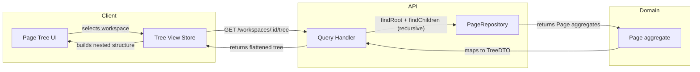
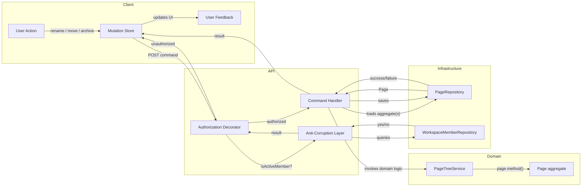

# Tree Structure and Navigation

## Purpose

This document describes the hierarchical page tree structure, how sibling ordering works, how the client navigates the tree, and what view states exist. It references the domain model in document 02 as the source of truth and adds concrete instance examples and layer-aware flowcharts. This document defers all lifecycle state transitions to document 03.

---

## Instance Example: Page Tree

The following diagram shows a concrete workspace with a root page, nested children, a mix of active and archived pages, and their ordering.

```mermaid
graph TB
    R[Root: "My Workspace"<br/>Active · pos:0]
    R --> A["Getting Started<br/>Active · pos:0"]
    R --> B["Q3 Planning<br/>Active · pos:1"]
    R --> C["Archive 2024<br/>Archived · pos:2"]

    A --> A1["Welcome Note<br/>Active · pos:0"]
    A --> A2["Keyboard Shortcuts<br/>Active · pos:1"]

    B --> B1["Sprint 1<br/>Active · pos:0"]
    B --> B2["Sprint 2<br/>Active · pos:1"]
    B --> B3["Backlog<br/>Active · pos:2"]

    B1 --> B1a["Design Review<br/>Active · pos:0"]
    B1 --> B1b["API Spec<br/>Archived · pos:1"]

    C --> C1["Old Notes<br/>Archived · pos:0"]
    C --> C2["2023 Reports<br/>Archived · pos:1"]
```

**Key observations:**
- The page tree is the **single structure** — archived pages remain in place, visually distinguishable by state.
- Siblings are ordered by `TreePosition` (integer). Gaps are allowed between positions but the displayed order is ascending.
- The root "My Workspace" is always present and cannot be archived.
- "API Spec" under "Sprint 1" is archived but still appears in the tree below "Design Review".

---

## Ordering Model

The `TreePosition` value object (defined in [02-domain-model.md](./02-domain-model.md)) provides the ordering contract. See the [TreePosition Behavioral Contract](./02-domain-model.md#treeposition-behavioral-contract) for the canonical specification of `first()`, `after()`, and `before()`.

> **Note on reordering:** When a page is moved between siblings, its `TreePosition` is recomputed. For large reorderings (drag-and-drop across many siblings), the system should re-index the `order` values of all affected siblings to avoid fractional drift. This re-indexing is an optimisation concern, not a domain concern — the domain only guarantees deterministic ordering.

---

## Read/Mutation Paths

### Navigation (read) path



**Flow:**
1. User selects a workspace → the client requests the full page tree.
2. The query handler fetches the root page, then recursively fetches children.
3. Pages are returned as a flat list with `parentId` references; the client builds the nested tree locally.
4. Only `Active` pages are shown in navigation (users can opt to "Show archived" to expand).

### Mutation path (e.g., rename, move, archive)



**Flow:**
1. User performs an action → the client sends a command to the API.
2. The command is intercepted by an `AuthorizationDecorator` (defined in [02-domain-model.md](./02-domain-model.md)) which gates on workspace membership once, before any handler executes. The decorator queries through the anti-corruption layer; if unauthorized, it returns a rejection directly to the client — the command handler is never invoked.
3. If authorized, the decorator delegates to the command handler, which loads the relevant `Page` aggregate(s) from the repository.
4. Domain logic executes on the aggregate via `Page` methods or `PageTreeService`.
5. The handler persists the changed aggregate(s).
6. The client receives a success/failure response and updates the UI.

> **Authorization is a single interception point:** The `AuthorizationDecorator` wraps every command handler. The `isActiveMember()` check lives in one place, not duplicated across handlers. This is a cross-cutting concern — see the [design rules in 02-domain-model.md](./02-domain-model.md#design-rules-to-prevent-duplication).

---

## Structural Expectations

| Rule | Maps to Invariant | Description |
|---|---|---|
| Every workspace has exactly one root | Invariant #2 | The root page is the tree entry point |
| Every non-root page has a parent | Invariant #3 | Parent must exist and be active |
| Tree is acyclic | Invariant #4 | Cycle detection on every move |
| Archived pages stay in tree | Invariant #6 | Per Invariant #6 (archived subtree isolation) — see [01-context-and-bounded-context.md](./01-context-and-bounded-context.md) |
| Siblings have deterministic order | Invariant #7 | `TreePosition` guarantees this |
| Archived children under active parent | (derived from #5, #6) | Possible — parent active, child archived |
| Workspace-scoped access | Invariant #8 | See [02-domain-model.md](./02-domain-model.md) — enforced by the `AuthorizationDecorator` before any command handler executes |

---

## View States

| View | Content | When Visible |
|---|---|---|
| **Full tree (default)** | All active pages in nested hierarchy, ordered by position | On workspace load, after any mutation that succeeds |
| **Tree with archived visible** | Same as full tree, plus archived pages shown collapsed/greyed | When user toggles "Show archived" |
| **Archived-only view** | Only archived pages, respecting hierarchy | When user filters by "Archived" |
| **Empty tree** | Root page only | First workspace setup (no child pages created yet) |
| **Error state** | Root page visible, non-blocking banner with error message | When a tree read fails (network error, server error) |
| **Loading state** | Skeleton placeholders matching tree depth | During initial tree fetch or after mutation with pending response |
