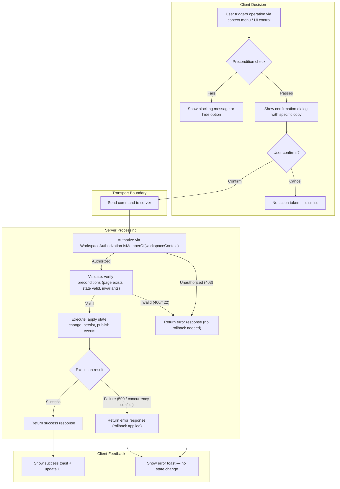
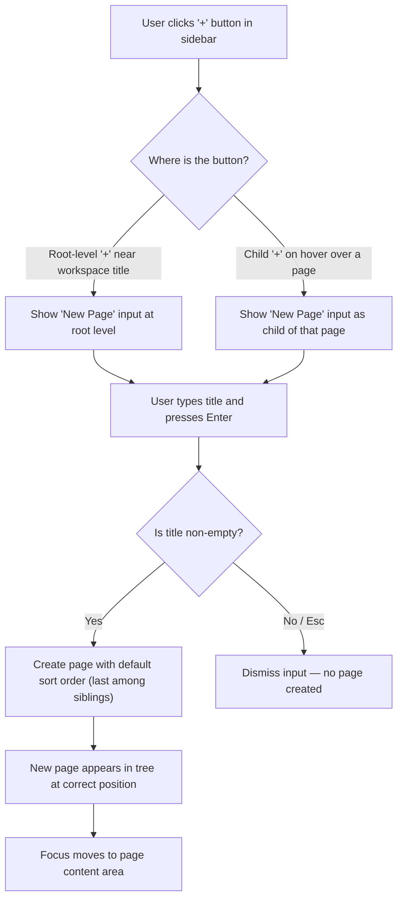
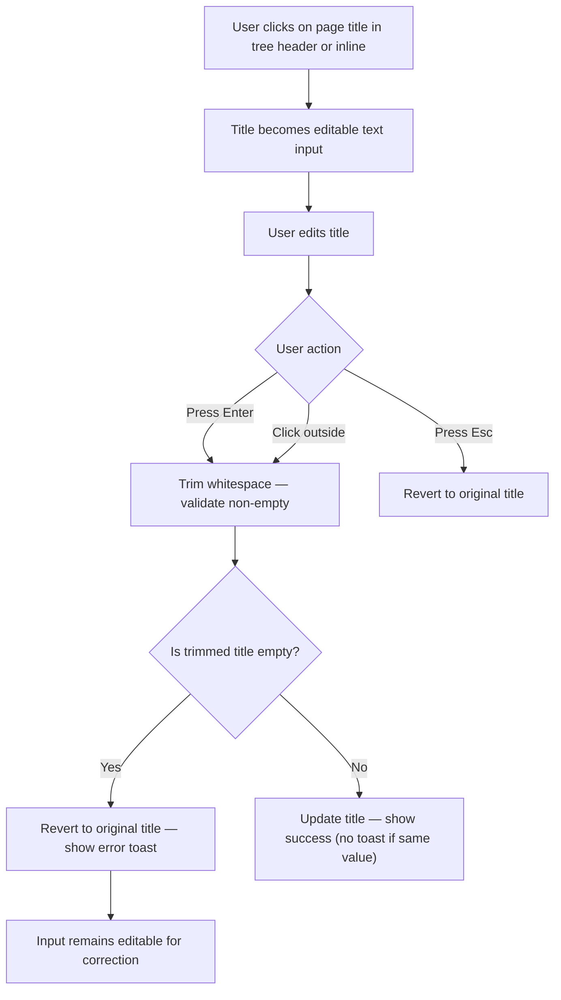
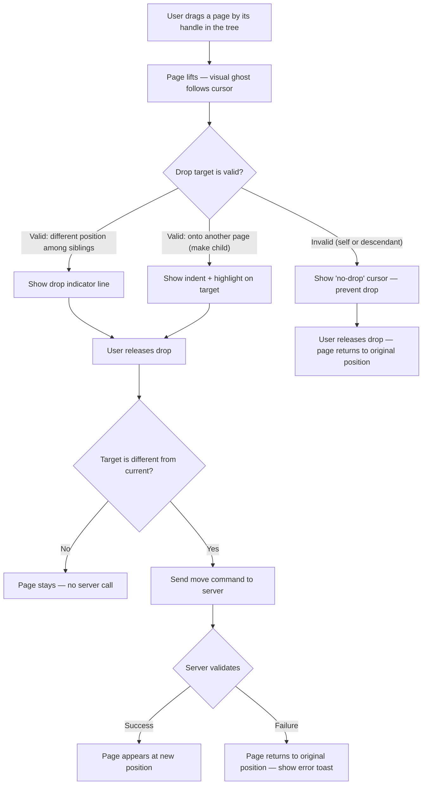

# PT-05: User Journey and Behavioral Expectations

## Purpose

This document defines user-facing behavioral expectations for every core page lifecycle operation. Each section includes user journey flowcharts and precise product rules. This document covers only what the user sees and experiences — the underlying domain model, state machine, and layered architecture are defined in their authoritative documents.

> **Note:** This document does **not** duplicate flowcharts from [04-page-tree-and-navigation.md](./04-page-tree-and-navigation.md). The mutation flow (layered decomposition) and read path live in `04`. This document covers user journey decision branches and product-level behavioral rules.

---

## Lifecycle Mutation Template

Archive, Restore, and Delete share an identical journey skeleton — a **lifecycle mutation template** — differing only in precondition, confirmation copy, and success feedback. The template is defined here once; each operation below parameterizes it.

> **Note — template parameterization (Server Processing):** The three server-side responsibilities are decomposed to expose distinct failure modes, each with different rollback semantics. Operations parameterize portions of this slot architecture:
> - **Archive** — `H3` must be transactional across the entire subtree (cascade to all descendants per FR-13). Authorization and validation apply to the root page only; the cascade atomicity concern is scoped to the Execute step.
> - **Restore** — `H3` is a single-aggregate write (no cascade). The `H2` validation step includes checking parent existence (if original parent was deleted, parent ID is cleared to null before execution).
> - **Delete** — `H3` is a single-aggregate delete, but `H2` must validate that the page has no children (the precondition from the client is re-checked server-side to prevent race conditions).
> - **Rename** — `H3` is a single property write. The `H1` and `H2` steps are identical to the template; `H2` includes `PageTitle` value-object validation.
>
> > **Invariant:** This decomposition is the single source of truth for the lifecycle mutation journey. Each operation below specifies only its parameterization — trigger, precondition, precondition-failure response, confirmation copy, success toast, and UI update. If the template itself changes (e.g., adding a loading spinner between Confirm and Transport), update it here; all three operations automatically inherit the change.

---

## Create Page

**Behavioral expectations:**

- A created page starts in the **Active** lifecycle state. It is immediately visible in the tree and navigable.
- The default title is what the user typed. There is no placeholder title like "Untitled" — the user must type a title or dismiss.
- The new page is placed **last** among its siblings (highest `SortOrder` in that parent group).
- If created as a child of an archived page, the parent must first be restored. Creating children under an archived page is blocked.
- The tree auto-expands to reveal the new page if collapsed.
- There is no "wizard" or multi-step creation — a single title input + Enter is the full flow.

> **Decision:** An "Untitled" default was considered but removed to avoid speculative generality. The team can add placeholder titles when analytics show users commonly create pages without immediately naming them.

---

## Rename Page

**Behavioral expectations:**

- Rename is available in both **Active** and **Archived** states.
- Renaming does **not** change lifecycle state, parent, or sort order.
- The rename is applied immediately on confirm (Enter). There is no debounce or delayed save.
- If the new title is identical to the old title, the operation is a no-op (no server call, no toast).
- Maximum title length is 500 characters (enforced by the `PageTitle` value object constructor). If exceeded, the user sees: "Page title must be under 500 characters."

> **Note:** Title validation (non-empty, trimmed, max 500 chars) is enforced by the `PageTitle` value object constructor defined in [02-domain-model.md](./02-domain-model.md).

---

## Move Page

> **Note:** Self-parenting (cannot move a page to be its own parent) and descendant-cycle (cannot move a page into its own subtree) are distinct invariants enforced separately at the server level by `Page.MoveTo()` — see invariants #3 and #4 in [02-domain-model.md](./02-domain-model.md). They share the same client-side treatment ("no-drop" cursor + return to original position). If product requirements for distinct visual feedback diverge in the future, split node **F** into two nodes.

**Behavioral expectations:**

- The drag preview shows the page title. It does not show the page's children (they move with it implicitly, but the preview is single-node).
- Moving a page **does not** change its lifecycle state. An archived page moved to a new parent remains archived.
- Moving a page into an archived parent is **allowed** (the moved page becomes a child of the archived page and is itself visible or archived depending on its own state).
- **No cascade on move** — children are not re-sorted or re-parented. The subtree moves intact with its parent.
- The drop zone visually distinguishes between "insert between siblings" (horizontal line) and "make child of" (indented highlight).
- If the move would create a cycle (moving a parent into its own descendant), the drop is blocked at the client level **and** enforced at the server level.

---

## Archive Page

**Parameterization of the Lifecycle Mutation Template:**

| Template Slot | Value |
|---------------|-------|
| **Trigger** | User right-clicks page or uses context menu, selects "Archive" |
| **Precondition** | Is the page already archived? |
| **Precondition failure** | Option is disabled or hidden |
| **Confirmation copy** | "Archive '[title]' and all sub-pages?" (omits "and all sub-pages" if no descendants) |
| **Success toast** | "Page archived" |
| **UI update** | Page and all descendants removed from default tree view |

> **Timestamp convention:** The underlying `AuditInfo.Archive()` method — which sets `UpdatedAt = Timestamp.Now()` and `ArchivedAt = Timestamp.Now()` — is defined in the domain model ([02-domain-model.md](./02-domain-model.md)). All temporal updates in this operation use the `Timestamp` value object's canonical factory rather than raw `DateTime.UtcNow`.

**Behavioral expectations:**

- Archiving **cascades to all descendants** regardless of depth. The entire subtree becomes Archived.
- The confirmation dialog explicitly states that all sub-pages will be archived — the user cannot claim surprise.
- Archived pages are **hidden** from the default sidebar tree. They remain accessible via an "Show archived" toggle or dedicated Archived view.
- An archived page cannot be edited in the content area (read-only mode or redirect).
- If the page has no descendants, the confirmation dialog omits "and all sub-pages" for simpler copy.
- The archive operation is **reversible** (via Restore).

---

## Restore Page

**Parameterization of the Lifecycle Mutation Template:**

| Template Slot | Value |
|---------------|-------|
| **Trigger** | User navigates to Archived view, finds archived page, clicks "Restore" |
| **Precondition** | Is the page already active? |
| **Precondition failure** | Option hidden — page is already active |
| **Confirmation copy** | No confirmation dialog (restore is non-destructive). The action executes immediately. |
| **Success toast** | "Page restored" |
| **UI update** | Page reappears in default tree under its original parent |

> **Timestamp convention:** The underlying `AuditInfo.Restore()` method — which sets `UpdatedAt = Timestamp.Now()` and clears `ArchivedAt` to `null` — is defined in the domain model ([02-domain-model.md](./02-domain-model.md)). All temporal updates in this operation use the `Timestamp` value object's canonical factory rather than raw `DateTime.UtcNow`.

> **Note:** Restore deviates from the template on confirmation: because restore is a reversible recovery action (not destructive), no confirmation dialog is shown. This is an intentional product decision — the template's confirmation node is omitted for this operation.

**Behavioral expectations:**

- Restore **does not cascade** to descendants. Only the selected page is restored.
- If the restored page's parent is still archived, the page becomes Active but remains **hidden** from the default tree (because its parent is hidden). The user must restore the parent to see it in the tree.
- The page reappears at its original `SortOrder` position among siblings.
- The user sees the page in the default tree immediately after restore.
- If the page's original parent was permanently deleted while it was archived, the page becomes a **root-level** page (its `ParentId` is cleared to null at the application layer before restore completes).

> **Decision:** Cascade-on-restore was considered (restore entire subtree) but removed to avoid data loss surprises. A user who intentionally archived a deep subtree may not want all children to reappear. They can restore children individually or in a batch operation in a future slice.

---

## Delete Page (Permanent)

**Parameterization of the Lifecycle Mutation Template:**

| Template Slot | Value |
|---------------|-------|
| **Trigger** | User right-clicks page or uses context menu, selects "Delete" |
| **Precondition** | Does the page have children? |
| **Precondition failure** | "Cannot delete — remove all sub-pages first." User must move or delete children, then retry. |
| **Confirmation copy** | "Permanently delete '[title]'? This cannot be undone." |
| **Success toast** | "Page deleted" |
| **UI update** | Page permanently removed from all views |

**Behavioral expectations:**

- Delete is **permanent and irreversible**. There is no trash or soft-delete in this slice. The confirmation dialog is explicit about this.
- Delete is **blocked** if the page has children. The user must move or delete children first.
- Deleting a page removes it from all views (default tree and archived view).
- There is no cascade delete — children must be handled explicitly by the user.
- If a user wants to remove a subtree, they must first move children elsewhere, then delete the parent; or delete bottom-up.

---

## Failure Behavior (Product Level)

| Scenario | Expected User Experience |
|----------|--------------------------|
| **Create page — network error** | Toast: "Could not create page. Please try again." The tree does not change. The title input is cleared. |
| **Create page — title validation error** | Toast: "Page title cannot be empty." Input remains for correction. |
| **Create page — authorization error** | Toast: "You do not have permission to create pages in this workspace." |
| **Rename page — network error** | Toast: "Could not rename page. Please try again." The title reverts to its previous value. |
| **Rename page — title too long** | Toast: "Page title must be under 500 characters." Input remains for editing. |
| **Rename page — concurrent modification** | Toast: "This page was modified by another user. Please reload and try again." Title reverts. |
| **Move page — network error** | Toast: "Could not move page. Please try again." Page returns to original position. |
| **Move page — cycle detected** | Toast: "A page cannot be moved into its own sub-pages." Page returns to original position. |
| **Archive page — network error** | Toast: "Could not archive page. Please try again." Page remains in default tree. |
| **Archive page — cascade fails mid-way** | Toast: "Could not archive page. No changes were saved." Full rollback — tree unchanged. |
| **Restore page — network error** | Toast: "Could not restore page. Please try again." Page remains archived. |
| **Restore page — parent deleted** | Toast: "Page restored. The original folder was deleted, so this page has been moved to the top level." Page appears at root level. |
| **Delete page — network error** | Toast: "Could not delete page. Please try again." Page remains. |
| **Delete page — has children** | Toast: "Cannot delete this page. Remove all sub-pages first." Page remains. |
| **Any operation — session expired** | Redirect to login page. Pending operations are discarded. Toast (on login return): "Session expired. Please try again." |
| **Any operation — concurrent conflicting operation** | Toast: "This page was modified by another user. Please reload and try again." Changes are not applied. |
| **Tree load — server error** | Error state in sidebar: "Could not load pages." with a [Retry] button. Previous tree is not shown (do not cache stale data). |
| **Tree load — empty workspace** | Sidebar shows: "No pages yet." with a prominent "New Page" button. |
