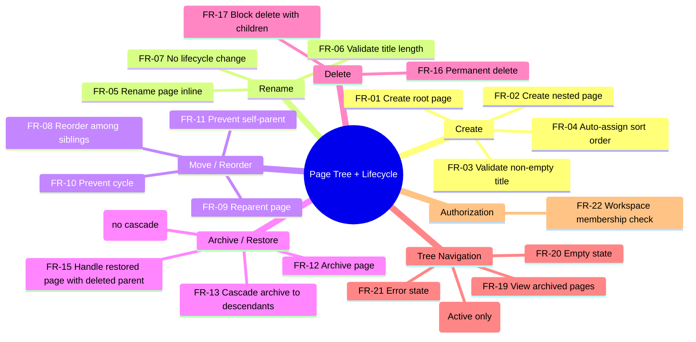
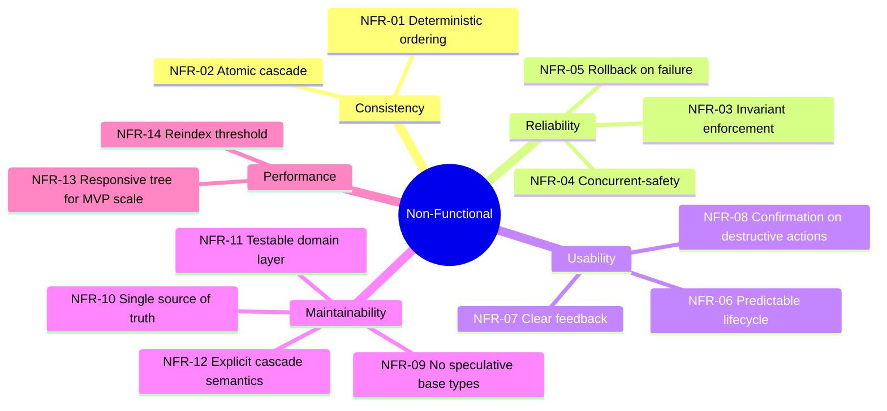

# PT-06: Functional and Non-Functional Requirements

## Purpose

This document enumerates all functional requirements (FRs) and non-functional requirements (NFRs) for the Page Tree + Page Lifecycle feature slice. Every requirement is testable, traceable to a scenario or constraint in the other planning documents, and assigned a priority. The FR mindmap provides a high-level overview; the detail tables are the authoritative source.

---

## Functional Requirements

### Functional Requirements Detail

| ID | Requirement | Priority | Notes |
|----|-------------|----------|-------|
| FR-01 | User can create a page at the root level of a workspace | Must | Title input, Enter to confirm |
| FR-02 | User can create a page as a child of an existing page | Must | Nested hierarchy |
| FR-03 | System rejects creation with empty or whitespace-only title | Must | Title must be ≥ 1 non-whitespace character |
| FR-04 | New page is assigned a sort order placing it last among existing siblings | Must | Default `SortOrder` = `maxSiblingOrder + 1.0` |
| FR-05 | User can rename any page they can see | Must | Inline editing, Enter or blur to confirm |
| FR-06 | System rejects rename with title exceeding 500 characters | Must | Enforced at server; client should also enforce |
| FR-07 | Renaming a page does not change its lifecycle state, parent, or sort order | Must | Self-transition only |
| FR-08 | User can reorder a page among its siblings by drag-and-drop | Must | Between-sibling insertion |
| FR-09 | User can reparent a page (make it a child of another page) by drag-and-drop | Must | Drop-on-page to make child |
| FR-10 | System prevents moving a page into its own descendant subtree | Must | Cycle detection in `Page.MoveTo()` |
| FR-11 | System prevents moving a page to be its own parent | Must | Self-reference check |
| FR-12 | User can archive an active page | Must | Confirmation required; shows cascade warning |
| FR-13 | Archiving a page cascades to all descendants — every page in the subtree becomes Archived | Must | Atomic cascade with rollback on failure |
| FR-14 | User can restore an archived page — only the selected page becomes Active; descendants are unaffected | Must | No cascade on restore |
| FR-15 | If the restored page's original parent was deleted, the page becomes a root-level page (ParentId cleared) | Must | Handles dangling reference |
| FR-16 | User can permanently delete a page with no undo | Must | Confirmation required; no trash in this slice |
| FR-17 | System blocks deletion of any page that has children | Must | User must move or delete children first |
| FR-18 | The default tree view shows only Active pages, sorted by SortOrder within each parent group | Must | Archived pages filtered out |
| FR-19 | User can view archived pages in a dedicated view or via a "Show archived" toggle | Should | Not critical for MVP but expected UX |
| FR-20 | An empty workspace displays a clear empty state with a call to action | Must | "No pages yet. Create your first page." |
| FR-21 | A failed tree load displays an error state with a retry option | Must | "Could not load pages. [Retry]" |
| FR-22 | All page operations verify the user is a member of the target workspace via `WorkspaceAuthorization.IsMemberOf()` | Must | Authorization check before any mutation or read; `WorkspaceAuthorization` composes `WorkspaceId` + `UserId` (see [02-domain-model.md](./02-domain-model.md)) |

---

## Non-Functional Requirements

### Non-Functional Requirements Detail

| ID | Requirement | Category | Target / Guidance |
|----|-------------|----------|-------------------|
| NFR-01 | Tree ordering is deterministic — same data always produces the same sort order | Consistency | SortOrder enforces strict weak ordering; no randomness or tie-breaking by creation date |
| NFR-02 | Archive cascade is atomic — either the entire subtree is archived or none of it is | Consistency | Transactional boundary at the application layer; no partial cascade visible to any user |
| NFR-03 | All domain invariants (title non-empty, no cycles, no self-parent, no delete-with-children) are enforced at the domain layer, not just the client | Reliability | Server-side validation must be independent of client validation; domain layer throws on violation |
| NFR-04 | Concurrent conflicting operations (two users moving the same page) must not produce an invalid hierarchy state | Reliability | Aggregates enforce invariants at write time; last-writer-wins is acceptable for conflicts but no cycle or orphan state may result |
| NFR-05 | Any failed lifecycle mutation must leave the system in the state it was in before the operation began | Reliability | Full rollback for cascade failures; atomic writes for single-page operations |
| NFR-06 | Lifecycle behavior is predictable and discoverable — users understand why a page is hidden or visible | Usability | Archived indicator, confirmation dialogs explain cascade, "Show archived" toggle; no hidden state changes |
| NFR-07 | Every user action produces immediate, clear feedback — success confirmation, error message, or optimistic update with rollback | Usability | Toasts, inline validation, visual drag feedback; no silent failures |
| NFR-08 | Destructive actions (archive with children, permanent delete) require explicit user confirmation | Usability | Confirmation dialog with specific consequences listed ("Archive 'X' and all 12 sub-pages?") |
| NFR-09 | No speculative base types or abstractions for future features | Maintainability | No generic `HierarchicalEntity<T>`, no `ILifecycle` interface, no placeholder types for templates or databases. The `Page` aggregate is designed for this slice only. |
| NFR-10 | Each domain concept is defined in exactly one document; no duplication of cascade rules, invariants, or entity definitions across planning artifacts | Maintainability | Cross-document links via relative markdown references; domain model in 02-domain-model.md is the single source of truth |
| NFR-11 | The domain layer (Page aggregate, value objects) is testable without a database, HTTP server, or browser | Maintainability | No infrastructure dependency in domain classes; persistence, transport, and UI are injected or abstracted |
| NFR-12 | Every cascade rule is explicitly stated in one place (the state machine document) and is never assumed or implied | Maintainability | [03-page-lifecycle-state-machine.md](./03-page-lifecycle-state-machine.md) is the sole location for cascade specifications |
| NFR-13 | The tree interaction (load, expand, collapse, drag) remains responsive for realistic MVP workspace sizes | Performance | Target: Tree root response < 500ms for up to 5000 pages total across a workspace. Client-side rendering handles up to 500 visible nodes without virtualization (beyond 500, virtual scrolling or lazy loading should be considered) |
| NFR-14 | When `SortOrder` midpoint precision degrades (approaching double floating-point limits after repeated between-insertions), the system transparently reindexes siblings — the user observes no difference | Performance | Reindex threshold: when two adjacent sort values differ by less than `1e-12`. Reindex assigns integer-spaced values (1.0, 2.0, 3.0…). Operation is O(n) for the sibling group. |

---

## Out of Scope (Explicit)

This list restates every exclusion from the scope contract and adds domain-specific exclusions:

- **API contracts, endpoint schemas, payload definitions, handler/repository design** — these belong in implementation design, not planning
- **UI component implementation specifics** — Vue components, templates, CSS, drag-and-drop library choice, animation details
- **Test implementation** — unit test files, integration test setup, e2e test scenarios
- **Page content types** — rich text blocks, databases, kanban boards, calendar views (existing prototype types are not part of this slice)
- **Collaborative editing** — no real-time sync, operational transforms, or conflict resolution
- **Version history** — no page revisions, diffs, or rollback to previous versions
- **Page templates** — no template creation, selection, or application
- **Page duplication / copy** — no duplicate or "copy as template" operations
- **Search and full-text indexing** — no search bar, filter-by-title-only search is client-side
- **Cross-workspace navigation** — tree is scoped to a single workspace; no workspace switcher in this slice
- **Role-based permissions** — only workspace membership is checked; no per-page access controls, roles, or sharing
- **Public pages / sharing** — no shareable links, public visibility, or guest access
- **Soft-delete / trash** — archive is the reversible operation; delete is permanent, no intermediate trash state
- **Page-level comments, notifications, or activity log** — no audit trail, comment threads, or change notifications
- **Bulk operations** — no multi-select archive, move, or delete; each operation acts on a single page

### Speculative UI Affordances (NFR-09 Enforcement)

In addition to explicit feature exclusions, the following **speculative UI patterns** are prohibited under NFR-09 — these are mock/simulated affordances that imply out-of-scope features and must not appear in production-bound code:

- **Hardcoded "last edited by" footers** — e.g., `"Last edited by Alex Rivera • 2 hours ago"`. This pattern implies both an activity log (who edited) and version history (when last edited) — both explicitly out of scope. Mock user data ("Alex Rivera") must never reach production. The legitimate extension point for a future activity log is the `#footer` slot; no default footer content should simulate activity metadata.
- **Fake timestamps or user names** — any hardcoded datetime, relative time string ("2 hours ago", "yesterday"), or fictitious person name presented as real metadata.

**Rationale:** These patterns pose four distinct risks:
1. Mock data can be mistakenly shipped to production, presenting fictitious content as real.
2. They create a misleading impression for developers that a tracking system exists or is about to be wired in.
3. A real implementation will conflict with the hardcoded fallback — the mock adds no scaffolding value.
4. NFR-09 explicitly mandates no speculative abstractions; hardcoded UI affordances for future features are the UI equivalent of speculative base types.

### Speculative Domain Entities (NFR-09 Enforcement)

In addition to the out-of-scope features listed above, the following **speculative domain modeling pattern** is prohibited under NFR-09 — formalizing a first-class domain entity for a concept explicitly deferred to a future slice:

- **Template domain entity formalization** — Creating a formal `Template` domain entity type (with dedicated model files, API functions, barrel exports, and entity-layer UI components) when templates are explicitly listed as out of scope. This includes but is not limited to:
  - Defining a `Template` interface/class in `entities/model/`
  - Creating a dedicated `templates.ts` API file with hardcoded mock data in `entities/api/`
  - Barrel re-exports (`entities/index.ts`) that make `Template` a first-class entity export
  - Moving UI components into `entities/ui/` that depend on the formal `Template` type
  - Defining value objects for template properties (e.g., `TemplateCategory`, `TemplateId`, `TemplateIcon`, `TemplateTitle`, `TemplateDescription`, `TemplateImageUri`)

**Permitted alternative:** Inline data and widgets-layer components. Templates that exist as pre-slice prototype code may remain as inline data in the component that uses them (e.g., a hardcoded array in a modal component) and as widgets-layer components (`widgets/`). This acknowledges their existence without promoting them to domain-entity status. The legitimate path for formalizing templates is: (1) a new planning task explicitly scopes the template feature, (2) a domain model is designed as part of that task, and (3) the entity layer is created as part of that task's implementation.

**Rationale:** These patterns pose the same four risks as speculative UI affordances, adapted for the domain layer:
1. A formal domain entity creates the false impression that the concept is an intended, designed part of the current slice's domain model — when it is explicitly deferred.
2. Hardcoded mock data in API files (e.g., `getTemplates()` returning 6 records with external image URLs) could be mistakenly shipped to production or create misleading expectations about data sources.
3. Every future slice that touches the feature must first undo the speculative formalization (delete entity files, revert barrel exports, downgrade components) — the formalization adds coupling that didn't exist with simpler inline data.
4. NFR-09 explicitly mandates no placeholder types for templates or databases; a formal `Template` entity with dedicated model/api/ui segments is a placeholder type.

#### Violation Log — Issue #284

A violation of NFR-09 was identified ([Issue #284](./../../issues/284)): a formal `Template` domain entity structure was created despite the explicit prohibition above. The following files constitute the violation and **must be remediated** per the treatment mandated below:

| Violation File | Location | What It Does |
|----------------|----------|-------------|
| `entities/model/template.ts` | `src/Web/src/modules/templates/entities/model/` | Defines `Template` interface (7-line type) |
| `entities/api/templates.ts` | `src/Web/src/modules/templates/entities/api/` | Exports `getTemplates()` returning 6 hardcoded records with external image URLs |
| `entities/index.ts` (barrel) | `src/Web/src/modules/templates/entities/` | Re-exports `Template`, `getTemplates`, `TemplateCard` — makes templates a first-class entity export |
| `entities/ui/TemplateCard.vue` | `src/Web/src/modules/templates/entities/ui/` | Moved from `widgets/` to `entities/ui/` — should be a widgets-layer component |

**Mandated Refactoring Treatment:**

1. **Structural Extraction** — Remove `entities/model/template.ts` and `entities/api/templates.ts`. The template data (6 hardcoded records with external image URLs) must be inlined as an array inside `TemplateGalleryModal.vue`, consistent with the design-permitted inline-data alternative.
2. **Naming Alignment** — Move `TemplateCard.vue` back to `widgets/TemplateCard.vue` (revert from `entities/ui/`). The widgets layer is the correct home for representational components of out-of-scope features.
3. **Consolidation** — Remove the `Template` type export from the `entities/` barrel and remove the entity-barrel dependency from `TemplateGalleryModal.vue`. The widgets-layer barrel (`widgets/index.ts`) must be the sole public API surface for template concerns.
4. **Verification** — After remediation, confirm that no files under `entities/model/`, `entities/api/`, or `entities/ui/` reference the `Template` concept, and that `entities/index.ts` no longer exports template-related symbols.

**Constraint:** If the team decides to formally scope templates in this slice (overriding the planning baseline), that decision must first be documented in an Architecture Decision Record (ADR) and all planning documents must be updated to reflect the scoped-in feature. Absent such an ADR, the permitted inline-data alternative is the only compliant approach.
