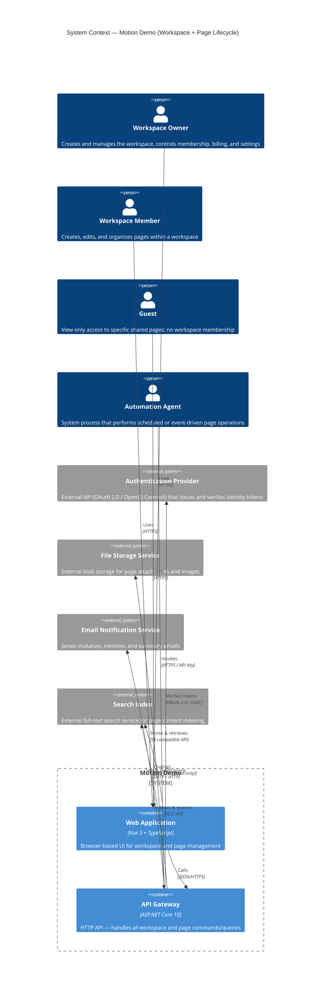
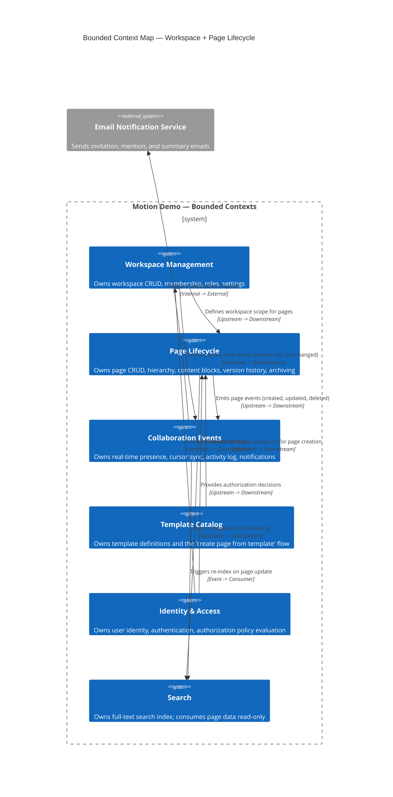
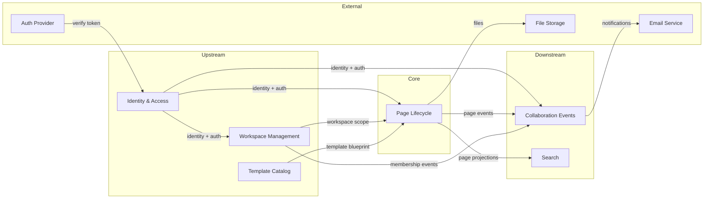

# System Context & Bounded Context Map — Workspace + Page Lifecycle

> **Artifact:** 01-context-and-bounded-context.md  
> **Feature Slice:** Workspace + Page Lifecycle  
> **Status:** Planning — first mandatory artifact  
> **Constrains:** All subsequent planning and implementation tasks in this slice.

---

## 1. System Context (C4Context)

### 1.1 Actor Definitions

| Actor | Description | Scope |
|-------|-------------|-------|
| **Workspace Owner** | Full control over a workspace: create, delete, manage members, billing, and all pages. Every workspace MUST have at least one owner at all times. | Workspace-wide |
| **Workspace Member** | Can create, read, update, and organize pages within the workspace. Cannot delete the workspace or manage billing. | Workspace-wide |
| **Guest** | Non-member with view-only access to specific shared pages. No workspace-level permissions. Cannot create or edit pages. | Page-scoped |
| **Automation Agent** | Headless system process (scheduled job, webhook handler) that performs page operations (create from template, archive, etc.). Authenticated via API key. | System-internal |

### 1.2 External Systems

| System | Interaction | Protocol |
|--------|-------------|----------|
| **Authentication Provider** | Identity token issuance and verification | OAuth 2.0 / OpenID Connect |
| **File Storage Service** | Upload/download page attachments and embedded images | S3-compatible REST API |
| **Email Notification Service** | Send workspace invitations, @mention alerts, digest summaries | SMTP / HTTP |
| **Search Index** | Index page title and content; serve full-text search queries | REST API |

---

## 2. Bounded Context Map

### 2.1 Context Descriptions

#### **Identity & Access** (Upstream — authoritative)
- **Owns:** User identity records, authentication sessions, role/permission definitions.
- **Publications:** Verified user identity, authorization decisions (can user X perform action Y on resource Z?).
- **Consumers:** All other contexts depend on I&A for identity verification. No context may bypass I&A for authorization.
- **Storage:** Users table, Roles table, Policy definitions.

#### **Workspace Management** (Upstream — authoritative for workspace scope)
- **Owns:** Workspace aggregate (id, name, slug, settings), Membership aggregate (user + workspace + role).
- **Publications:** Workspace existence (pages must belong to a valid workspace), membership roster, workspace-level settings (default permissions, slug).
- **Consumers:** Page Lifecycle reads workspace existence and settings. Collaboration Events reads membership roster for presence.
- **Invariant authority:** Enforces "at least one owner per workspace", "unique workspace slug", "workspace member limit".

#### **Page Lifecycle** (Middle — authoritative for pages)
- **Owns:** Page aggregate (id, title, slug, content blocks, parent reference, version history, status: PageStatus).
- **Publications:** Page events (PageCreated, PageUpdated, PageDeleted, PageArchived, PageRestored, PageMoved).
- **Consumers:** Collaboration Events consumes page events for activity log and presence. Search consumes page projections.
- **Reads from:** Workspace Management (workspace existence + settings), Identity & Access (authorization), Template Catalog (blueprints).
- **Invariant authority:** Enforces "page hierarchy must be acyclic", "page slug unique per workspace", "page parent must be in same workspace".

#### **Collaboration Events** (Downstream — consumer)
- **Owns:** Activity log entries, real-time presence sessions, pending notifications.
- **Reads from:** Page Lifecycle events, Workspace Management membership events.
- **Writes to:** Email service (via outbound adapter), Search (re-index triggers).
- **No authority over core domain invariants.** This context is purely observational and notification-oriented.

#### **Template Catalog** (Upstream — authoritative for template definitions)
- **Owns:** Template definitions (id, name, category, preset content blocks, icon).
- **Publications:** Template blueprints consumed by Page Lifecycle during "create page from template" flow.
- **Reads from:** None (self-contained catalog).

#### **Search** (Downstream — read-only consumer)
- **Owns:** Search index schema, indexing pipeline, query API.
- **Reads from:** Page Lifecycle (page projections via events or periodic sync).
- **No authority over domain data.** Indexing failures MUST NOT affect page create/update operations. Eventually consistent.

### 2.2 Context Integration Diagram

### 2.3 Integration Touchpoints

| # | Source Context | Target Context | Mechanism | Data Ownership | Criticality |
|---|----------------|----------------|-----------|----------------|-------------|
| 1 | Identity & Access | All others | HTTP header (JWT) + local policy evaluation | Source owns identity; each context caches policy | **High** — auth failure blocks all usage |
| 2 | Workspace Management | Page Lifecycle | In-process query (workspace exists?) | Workspace owns workspace entity; Page reads | **High** — every page operation depends on this |
| 3 | Workspace Management | Collaboration Events | Domain event (membership changed) | Workspace owns membership data; Collab caches projection | Medium |
| 4 | Page Lifecycle | Collaboration Events | Domain event (page CRUD) | Page owns page data; Collab caches projection | Medium |
| 5 | Page Lifecycle | Search | Integration event (page updated) | Page owns data; Search owns index | Low** — search index can lag |
| 6 | Template Catalog | Page Lifecycle | In-process query or copy-on-create | Template owns blueprint; Page owns instantiated copy | Low — templates are optional at creation |

> **\*\*Low criticality for search means:** if the search index is unavailable, page creation/update MUST still succeed. The index will catch up eventually.

---

## 3. Decisions Table

| Decision | Rationale |
|----------|-----------|
| **Page Lifecycle is a standalone bounded context, not embedded in Workspace Management.** | Page lifecycle has its own invariants (hierarchy, archiving, versioning) that differ from workspace membership and settings. Separating them prevents accidental coupling and allows independent evolution. |
| **Collaboration Events is a downstream observer, not an authoritative context.** | Real-time events and activity logs must never block or influence core domain operations. Making it a downstream consumer ensures that page creation/update is never delayed by event bus availability. |
| **Search is eventually consistent and non-blocking.** | Search indexing latency is acceptable (seconds to minutes). Synchronous indexing would couple page write latency to an external system's availability. |
| **Template Catalog provides blueprints, not live references.** | Once a page is created from a template, there is no runtime dependency back to the template. This avoids "template update changes all pages" surprises and keeps the Page Lifecycle context autonomous. |
| **Authorization is evaluated in each context, not centralized.** | Each bounded context receives the user's identity (JWT) and evaluates its own policy against the resource. This avoids a single authorization bottleneck and keeps policies close to the data they protect. The policy definitions (roles, permissions) are centralized in Identity & Access. |
| **Workspace slug and page slug are separate namespaces.** | Page slugs are unique only within a workspace, not globally. This avoids artificial naming conflicts and aligns with user expectations (e.g., same page title can exist in different workspaces). |
| **Domains events use an outbox pattern (local table → event bus).** | Guarantees at-least-once delivery without requiring distributed transactions. If the event bus is down, the operation commits locally and the outbox is drained when the bus recovers. |

---

## 4. Ownership Rules

### 4.1 Per-Context Ownership

| Bounded Context | Owns (Authoritative) | Reads (Non-authoritative) | Does Not Own |
|-----------------|----------------------|---------------------------|--------------|
| **Identity & Access** | Users, roles, permissions, auth sessions | — | Workspace settings, page content, templates, activity log |
| **Workspace Management** | Workspace aggregate, membership aggregate | User identities (from I&A) | Page content, page hierarchy, activity log, search index |
| **Page Lifecycle** | Page aggregate, content blocks, version history, PageStatus | Workspace existence, template blueprints, authorization decisions | Activity log, search index, file blobs |
| **Collaboration Events** | Activity log entries, presence sessions, notification queue | Page events, membership events | Page content, workspace settings, user identities |
| **Template Catalog** | Template definitions and categories | — | Page instances, workspace settings |
| **Search** | Search index schema and query API | Page projections | Page content (source of truth is Page Lifecycle) |

### 4.2 Integration Ownership

| Touchpoint | Owned By | Consumer Behavior |
|------------|----------|-------------------|
| Workspace existence query | Workspace Management | Page Lifecycle MUST call this synchronously on page write. Cache with TTL ≤ 60s on read paths. |
| Authorization check | Each context evaluates its own policy | Policy definition is centralized in I&A; evaluation happens locally. MUST re-evaluate on every write operation. |
| Page created/updated/deleted events | Page Lifecycle | Collaboration Events MUST handle events idempotently. Events carry full context (page id, workspace id, timestamp) — never reference-only. |
| Membership changed events | Workspace Management | Collaboration Events MUST update its presence roster. |
| Search index updates | Page Lifecycle (publisher) / Search (consumer) | Search MUST tolerate duplicate or out-of-order events. |

---

## 5. Domain Invariants

Each invariant below is verifiable (binary pass/fail) at the domain level — no external system state is required.

| # | Invariant | Context | Category | Verifiable Form |
|---|-----------|---------|----------|-----------------|
| INV-01 | Every page MUST belong to exactly one workspace. | Page Lifecycle | Identity / Scope | `page.workspaceId != null && workspaceExists(page.workspaceId) == true` |
| INV-02 | A workspace MUST have at least one owner at all times. | Workspace Management | Ownership | `workspace.memberships.count(m => m.role == WorkspaceRole.Owner) >= 1` |
| INV-03 | A workspace slug MUST be unique across all workspaces. | Workspace Management | Identity | `workspaceRepository.FindBySlug(slug) == null || foundWorkspace.id == workspace.id` |
| INV-04 | A page slug MUST be unique within its workspace. | Page Lifecycle | Identity | `pageRepository.FindBySlug(workspaceId, slug) == null || foundPage.id == page.id` |
| INV-05 | Page hierarchy MUST NOT contain cycles. | Page Lifecycle | Structure | For any page P, there MUST be no ancestor chain A1, A2, ..., An where An.parentId == P.id. Verifiable by computing transitive closure at write time. |
| INV-06 | A page's parent MUST belong to the same workspace. | Page Lifecycle | Tenancy | `parent == null || parent.workspaceId == page.workspaceId` |
| INV-07 | A workspace cannot be deleted if it contains non-archived pages. | Workspace Management | Lifecycle Legality | `workspace.pages.count(p => p.status != PageStatus.Archived) == 0` |
| INV-08 | A workspace member MUST have at least one role assigned. | Workspace Management | Ownership Consistency | `membership.roles.length >= 1` |
| INV-09 | Page content blocks within a single page MUST have a deterministic order. | Page Lifecycle | Structure | `page.blocks` is an ordered sequence; every block has a `position` integer (0-based, no gaps). |
| INV-10 | A page cannot be moved to a workspace different from the one it was created in. | Page Lifecycle | Tenancy | `page.workspaceId` is immutable after creation. |

### 5.1 Invariant Enforcement

| Severity | Enforcement Point | Invariants |
|----------|-------------------|------------|
| **Hard** (reject the operation) | Domain service / aggregate method before persistence | INV-01 through INV-10 |
| **Soft** (warn / log, do not reject) | Application layer after successful command | None currently — all invariants above are hard |
| **Deferred** (enforced asynchronously, eventual consistency) | Background job | None currently — all invariants above are synchronous |

---

## 6. Assumptions

1. **Single-tenancy per deployment.** Motion Demo is deployed as a single instance serving multiple workspaces (multi-workspace on single tenancy). Per-workspace isolation is logical, not physical.
2. **Page content is block-based.** A page's body is composed of an ordered list of content blocks (text, image, table, embed, etc.), not a monolithic blob. This is consistent with the existing `View` and `Row`/`KanbanCard` types that represent structured data within a workspace.
3. **File attachments reference external storage.** The Page Lifecycle context stores only metadata (filename, URL, MIME type, size, uploaded by). The file bytes live in the File Storage Service.
4. **Real-time collaboration is out of scope for the MVP slice.** The Collaboration Events context is defined structurally but will be implemented in a subsequent slice. For MVP, only the event emission infrastructure (outbox) is built.
5. **Billing is out of scope for the MVP slice.** Billing and subscription management are deferred to the Workspace Billing slice. No billing domain model, invariants, or integration touchpoints are defined at this stage.
6. **The Authentication Provider is external.** Motion does not implement its own identity provider. All identity verification delegates to an external OAuth 2.0 / OIDC provider.
7. **The project follows Feature-Sliced Design on the frontend** and a modular monolith on the backend. The bounded contexts defined here correspond to backend module boundaries, not necessarily 1:1 with frontend FSD modules.
8. **Canonical naming.** The terms `Workspace`, `Page`, `PageStatus`, `Member`, `Role`, `Slug`, `Block`, `Version` are used consistently across all contexts. No synonyms are introduced.
9. **Page lifecycle is modeled as a PageStatus value object (Active, Archived, Deleted).** Archived is reversible; Deleted is irreversible. Hard delete (transition to Deleted) is gated behind a confirmation flow.

---

## 7. Out of Scope (for this slice)

| Item | Rationale | Future Slice |
|------|-----------|--------------|
| Real-time collaboration (cursors, presence, WebSocket) | MVP scope — only event infrastructure (outbox) is built. Real-time UI is deferred. | Collaboration Events slice |
| Billing and subscription management | Domain model, invariants, and integration touchpoints for billing are not yet defined. Deferred in full. | Workspace Billing slice |
| Hard page deletion / trash bin expungement | Soft-delete (archive/restore) is sufficient for MVP. Hard delete is more complex (cascade, permissions). | Page Lifecycle — Phase 2 |
| Page version diff and restore UI | Version history is recorded (append-only) but the diff/restore UI is deferred. | Page Lifecycle — Phase 2 |
| Cross-workspace page sharing / public pages | Guests are scoped to specific pages within a workspace. No cross-workspace or fully public pages. | Collaboration slice |
| Rich inline commenting on blocks | Comments are tracked as an issue type on a task — not a page-level concept. | Collaboration slice |
| Page export (PDF, Markdown, CSV) | Export is a utility concern, not a lifecycle invariant. | Page Lifecycle — Phase 2 |
| Template versioning | Templates are static snapshots. Versioning adds complexity with low MVP value. | Template Catalog slice |
| Search ranking tuning / full-text relevance | Basic full-text indexing only. Ranking and relevance tuning are deferred. | Search slice |

---

## 8. Glossary

| Term | Definition |
|------|------------|
| **Workspace** | Top-level organizational container. Holds pages, members, and settings. Analogous to a "team" or "organization" in Notion. |
| **Page** | A document or view within a workspace. Has a title, slug, parent reference (for hierarchy), an ordered list of content blocks, and a PageStatus. |
| **PageStatus** | A typed value object (enum/sum type) representing the lifecycle phase of a page. Members: `PageStatus.Active` (live, editable), `PageStatus.Archived` (soft-deleted, reversible), `PageStatus.Deleted` (hard-deleted, irreversible). Replaces independent boolean flags — guarantees mutual exclusivity at compile time and eliminates scattered dual-flag logic. |
| **Slug** | URL-friendly identifier for a page (unique within a workspace) or workspace (globally unique). |
| **Block** | The atomic unit of page content. One block = one paragraph, image, table, embed, etc. |
| **Member** | A user who belongs to a workspace with one or more `WorkspaceRole` values assigned. |
| **Owner** | A member with the `WorkspaceRole.Owner` role. Has full administrative control over the workspace. |
| **Guest** | A non-member with view-only access to specific pages. Not a workspace member. |
| **WorkspaceRole** | A typed value object (enum/sum type) representing a workspace membership role. Explicit members: `WorkspaceRole.Owner`, `WorkspaceRole.Admin`, `WorkspaceRole.Member`. Guarantees validity at compile time — eliminates raw string comparisons and scattered validation. Guest is intentionally excluded; it is a page-scoped, non-membership concept. |
| **Version** | An immutable snapshot of page content at a point in time. Created on every page update. |
| **Outbox** | A local database table that stores domain events for reliable asynchronous delivery to downstream consumers. |

---

## 9. Revision History

| Date | Author | Change |
|------|--------|--------|
| 2026-07-15 | AI Agent | Initial version — system context, bounded context map, decisions, invariants, ownership rules. |
