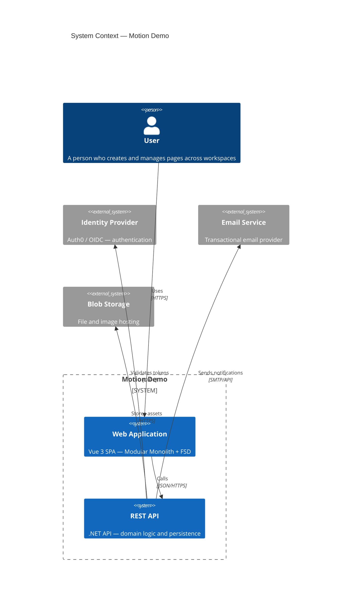
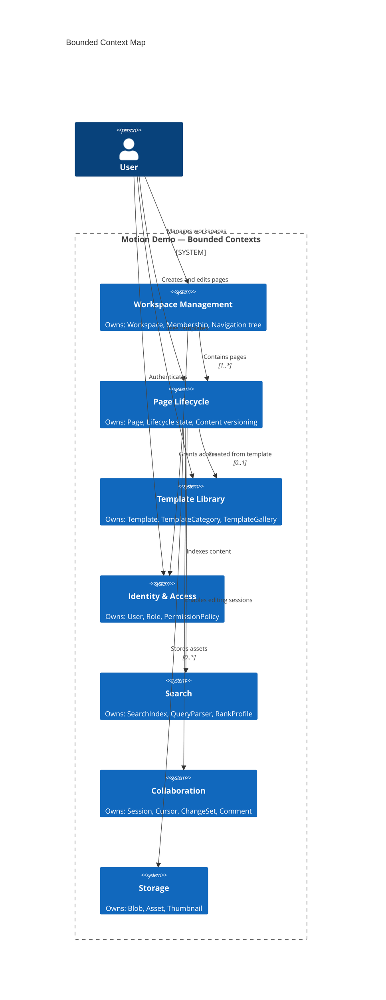

# Context & Bounded Context

## System Context (C4)

## Bounded Context Map

The Motion Demo domain is decomposed into the following bounded contexts. The **Workspace Management** and **Page Lifecycle** contexts are the focus of this planning pack.

## Key Architectural Decisions

| Decision | Rationale |
|----------|-----------|
| Workspace Management and Page Lifecycle are separate bounded contexts | A workspace is an organizational container (members, settings, tree structure); a page is a content entity with its own lifecycle. Merging them couples membership logic with content state, violating SRP. |
| Page Lifecycle owns the page state machine, not Workspace Management | The state machine (draft → published → archived → deleted) is a page-internal behavioral concern. Workspace Management only needs to know whether a page is visible in the tree. |
| Workspace Management owns the navigation tree (page-parent relationships) | The tree structure is the workspace's primary organizational tool. Pages exist within it; the tree's shape is a workspace concern. |
| Soft-delete is the only delete mechanism surfaced to Page Lifecycle | Hard-delete is a storage-level concern driven by retention policy, not user intent. Page Lifecycle models deletion as a state transition to `deleted`. |
| Identity & Access is a separate bounded context upstream of both | Authentication and authorization are cross-cutting concerns with their own evolution pace. Workspace Management and Page Lifecycle express permission requirements declaratively. |

## Ownership Boundary Rules

| Responsibility | Owned By | Consumed By |
|---|---|---|
| Workspace aggregate (identity, settings, membership) | Workspace Management | Page Lifecycle (read-only: scope of pages) |
| Membership and role assignment | Workspace Management | Identity & Access (authorization decisions) |
| Page aggregate (content, state, version) | Page Lifecycle | Search (indexing), Storage (asset references) |
| Page lifecycle state transitions | Page Lifecycle | Workspace Management (visibility in tree) |
| Navigation tree (page hierarchy) | Workspace Management | Page Lifecycle (parent assignment on create) |
| Retention policy and hard-delete scheduling | Storage | Page Lifecycle (when to purge) |

## Invariants

1. **No orphan pages** — Every page MUST belong to exactly one workspace. A page MUST NOT exist outside a workspace boundary.
2. **No duplicate sibling names** — Within the same parent container (workspace root or parent page), page names MUST be unique.
3. **Archive cascading** — When a page is archived, all descendant pages in the tree MUST also be archived.
4. **Restore reachability** — A page MUST NOT be restored if any ancestor page is in the `archived` or `deleted` state (restore from the top down).
5. **Single lifecycle lineage** — A page MUST be in exactly one lifecycle state at any point in time.
6. **Delete immutability** — Once a page transitions to `deleted`, no further state transitions are permitted (except hard-delete by the retention system).
7. **Workspace membership gating** — A user MUST be a member of a workspace to create or modify pages within it.
8. **Parent consistency** — A page's `parentId` MUST reference a page that exists within the same workspace. Cross-workspace parent references are prohibited.
