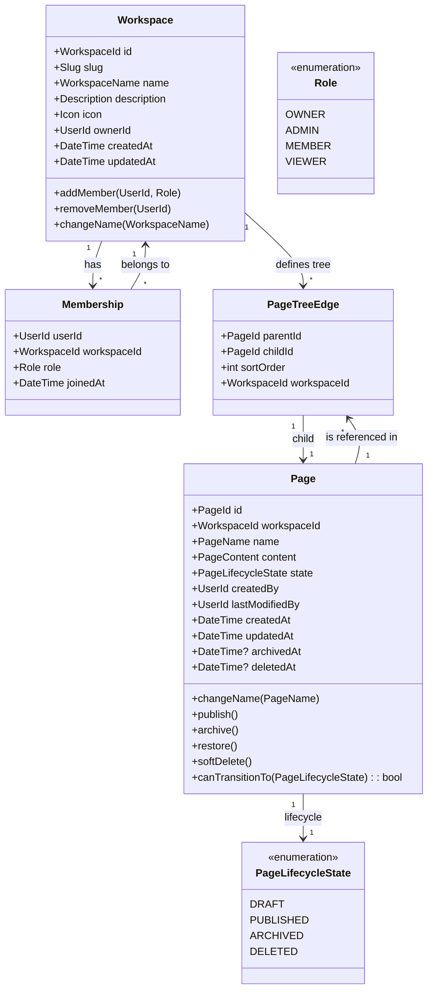

# Domain Model

## Class Diagram

## Domain Concepts

| Concept | Type | DDD Classification | Description |
|---------|------|--------------------|-------------|
| `Workspace` | Aggregate Root | Entity | Top-level organizational boundary. Owns the navigation tree and member roster. Globally unique by slug. |
| `Membership` | Entity | Child Entity | Links a User to a Workspace with a role. Always accessed through Workspace. |
| `Page` | Aggregate Root | Entity | A single content unit within a workspace. Has a lifecycle state, hierarchical position, and versioned content. |
| `PageTreeEdge` | Value Object | Value Object | Represents a parent-child relationship between two pages within a workspace. Immutable after creation. |
| `PageLifecycleState` | Enumeration | Value Object | The finite set of states a page can occupy. Governs all visibility and mutability decisions. |
| `WorkspaceName` | Value Object | Value Object | Wraps a string with business rules: 1–100 chars, no leading/trailing whitespace, sanitized. |
| `PageName` | Value Object | Value Object | Wraps a string with business rules: 1–300 chars, no leading/trailing whitespace. |
| `Role` | Enumeration | Value Object | Authority level within a workspace. Determines which operations a member may perform. |
| `Slug` | Value Object | Value Object | URL-friendly identifier for a workspace. Unique, immutable after creation. |
| `PageContent` | Value Object | Value Object | The body of a page. Represented as an opaque document model (block tree, JSON). Versioned externally. |

## Cardinalities

| Relationship | Source | Target | Cardinality | Notes |
|---|---|---|---|---|
| Workspace → Membership | `Workspace` | `Membership` | 1..* | Every workspace must have at least one member (the creator). |
| Workspace → PageTreeEdge | `Workspace` | `PageTreeEdge` | 0..* | A workspace may have zero or more tree edges (empty workspace). |
| Workspace → Page (via tree) | `Workspace` | `Page` | 0..* | Pages are indirectly associated via tree edges. |
| Page → PageTreeEdge (child) | `Page` | `PageTreeEdge` | 0..1 | A page has at most one parent edge. A root page has zero. |
| Page → PageTreeEdge (parent) | `Page` | `PageTreeEdge` | 0..* | A page may have unlimited child edges. |
| Page → PageLifecycleState | `Page` | `PageLifecycleState` | 1..1 | Every page has exactly one lifecycle state. |
| Membership → Workspace | `Membership` | `Workspace` | 1..1 | A membership always references exactly one workspace. |
| Membership → User | `Membership` | `User` | 1..1 | A membership belongs to exactly one user. |

## Design Constraints

1. **Aggregate consistency boundaries** — `Workspace` and `Page` are separate aggregates. Workspace operations (add member, rename) and Page operations (publish, archive) MUST be transactional within their own aggregate but eventually consistent between aggregates. Workspace Management never locks a Page aggregate.

2. **PageTreeEdge immutability** — Once created, a `PageTreeEdge` is immutable except for `sortOrder`. To reparent a page, the existing edge is deleted and a new edge is created. This preserves audit history.

3. **Non-nullable workspace context** — Every domain operation that involves a Page MUST carry the `WorkspaceId` as a parameter. Cross-workspace access is structurally impossible.

4. **State machine as protocol** — The `canTransitionTo()` method on Page encapsulates all transition rules. No domain logic outside the Page aggregate may directly set `state`. This enforces the state machine within the aggregate boundary.

5. **Membership as gateway** — All page mutation operations MUST validate that the requesting user has an active `Membership` in the target workspace before loading the Page aggregate. Membership checks happen before Page aggregate hydration.
