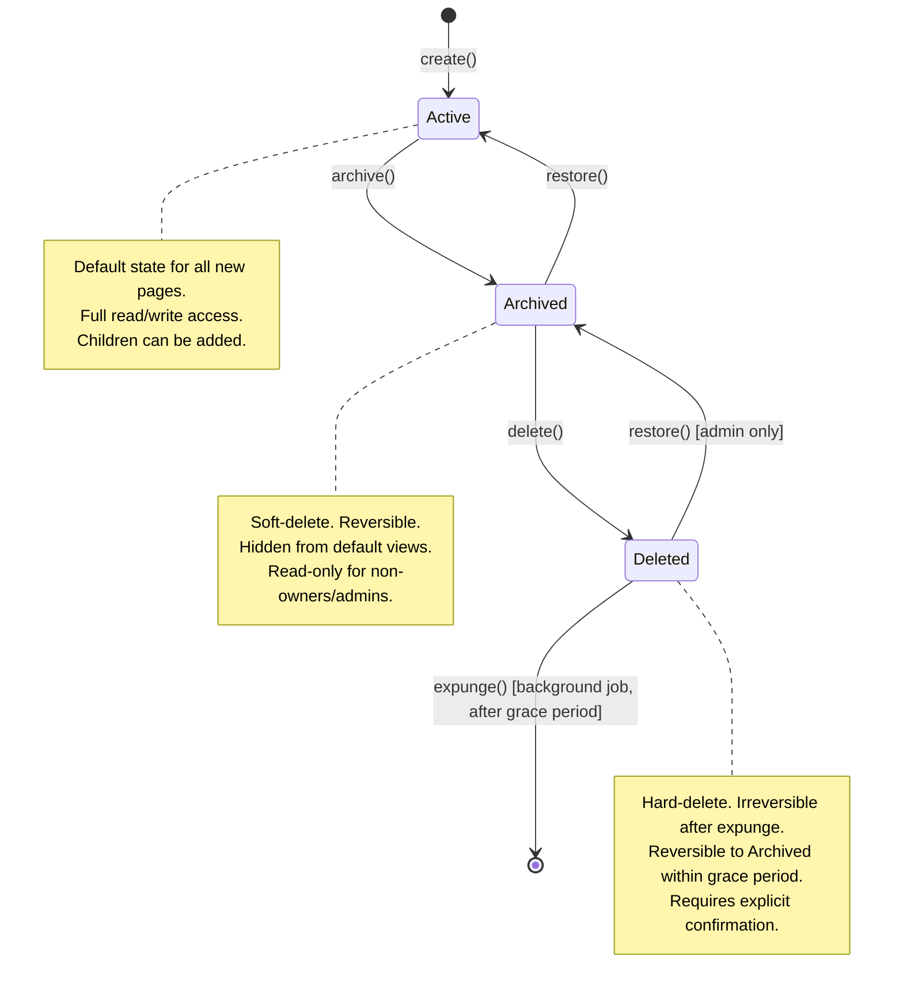

# Domain Model — Workspace + Page Lifecycle

> **Artifact:** 02-domain-model.md  
> **Feature Slice:** Workspace + Page Lifecycle  
> **Status:** Planning — second mandatory artifact  
> **Preceded by:** [01-context-and-bounded-context.md](./01-context-and-bounded-context.md)  
> **Source of truth for:** State machine design, API contracts, Postgres schema, Vue UI state.

---

## 1. Class Diagram

```mermaid
classDiagram
    %% ──────────────────────────────────────────────
    %% Aggregate: Workspace
    %% ──────────────────────────────────────────────
    class Workspace {
        <<Aggregate Root>>
        +WorkspaceId id
        +WorkspaceName name
        +Slug slug
        +WorkspaceSettings settings
        +AuditInfo auditInfo
        +create(name, ownerUserId) Workspace
        +updateSettings(settings) void
        +addMember(userId, role) WorkspaceMembership
        +removeMember(membershipId) void
        +changeMemberRole(membershipId, role) void
        +delete() void  [requires all pages archived]
    }

    class WorkspaceMembership {
        <<Entity>>
        +MembershipId id
        +UserId userId
        +WorkspaceRole role
        +JoinedAt joinedAt
        +changeRole(newRole) void
    }

    %% ──────────────────────────────────────────────
    %% Aggregate: Page
    %% ──────────────────────────────────────────────
    class Page {
        <<Aggregate Root>>
        +PageId id
        +WorkspaceId workspaceId  [immutable after creation]
        +PageTitle title
        +Slug slug
        +PageParent parent
        +PageStatus status
        +ContentBlock[] blocks
        +RevisionMetadata revision
        +AuditInfo auditInfo
        +create(workspaceId, title, slug, parent, createdBy) Page
        +updateTitle(title) void
        +updateSlug(slug) void
        +move(newParent) void  [validates acyclic]
        +reorderBlocks(orderedIds) void
        +archive() void  [Active -> Archived]
        +restore() void  [Archived -> Active]
        +delete() void  [Archived -> Deleted]
        +restoreDeleted() void  [Deleted -> Archived]
        +canTransitionTo(targetStatus) bool
    }

    class ContentBlock {
        <<Value Object>>
        +BlockId id
        +BlockType type
        +BlockData data
        +Position position
        +isValid() bool
    }

    class RevisionMetadata {
        <<Value Object>>
        +int versionNumber
        +Instant editedAt
        +UserId editedBy
        +ChangeDescription changeDescription
        +increment() RevisionMetadata
    }

    %% ──────────────────────────────────────────────
    %% Value Objects
    %% ──────────────────────────────────────────────
    class WorkspaceId {
        <<Value Object>>
        +Guid value
    }

    class PageId {
        <<Value Object>>
        +Guid value
    }

    class UserId {
        <<Value Object>>
        +Guid value
    }

    class MembershipId {
        <<Value Object>>
        +Guid value
    }

    class BlockId {
        <<Value Object>>
        +Guid value
    }

    class WorkspaceName {
        <<Value Object>>
        +string value
        +isValid() bool
    }

    class PageTitle {
        <<Value Object>>
        +string value
        +isValid() bool
    }

    class Slug {
        <<Value Object>>
        +string value
        +isValid() bool
        +isUniqueInWorkspace(workspaceId, slug) bool
        +toUrlPath() string
    }

    class Url {
        <<Value Object>>
        +string value
        +isValid() bool
        +toAbsoluteUrl() string
    }

    class PageParent {
        <<Value Object>>
        +PageId parentId
        +isRoot() bool
        +isChildOf(candidateParent) bool
    }

    class PageStatus {
        <<Value Object / Enum>>
        +Active
        +Archived
        +Deleted
        +canTransitionTo(target) bool
    }

    class CascadeOperation {
        <<Value Object / Enum>>
        +Archive     # Descendants → Archived; emits PageArchived
        +Restore     # Descendants → Active; emits PageRestored
        +Delete      # Descendants → Deleted; emits PageDeleted
    }

    class WorkspaceRole {
        <<Value Object / Enum>>
        +Owner
        +Admin
        +Member
    }

    class BlockType {
        <<Value Object / Enum>>
        +Text
        +Heading1
        +Heading2
        +Heading3
        +BulletList
        +NumberedList
        +Todo
        +Image
        +Table
        +Embed
        +Divider
        +Callout
    }

    class BlockData {
        <<Abstract Value Object>>
        +isValid() bool
    }

    class TextBlockData {
        <<Value Object>>
        +string content
        +FormattedText[] inlineFormats
        +isValid() bool
    }

    class ImageBlockData {
        <<Value Object>>
        +Url sourceUrl
        +string altText
        +int width
        +int height
        +isValid() bool
    }

    class TableBlockData {
        <<Value Object>>
        +string[][] rows
        +bool hasHeaderRow
        +isValid() bool
    }

    class TodoBlockData {
        <<Value Object>>
        +string content
        +bool isChecked
        +isValid() bool
    }

    class EmbedBlockData {
        <<Value Object>>
        +Url embedUrl
        +string provider
        +Url thumbnailUrl
        +isValid() bool
    }

    class CalloutBlockData {
        <<Value Object>>
        +string content
        +CalloutEmoji icon
        +CalloutColor color
        +isValid() bool
    }

    class DividerBlockData {
        <<Value Object>>
        +isValid() bool
    }

    class FormattedText {
        <<Value Object>>
        +int startOffset
        +int length
        +FormattingType formatType
        +Url linkUrl  [nullable, only for Link format]
    }

    class FormattingType {
        <<Value Object / Enum>>
        +Bold
        +Italic
        +Code
        +Strikethrough
        +Link
    }

    class CalloutEmoji {
        <<Value Object>>
        +string value
        +isValid() bool
    }

    class CalloutColor {
        <<Value Object / Enum>>
        +Default
        +Gray
        +Brown
        +Orange
        +Yellow
        +Green
        +Blue
        +Purple
        +Pink
        +Red
    }

    class Position {
        <<Value Object>>
        +int value  [0-based, non-negative]
        +between(after, before) Position
    }

    class WorkspaceSettings {
        <<Value Object>>
        +bool allowGuests
        +bool inviteRequired
        +bool pageHistoryEnabled
        +int archiveAfterDays
    }

    class AuditInfo {
        <<Value Object>>
        +Instant createdAt
        +UserId createdBy
        +Instant updatedAt
        +UserId updatedBy
        +touch(modifier) AuditInfo
    }

    class ChangeDescription {
        <<Value Object>>
        +string summary
        +ChangeType type
    }

    class ChangeType {
        <<Value Object / Enum>>
        +TitleChanged
        +SlugChanged
        +ContentChanged
        +ParentChanged
        +StatusChanged
        +BlocksReordered
        +BlockAdded
        +BlockRemoved
    }

    %% ──────────────────────────────────────────────
    %% Domain Services
    %% ──────────────────────────────────────────────
    class PageHierarchyService {
        <<Domain Service>>
        +validateMove(page, newParentId) bool
        +isAcyclic(pageId, parentId, allPages) bool
        +computeDepth(pageId) int
        +findAncestors(pageId) PageId[]
        +findDescendants(pageId) PageId[]
        +cascadeToDescendants(rootPageId, operation: CascadeOperation) void
    }

    class SlugUniquenessService {
        <<Domain Service>>
        +isWorkspaceSlugAvailable(slug) bool
        +isPageSlugAvailable(workspaceId, slug, excludePageId) bool
    }

    class WorkspaceOwnershipService {
        <<Domain Service>>
        +validateAtLeastOneOwner(memberships) bool
    }

    class PageFactory {
        <<Domain Service>>
        +createFromTemplate(templateBlueprint, workspaceId, parent, createdBy) Page
        +createRootPage(workspaceId, title, createdBy) Page
    }

    %% ──────────────────────────────────────────────
    %% Domain Events
    %% ──────────────────────────────────────────────
    class DomainEvent {
        <<Abstract / Interface>>
        +Guid eventId
        +Instant occurredAt
        +int eventVersion
        +Guid aggregateId
    }

    class PageCreated {
        <<Domain Event>>
        +PageId pageId
        +WorkspaceId workspaceId
        +UserId createdBy
    }

    class PageUpdated {
        <<Domain Event>>
        +PageId pageId
        +ChangeDescription change
        +RevisionMetadata revision
    }

    class PageArchived {
        <<Domain Event>>
        +PageId pageId
        +UserId archivedBy
    }

    class PageRestored {
        <<Domain Event>>
        +PageId pageId
        +UserId restoredBy
    }

    class PageDeleted {
        <<Domain Event>>
        +PageId pageId
        +UserId deletedBy
    }

    class PageMoved {
        <<Domain Event>>
        +PageId pageId
        +PageParent oldParent
        +PageParent newParent
    }

    class WorkspaceCreated {
        <<Domain Event>>
        +WorkspaceId workspaceId
        +UserId ownerUserId
    }

    class MemberChanged {
        <<Domain Event>>
        +WorkspaceId workspaceId
        +UserId userId
        +WorkspaceRole newRole
        +ChangeType type
    }

    DomainEvent <|-- PageCreated
    DomainEvent <|-- PageUpdated
    DomainEvent <|-- PageArchived
    DomainEvent <|-- PageRestored
    DomainEvent <|-- PageDeleted
    DomainEvent <|-- PageMoved
    DomainEvent <|-- WorkspaceCreated
    DomainEvent <|-- MemberChanged

    %% ──────────────────────────────────────────────
    %% Relationships
    %% ──────────────────────────────────────────────
    Workspace "1" --> "*" WorkspaceMembership : contains
    Workspace "1" --> "1" WorkspaceSettings : has
    Workspace "1" --> "*" Page : owns

    Page "1" --> "0..1" PageParent : has
    Page "0..*" --> "1" Workspace : belongs to
    Page "1" --> "1" PageStatus : has
    Page "1" --> "*" ContentBlock : contains (ordered)
    Page "1" --> "1" RevisionMetadata : tracks
    Page "1" --> "1" AuditInfo : records

    ContentBlock "1" --> "1" BlockType : typed
    ContentBlock "1" --> "1" BlockData : carries (polymorphic)
    ContentBlock "1" --> "1" Position : positioned

    BlockData <|-- TextBlockData
    BlockData <|-- ImageBlockData
    BlockData <|-- TableBlockData
    BlockData <|-- TodoBlockData
    BlockData <|-- EmbedBlockData
    BlockData <|-- CalloutBlockData
    BlockData <|-- DividerBlockData

    TextBlockData "1" --> "0..*" FormattedText : formats
    FormattedText "1" --> "1" FormattingType : typed

    RevisionMetadata "1" --> "1" ChangeDescription : describes

    PageParent --> PageId : references

    PageFactory ..> Page : creates
    PageHierarchyService ..> Page : validates
    PageHierarchyService ..> PageParent : traverses
    PageHierarchyService ..> CascadeOperation : parameterizes
    SlugUniquenessService ..> Slug : validates
    WorkspaceOwnershipService ..> WorkspaceMembership : inspects

    Page ..|> PageCreated : emits on create
    Page ..|> PageUpdated : emits on update
    Page ..|> PageArchived : emits on archive
    Page ..|> PageRestored : emits on restore
    Page ..|> PageDeleted : emits on delete
    Page ..|> PageMoved : emits on move
    Workspace ..|> WorkspaceCreated : emits on create
    Workspace ..|> MemberChanged : emits on membership change
```



---

## 2. Concepts Table

| Concept | Type | Description |
|---------|------|-------------|
| **Workspace** | Aggregate Root | Top-level organizational container. Holds pages, members, and settings. Analogous to a "team" or "organization" in Notion. Identity anchored to `WorkspaceId`. |
| **WorkspaceMembership** | Entity | Maps a user to a workspace with a specific role. Part of the Workspace aggregate — created/removed only through the Workspace aggregate root. |
| **Page** | Aggregate Root | A document or view within a workspace. Has a title, slug, parent reference (for hierarchy), an ordered list of content blocks, and a lifecycle status. Identity anchored to `PageId`. |
| **ContentBlock** | Value Object | The atomic unit of page content. One block = one paragraph, image, table, embed, todo item, etc. Completely defined by its attributes — two blocks with the same `type`, `data`, and `position` are interchangeable. Immutable (a change produces a new block). |
| **RevisionMetadata** | Value Object | Immutable snapshot of version metadata for a page. Captures the version number, editor identity, timestamp, and a change description. Created on every page update. Immutable by design to guarantee an auditable history. |
| **WorkspaceId** | Value Object | Wraps a GUID to uniquely identify a workspace. Replaces raw `Guid`/`string` to prevent accidental misuse (e.g., passing a page id where a workspace id is expected). |
| **PageId** | Value Object | Wraps a GUID to uniquely identify a page. Same rationale as `WorkspaceId` — type safety through nominal typing. |
| **UserId** | Value Object | Wraps a GUID identifying a user. Provided by the Identity & Access context; this model does not own user data. |
| **Slug** | Value Object | A URL-friendly identifier (e.g., `my-page-title`). Validated at construction for format (lowercase alphanumeric + hyphens, no leading/trailing hyphens, length 1–200). Uniqueness is workspace-scoped for pages, global for workspaces (see INV-03, INV-04). |
| **Url** | Value Object | Wraps an absolute URL string with HTTPS-only validation (protocol + host + path, max length 2048, XSS guard). Used by `ImageBlockData.sourceUrl`, `EmbedBlockData.embedUrl`/`thumbnailUrl`, and `FormattedText.linkUrl`. Replaces raw `string` to centralize URL format and security validation. |
| **PageParent** | Value Object | References a parent page by `PageId`. A null/absent value means the page is a root-level page in the workspace. The reference is validated for cyclic hierarchy at write time (INV-05). |
| **PageStatus** | Value Object (Enum) | Represents the lifecycle phase of a page. Members: `Active`, `Archived`, `Deleted`. Replaces independent boolean flags (`isArchived`, `isDeleted`) — guarantees mutual exclusivity at compile time. |
| **CascadeOperation** | Value Object (Enum) | Parameterises the descendant cascade in `PageHierarchyService`. Members: `Archive` (descendants → Archived, emits `PageArchived`), `Restore` (descendants → Active, emits `PageRestored`), `Delete` (descendants → Deleted, emits `PageDeleted`). Collapses four identical tree-traversal algorithms into a single parameterised operation, eliminating duplication at the model level. |
| **WorkspaceRole** | Value Object (Enum) | Represents a member's role within a workspace. Members: `Owner` (full control), `Admin` (manage members + settings), `Member` (create/edit pages). Guest is deliberately excluded — it is a page-scoped, non-membership concept. |
| **BlockType** | Value Object (Enum) | Discriminated union of all supported content block types. Adding a new block type extends this enum; no other model changes are needed. |
| **BlockData** | Abstract Value Object | Discriminated base type for block payloads. Each concrete subclass carries typed properties specific to its block family — `TextBlockData` (content + inline formatting), `ImageBlockData` (URL, alt text, dimensions), `TableBlockData` (rows, header flag), `TodoBlockData` (content, checked state), `EmbedBlockData` (embed URL, provider), `CalloutBlockData` (content, icon, color), `DividerBlockData` (no payload). Validation is encapsulated per subclass via `isValid()`. Replaces `Dictionary<string, object>` with a compile-time safe discriminated union. |
| **TextBlockData** | Value Object | Payload for text-based blocks (Text, Heading1–3, BulletList, NumberedList). Carries `content` (plain text or markdown) and an optional array of `FormattedText` ranges for rich formatting (bold, italic, code, strikethrough, links). |
| **ImageBlockData** | Value Object | Payload for Image blocks. Carries a `sourceUrl`, `altText`, and optional `width`/`height` dimensions. |
| **TableBlockData** | Value Object | Payload for Table blocks. Carries `rows` as a string matrix and a `hasHeaderRow` flag to indicate whether the first row is a header. |
| **TodoBlockData** | Value Object | Payload for Todo blocks. Carries the todo item's `content` text and its `isChecked` completion state. |
| **EmbedBlockData** | Value Object | Payload for Embed blocks. Carries the `embedUrl`, an optional `provider` name, and a `thumbnailUrl` for preview. |
| **CalloutBlockData** | Value Object | Payload for Callout blocks. Carries callout `content`, a `CalloutEmoji` icon, and a `CalloutColor` for visual distinction. |
| **DividerBlockData** | Value Object | Payload for Divider blocks. Has no additional fields — the divider is purely a visual separator. |
| **FormattedText** | Value Object | Describes an inline formatting span within a text block. Specifies a `startOffset`, `length`, and `formatType` (Bold, Italic, Code, Strikethrough, Link). For Link formatting, a `linkUrl` provides the target. |
| **FormattingType** | Value Object (Enum) | Discriminated union of inline formatting styles: `Bold`, `Italic`, `Code`, `Strikethrough`, `Link`. |
| **CalloutEmoji** | Value Object | Wraps a single emoji character used as the callout icon. Validated at construction to ensure a valid emoji. |
| **CalloutColor** | Value Object (Enum) | Discriminated color palette for callout blocks: `Default`, `Gray`, `Brown`, `Orange`, `Yellow`, `Green`, `Blue`, `Purple`, `Pink`, `Red`. |
| **Position** | Value Object | A non-negative integer representing a block's order within a page's block sequence (0-based, gap-free). Provides `new Position(n)` for boundary insertions and `between()` for mid-sequence insertions. Enforces INV-09. |
| **WorkspaceSettings** | Value Object | Configuration bag for a workspace. Captures toggleable features (guest access, invite policy, history retention). Replaces a generic `Dictionary<string, object>` with a typed structure — prevents key-name typos and provides compile-time validation. |
| **AuditInfo** | Value Object | Tracks creation and last-update metadata for both aggregates and entities. `touch(modifier)` produces a new instance with updated `updatedAt`/`updatedBy`. |
| **ChangeDescription** | Value Object | Describes what changed in a page revision. Contains a human-readable summary and a `ChangeType` enum for machine-consumable categorization. |
| **ChangeType** | Value Object (Enum) | Categorizes the nature of a page change. Used by `RevisionMetadata` and the downstream `Collaboration Events` context for selective event handling. |
| **PageFactory** | Domain Service | Encapsulates page creation logic, especially "create from template" — extracts the complexity of blueprint instantiation from the `Page` aggregate itself. Keeps the aggregate focused on lifecycle operations. |
| **PageHierarchyService** | Domain Service | Owns the cyclic-detection algorithm for page moves and the consolidated descendant cascade operation. Extracted as a service because (a) both algorithms require traversing the full page set, and (b) they are independently testable and may be optimised (e.g., with path compression or batch loading). `cascadeToDescendants()` accepts a `CascadeOperation` parameter — Archive, Restore, or Delete — collapsing four identical tree-traversal algorithms into a single parameterised method. |
| **SlugUniquenessService** | Domain Service | Centralizes slug uniqueness rules (workspace-scoped for pages, global for workspaces). Separated from the aggregates to avoid injecting a repository dependency into value objects. |
| **WorkspaceOwnershipService** | Domain Service | Encapsulates the "at least one owner" invariant (INV-02). Separated because it requires scanning the full membership collection, which is a cross-entity concern within the aggregate. |
| **PageCreated** | Domain Event | Emitted immediately after a new page is persisted. Carries the page id, owning workspace id, creator identity, and timestamp. |
| **PageUpdated** | Domain Event | Emitted after a page's content, title, slug, or blocks are modified. Carries the change description and new revision metadata. |
| **PageArchived** | Domain Event | Emitted after a page transitions from `Active` to `Archived`. |
| **PageRestored** | Domain Event | Emitted after a page transitions from `Archived` back to `Active`, or from `Deleted` to `Archived`. |
| **PageDeleted** | Domain Event | Emitted after a page transitions from `Archived` to `Deleted` (irreversible). |
| **PageMoved** | Domain Event | Emitted after a page's parent reference is changed. Carries both old and new parent ids so downstream consumers can invalidate cached hierarchies. |
| **WorkspaceCreated** | Domain Event | Emitted after a new workspace is created with its first owner. |
| **MemberChanged** | Domain Event | Emitted when a member joins, leaves, or changes role within a workspace. |

---

## 3. Aggregate Boundaries

### 3.1 Workspace Aggregate

```
┌──────────────────────────────────────────────────────┐
│                    Workspace                          │
│  ┌────────────────────────────────────────────────┐  │
│  │  WorkspaceMembership[]                          │  │
│  │  ┌─────────────┐ ┌─────────────┐ ┌───────────┐ │  │
│  │  │ Membership 1 │ │ Membership 2 │ │ ...       │ │  │
│  │  └─────────────┘ └─────────────┘ └───────────┘ │  │
│  └────────────────────────────────────────────────┘  │
│  ┌──────────────────────┐                             │
│  │  WorkspaceSettings   │                             │
│  └──────────────────────┘                             │
│  ┌──────────────────────┐                             │
│  │  AuditInfo           │                             │
│  └──────────────────────┘                             │
└──────────────────────────────────────────────────────┘
```

**Aggregate Root:** `Workspace`  
**Identity:** `WorkspaceId` (Guid)  
**Consistency boundary:** All membership operations must go through `Workspace`. Direct mutation of a `WorkspaceMembership` without the parent workspace is forbidden.  
**Why this boundary:** Membership invariants (at least one owner, role assignments) are cross-cutting across members. Splitting members into a separate aggregate would make it impossible to enforce INV-02 atomically. Page ownership is excluded because pages have independent lifecycle invariants (hierarchy, archiving, versioning) that would bloat the Workspace aggregate.

### 3.2 Page Aggregate

```
┌──────────────────────────────────────────────────────┐
│                       Page                            │
│  ┌────────────────────────────────────────────────┐  │
│  │  ContentBlock[]   (ordered)                    │  │
│  │  ┌────────┐ ┌────────┐ ┌────────┐ ┌────────┐  │  │
│  │  │ Block 1│ │ Block 2│ │ Block 3│ │ ...    │  │  │
│  │  └────────┘ └────────┘ └────────┘ └────────┘  │  │
│  └────────────────────────────────────────────────┘  │
│  ┌──────────────────────┐ ┌──────────────────────┐   │
│  │  PageParent          │ │  PageStatus           │   │
│  └──────────────────────┘ └──────────────────────┘   │
│  ┌──────────────────────┐ ┌──────────────────────┐   │
│  │  RevisionMetadata    │ │  AuditInfo            │   │
│  └──────────────────────┘ └──────────────────────┘   │
└──────────────────────────────────────────────────────┘
```

**Aggregate Root:** `Page`  
**Identity:** `PageId` (Guid)  
**Consistency boundary:** All content, hierarchy, and lifecycle changes go through `Page`. Content blocks are value objects — they are replaced in full, never mutated in place.  
**Why this boundary:** A page's blocks, hierarchy, and status are tightly coupled: reordering blocks does not affect the parent, but archiving a page should cascade to block rendering. Keeping them under one aggregate root ensures atomic consistency. Version history is recorded via `RevisionMetadata` (current revision only); full version history (append-only log) is a separate persistence concern outside the aggregate.

### 3.3 Cross-Aggregate References

| From | To | Nature | Consistency Model |
|------|----|--------|-------------------|
| `Page` | `Workspace` | `Page.workspaceId` references `Workspace.id` | **Eventual** — the workspace existence check is a synchronous query (see integration touchpoint #2 in task 01), but the Page aggregate does not hold a reference to the Workspace aggregate instance. Built on a read-model query, not an object reference. |
| `Page` | `Page` | `Page.parent` references another `Page.id` | **Synchronous** — hierarchy validation (INV-05) requires reading parent candidates. The Page aggregate is loaded together with its parent reference chain to validate moves. |
| `RevisionMetadata` | `UserId` | `RevisionMetadata.editedBy` references a user identity | **Read-only reference** — the identity is owned by the Identity & Access context. The Page aggregate stores only the id for audit purposes. |

---

## 4. Page Lifecycle State Machine



### 4.1 Transition Rules

| From | To | Preconditions | Side Effects | Authority Required |
|------|----|---------------|--------------|-------------------|
| `[new]` | `Active` | Workspace exists, slug unique, parent exists (if set) | Emit `PageCreated` | Member or Owner |
| `Active` | `Archived` | No preconditions | Cascade Archive to descendants. Emit `PageArchived`. | Member or Owner |
| `Archived` | `Active` | No preconditions | Cascade Restore to descendants (if archived due to parent). Emit `PageRestored`. | Member or Owner |
| `Archived` | `Deleted` | Grace period elapsed (if configured, default 30 days) OR explicit confirm | Cascade Delete to descendants. Cannot be undone after expunge. Emit `PageDeleted`. | Owner or Admin only |
| `Deleted` | `Archived` | Within grace period (default 30 days after deletion) | Cascade Restore to descendants. Emit `PageRestored`. | Owner or Admin only |
| `Deleted` | `[removed]` | Grace period elapsed | Hard-delete from database. No event emitted (beyond the scope of this slice — handled by background job). | System (background job) |

### 4.2 Invalid Transitions (enforced by `canTransitionTo()`)

- `Active` -> `Deleted` (must archive first)
- `Deleted` -> `Active` (must go through Archived)
- `Active` -> `Active` (no-op)
- `Archived` -> `Archived` (no-op)
- `Deleted` -> `Deleted` (no-op)

---

## 5. Relationship Cardinalities

| Relationship | Cardinality | Justification |
|---|---|---|
| **Workspace → WorkspaceMembership** | 1 : 0..* | A workspace can have zero members (when first created, the creator is immediately added as Owner — so practically 1..* after creation). Each membership belongs to exactly one workspace. |
| **Workspace → Page** | 1 : 0..* | A workspace owns zero or more pages. Each page belongs to exactly one workspace (INV-01, INV-10). |
| **Page → PageParent** | 1 : 0..1 | A page may have zero parents (root-level page) or exactly one parent. A parent references another page. |
| **Parent Page → Child Page** | 1 : 0..* | A page can have zero or more direct children. Enforced by `parent` reference on the child; there is no separate children collection on the parent (avoids dual-write consistency issues). |
| **Page → ContentBlock** | 1 : 0..* | A page contains zero or more content blocks. Blocks are ordered by `Position`. |
| **Page → RevisionMetadata** | 1 : 1 | Every page always has exactly one current revision. Previous revisions are an append-only log outside the aggregate boundary. |
| **Page → PageStatus** | 1 : 1 | Every page has exactly one status at any point in time. The status is mandatory and mutually exclusive (cannot be both Active and Archived). |
| **WorkspaceMembership → WorkspaceRole** | 1 : 1 | A membership has exactly one role. If role granularity needs to increase (multiple roles per member), `WorkspaceRole` would become a collection — but for MVP, single-role membership is simpler and sufficient. |

---

## 6. Enforced Invariants & Design Rules

### 6.1 Aggregate Invariants (Hard — reject on violation)

| ID | Invariant | Enforced By | Mapped From (Task 01) |
|----|-----------|-------------|----------------------|
| INV-01 | Every page MUST belong to exactly one workspace. | `Page` constructor — `workspaceId` is required and immutable | INV-01 |
| INV-02 | A workspace MUST have at least one owner at all times. | `Workspace.removeMember()` — checks via `WorkspaceOwnershipService` before removal | INV-02 |
| INV-03 | A workspace slug MUST be globally unique. | `Workspace` factory method — checks via `SlugUniquenessService` | INV-03 |
| INV-04 | A page slug MUST be unique within its workspace. | `Page` constructor and `updateSlug()` — checks via `SlugUniquenessService` | INV-04 |
| INV-05 | Page hierarchy MUST NOT contain cycles. | `Page.move()` — validates via `PageHierarchyService` | INV-05 |
| INV-06 | A page's parent MUST belong to the same workspace. | `PageParent` constructor — validates `parent.workspaceId == page.workspaceId` | INV-06 |
| INV-07 | A workspace cannot be deleted if it contains non-archived pages. | `Workspace.delete()` — rejects if `pages.count(p => p.status != Archived) > 0` | INV-07 |
| INV-08 | A workspace membership MUST have exactly one role assigned. | `WorkspaceMembership` constructor — role is required | INV-08 |
| INV-09 | Content blocks within a page MUST have a deterministic order. | `Page.blocks` enforces gap-free 0-based `Position` values on every write | INV-09 |
| INV-10 | A page's workspace identity is immutable after creation. | `Page.workspaceId` has no setter — set only in constructor | INV-10 |

### 6.2 Value Object Invariants (Self-validating on construction)

| ID | Invariant | Value Object | Rule |
|----|-----------|-------------|------|
| VO-01 | Slug MUST be lowercase alphanumeric with hyphens only, length 1–200. | `Slug` | Pattern: `^[a-z0-9]+(-[a-z0-9]+)*$`. Rejects leading/trailing hyphens, uppercase, spaces, special chars. |
| VO-02 | Workspace name MUST be 1–100 characters, non-empty. | `WorkspaceName` | Whitespace-only names are rejected. |
| VO-03 | Page title MUST be 1–500 characters, non-empty. | `PageTitle` | Whitespace-only titles are rejected. |
| VO-04 | Position MUST be a non-negative integer. | `Position` | Negative positions are rejected. `value >= 0`. |
| VO-05 | Position sequence MUST be gap-free with no duplicates. | `Position` (in context of `Page.blocks`) | When blocks are persisted, positions must form a contiguous sequence `0, 1, 2, ..., n-1`. |
| VO-06 | Block id MUST be unique within a page. | `BlockId` (in context of `ContentBlock[]`) | No two blocks in the same page may share the same `BlockId`. |
| VO-07 | Audit timestamps MUST be UTC. | `AuditInfo` | Non-UTC timestamps are rejected at construction. |

### 6.3 Design Rules

| Rule | Rationale |
|------|-----------|
| **Aggregates never hold references to other aggregates' instances.** | Cross-aggregate references are by identity only (`WorkspaceId`, `PageId`). Prevents accidental in-memory mutation of another aggregate and keeps the consistency boundary explicit. |
| **All value objects are immutable.** | Enforced by `readonly` properties and no public setters. Any mutation produces a new instance. This eliminates a class of bugs where a value object is shared across aggregate roots. |
| **Domain events are emitted by the aggregate, not by application services.** | The aggregate knows when its state has changed and what the meaning of that change is. Application services only commit the aggregate and publish the emitted events. |
| **Null/absent parent means root-level page.** | A `PageParent` with a null `parentId` is valid and represents a root-level page. The model does not use a sentinel root page or a separate "no parent" value. |
| **Block order is maintained by the aggregate, not the database.** | `Page.blocks` is an ordered list. The database stores `position` as a column, but the aggregate is responsible for maintaining gap-free positions on every write. |
| **Factory methods, not public constructors, for aggregates.** | `Workspace.create()`, `Page.create()` enforce invariants that a raw constructor cannot (e.g., slug uniqueness, parent validation). Constructors are internal/private. |
| **WorkspaceSettings and AuditInfo are always set, never null.** | Eliminates null checks throughout the codebase. New workspaces/pages get default settings/audit info at creation time. |
| **Revision version number is monotonic and append-only.** | The current `RevisionMetadata` on the aggregate reflects the latest version. Historical revisions are persisted in a separate `page_revisions` table, keyed by `(PageId, VersionNumber)`. |

---

## 6. Mutable vs Immutable Concepts

### 6.1 Immutable Concepts (must not change after creation)

| Concept | Rationale |
|---------|-----------|
| **WorkspaceId** | Identity is fixed. Changing a workspace's id would orphan all page references. |
| **PageId** | Identity is fixed. Changing a page's id would orphan all parent references and version history. |
| **UserId** | Provided by Identity & Access context. Not owned by this domain model. |
| **MembershipId** | Identity of the membership record. Fixed at creation. |
| **BlockId** | Identity of a content block. Fixed at creation — a block change produces a new block with a new id. |
| **BlockData** | Value object — any change produces a new `BlockData` instance. |
| **BlockType** | Discriminated union — fixed at block creation. If the type needs to change, the block is replaced. |
| **Position** (as a value) | Value object — exists as an immutable snapshot. Positions are changed by replacing the block in the ordered list with a new position. |
| **RevisionMetadata** (once emitted) | Historical revisions are append-only and never mutated. The current revision on the aggregate is replaced, not mutated. |
| **Page.workspaceId** | INV-10 — a page cannot change workspaces. |
| **Domain Events** | Events are facts about the past. They are never mutated after emission. |
| **AuditInfo.createdAt / createdBy** | Creation metadata is fixed. Only `updatedAt`/`updatedBy` change. |

### 6.2 Mutable Concepts (within aggregate boundary)

| Concept | How It Changes | Constraints |
|---------|----------------|-------------|
| **WorkspaceName** | Replaced via `Workspace` aggregate method. | Must pass `WorkspaceName` validation (VO-02). |
| **WorkspaceSettings** | Replaced via `Workspace.updateSettings()`. | All fields have defaults; replacement must provide all fields (not a partial merge). |
| **PageTitle** | Replaced via `Page.updateTitle()`. | Must pass `PageTitle` validation (VO-03). |
| **Slug** | Replaced via `Page.updateSlug()` / `Workspace.updateSlug()`. | Must pass uniqueness check (INV-03/INV-04). |
| **PageParent** | Replaced via `Page.move()`. | Must pass cycle check (INV-05) and same-workspace check (INV-06). |
| **PageStatus** | Transitioned via `archive()`, `restore()`, `delete()`. | Must follow allowed transitions (Section 4.1). |
| **ContentBlock[]** | Replaced in full on every content change. | Must maintain gap-free positions (INV-09). |
| **RevisionMetadata** (current) | Replaced on every page update. | Version number increments monotonically. |
| **AuditInfo.updatedAt / updatedBy** | Updated by `touch(modifier)` on every aggregate mutation. | Timestamps must be UTC. |
| **WorkspaceMembership.role** | Changed via `Workspace.changeMemberRole()`. | Must not violate INV-02 (at least one owner). |

---

## 7. References to System Boundaries (Task 01)

### 7.1 Bounded Context Alignment

| Domain Model Concept | Bounded Context (from Task 01) | Notes |
|----------------------|--------------------------------|-------|
| Workspace, WorkspaceMembership, WorkspaceRole, WorkspaceSettings, Slug (workspace) | **Workspace Management** | Workspace is the aggregate root of this context. Page Lifecycle reads workspace existence but never modifies it. |
| Page, ContentBlock, PageStatus, PageParent, RevisionMetadata, Slug (page), BlockType, BlockData, Position | **Page Lifecycle** | Page is the aggregate root of this context. All lifecycle operations are defined here. |
| PageFactory (create from template) | **Template Catalog** ↔ **Page Lifecycle** | The factory bridges the two contexts: it consumes a template blueprint and produces a Page instance. |
| Domain Events (PageCreated, PageUpdated, etc.) | **Page Lifecycle** → **Collaboration Events** | Events are emitted by the Page aggregate and consumed asynchronously by the Collaboration Events context (see task 01, §2.1). |
| UserId | **Identity & Access** | The UserId value object is a reference type — the model stores it but does not own user data. |
| WorkspaceCreated, MemberChanged | **Workspace Management** → **Collaboration Events** | Events emitted by the Workspace aggregate for downstream consumption. |

### 7.2 Context Boundary Rules (reaffirmed)

| Rule from Task 01 | How This Model Enforces It |
|-------------------|---------------------------|
| **Page Lifecycle is a standalone context** | Page is a separate aggregate root from Workspace. It references Workspace only by `WorkspaceId`. No workspace state is duplicated on the Page aggregate. |
| **Authorization is evaluated in each context** | This model does not define authorization logic. It exposes identity (`UserId`, `WorkspaceRole`) for policy evaluation, but the policy engine lives outside this model, in the application layer. |
| **Workspace slug and page slug are separate namespaces** | `SlugUniquenessService` has separate methods for workspace-level and page-level uniqueness checks, enforcing different scopes. |
| **Search is eventually consistent and non-blocking** | Domain events are the integration mechanism. The Page aggregate never waits for search indexing. |
| **Template Catalog provides blueprints, not live references** | `PageFactory.createFromTemplate()` copies the blueprint data into the new Page. No reference back to the template is retained. |

### 7.3 Invariant Cross-Reference

| Invariant (Task 01) | Domain Model Enforcement |
|---------------------|--------------------------|
| INV-01 | `Page.workspaceId` is required and immutable. |
| INV-02 | `Workspace.removeMember()` delegates to `WorkspaceOwnershipService.validateAtLeastOneOwner()`. |
| INV-03 | `SlugUniquenessService.isWorkspaceSlugAvailable()` called during workspace creation and slug change. |
| INV-04 | `SlugUniquenessService.isPageSlugAvailable()` called during page creation and slug change. |
| INV-05 | `PageHierarchyService.validateMove()` computes transitive closure at write time. |
| INV-06 | `PageParent` validates `parent.workspaceId == page.workspaceId` (passed via application layer). |
| INV-07 | `Workspace.delete()` checks `pages.count(p => p.status != Archived)`. |
| INV-08 | `WorkspaceMembership.role` is required and non-nullable. |
| INV-09 | `Page.blocks` enforces gap-free 0-based positions on every `reorderBlocks()` call. |
| INV-10 | `Page.workspaceId` has no public setter. Set only in private constructor. |

---

## 8. Domain Event Specification

### 8.1 Event Properties

Every domain event inherits the following base properties:

| Property | Type | Description |
|----------|------|-------------|
| `eventId` | `Guid` | Unique event identifier (for idempotent consumption). |
| `occurredAt` | `Instant` | UTC timestamp of when the event was raised. |
| `eventVersion` | `int` | Schema version number (for event-store evolution). |
| `aggregateId` | `Guid` | Id of the aggregate root that raised the event. |

### 8.2 Event Catalog

| Event | Raised By | Payload | Downstream Consumers |
|-------|-----------|---------|---------------------|
| `WorkspaceCreated` | `Workspace.create()` | `workspaceId`, `ownerUserId`, `occurredAt` | Collaboration Events (presence initialization) |
| `MemberChanged` | `Workspace.addMember()`, `removeMember()`, `changeMemberRole()` | `workspaceId`, `userId`, `newRole`, `changeType` (Joined/Left/RoleChanged) | Collaboration Events (presence roster) |
| `PageCreated` | `Page.create()` | `pageId`, `workspaceId`, `createdBy`, `parentId` (nullable), `occurredAt` | Collaboration Events (activity log), Search (index) |
| `PageUpdated` | `Page.updateTitle()`, `updateSlug()`, `reorderBlocks()`, content changes | `pageId`, `workspaceId`, `changeDescription`, `revisionMetadata`, `occurredAt` | Collaboration Events (activity log), Search (re-index) |
| `PageArchived` | `Page.archive()` | `pageId`, `workspaceId`, `archivedBy`, `occurredAt` | Collaboration Events (activity log), Search (remove from index) |
| `PageRestored` | `Page.restore()` | `pageId`, `workspaceId`, `restoredBy`, `occurredAt` | Collaboration Events (activity log), Search (re-index) |
| `PageDeleted` | `Page.delete()` | `pageId`, `workspaceId`, `deletedBy`, `occurredAt` | Collaboration Events (activity log), Search (remove from index) |
| `PageMoved` | `Page.move()` | `pageId`, `workspaceId`, `oldParentId`, `newParentId`, `occurredAt` | Collaboration Events (activity log), Search (re-index parent paths) |

---

## 9. Identity Strategy

| Aggregate | Id Type | Generation | Strategy |
|-----------|---------|------------|----------|
| **Workspace** | `WorkspaceId` (Guid) | Server-side (application layer) | Guid v4. Unpredictable, no sequential guessing. |
| **Page** | `PageId` (Guid) | Server-side (application layer) | Guid v4. Same rationale — prevents enumeration attacks. |
| **WorkspaceMembership** | `MembershipId` (Guid) | Server-side (application layer) | Guid v4. |
| **ContentBlock** | `BlockId` (Guid) | Client-side (UI layer) | Guid v4. Blocks are created by the UI before being sent to the server. Client-side generation enables optimistic UI updates without waiting for a server-assigned id. |
| **Revision (version number)** | `int` (monotonic) | Aggregate (domain layer) | Auto-incrementing version number per page. Managed by the `RevisionMetadata` value object. |

---

## 10. Backend ↔ Frontend Mapping

| Domain Concept | Backend (C#) | Frontend (Vue/TS) | Store |
|----------------|-------------|-------------------|-------|
| Workspace | `Workspace` aggregate | `modules/workspace/entities/model` | Pinia workspace store |
| Page | `Page` aggregate | `modules/workspace/entities/model` (to be created) | Pinia page store |
| ContentBlock | `ContentBlock` value object | `modules/workspace/entities/model` | Embedded in page store |
| BlockData (abstract) | Abstract record or interface | Discriminated union: `TextBlockData \| ImageBlockData \| TableBlockData \| TodoBlockData \| EmbedBlockData \| CalloutBlockData \| DividerBlockData` | Embedded in block state |
| TextBlockData | `TextBlockData` record | `{ content: string; inlineFormats?: FormattedText[] }` | Embedded in block state |
| ImageBlockData | `ImageBlockData` record | `{ sourceUrl: string; altText: string; width?: number; height?: number }` | Embedded in block state |
| TableBlockData | `TableBlockData` record | `{ rows: string[][]; hasHeaderRow: boolean }` | Embedded in block state |
| TodoBlockData | `TodoBlockData` record | `{ content: string; isChecked: boolean }` | Embedded in block state |
| EmbedBlockData | `EmbedBlockData` record | `{ embedUrl: string; provider?: string; thumbnailUrl?: string }` | Embedded in block state |
| CalloutBlockData | `CalloutBlockData` record | `{ content: string; icon: string; color: CalloutColor }` | Embedded in block state |
| DividerBlockData | `DividerBlockData` record | `{}` (empty) | Embedded in block state |
| PageStatus | `PageStatus` enum | Union type: `'active' \| 'archived' \| 'deleted'` | Embedded in page store |
| WorkspaceRole | `WorkspaceRole` enum | Union type: `'owner' \| 'admin' \| 'member'` | Pinia membership store |
| Slug | `Slug` value object | String with validation helper | Embedded in workspace/page store |
| AuditInfo | `AuditInfo` value object | Interface with `Instant` fields | Embedded in entity state |

---

## 11. Revision History

| Date | Author | Change |
|------|--------|--------|
| 2026-07-16 | AI Agent | Initial version — complete domain model with class diagram, concepts table, aggregate boundaries, state machine, invariants, and task 01 cross-references. |

---

## Appendix A: Slug Validation Reference

For implementation consistency across backend and frontend:

```
Backend (C#):    Slug record { string Value }
                 Validation: Regex.IsMatch(Value, @"^[a-z0-9]+(-[a-z0-9]+)*$")
                             && Value.Length >= 1 && Value.Length <= 200

Frontend (TS):   type Slug = string  (branded: `Slug & { __brand: 'Slug' }`)
                 validateSlug(s: string): s is Slug
                 Pattern: /^[a-z0-9]+(-[a-z0-9]+)*$/
                 Length:  1–200 chars

Frontend input:  SlugInput component auto-lowercases, replaces spaces with hyphens,
                 strips disallowed characters on keystroke.
```

## Appendix B: Position Arithmetic

For consistent ordering logic:

```
Given a gap-free sequence of n blocks with positions [0, 1, ..., n-1]:

Insert at beginning:  new Position(0), then shift all subsequent positions by 1
Insert at end:       new Position(n)
Insert between i,j:   Position.between(after: Position(i), before: Position(j))
                       => new Position(Position(i).value + 1)
                       shift all subsequent positions by 1

Reorder:             reorderBlocks(newOrderedIds: BlockId[])
                     1. Validate all block ids exist in current set
                     2. Assign positions 0..n-1 in the new order
                     3. Replace blocks array in one atomic operation

Move to different page:  Remove from source (compact positions), add to target (insert at position)
                         Both operations happen in separate aggregate transactions.
```
