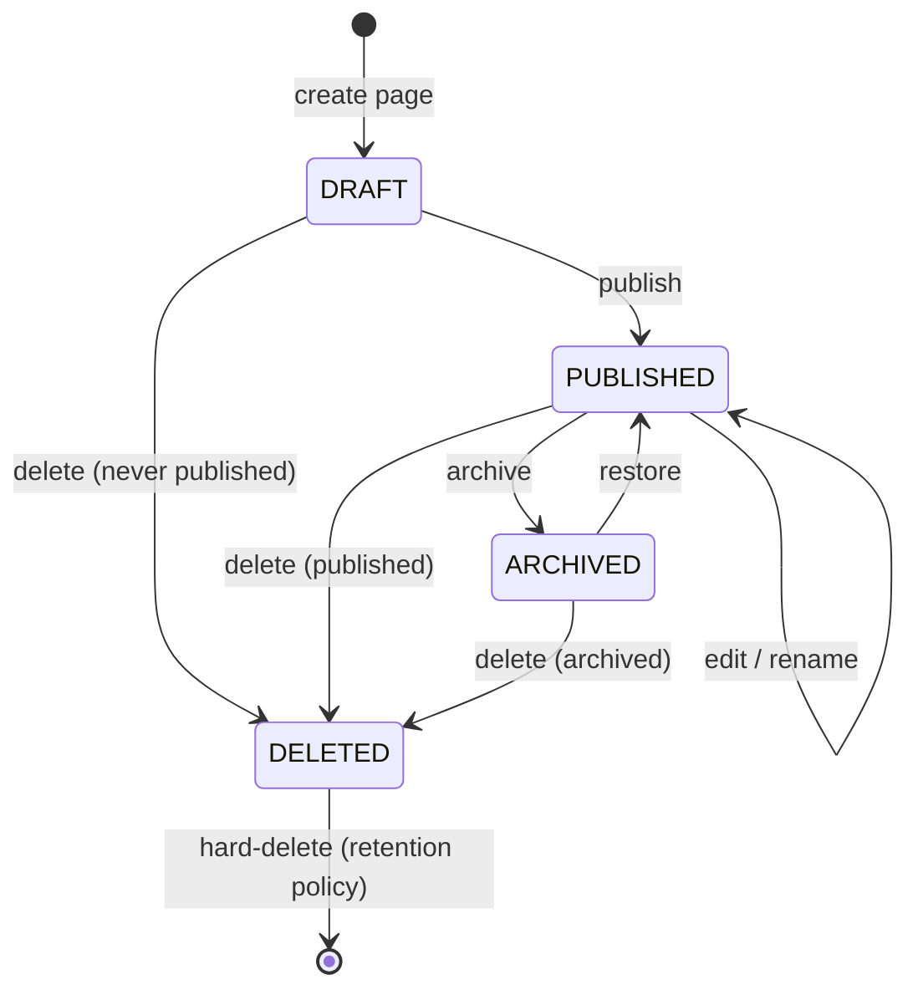

# Page Lifecycle State Machine

## State Diagram

## Transition Table

All transitions are driven by user intent expressed through the domain API. The Page aggregate enforces these rules.

| From | To | Intent | Preconditions | Side Effects |
|------|----|--------|---------------|--------------|
| `[*]` | `DRAFT` | Create | User is a workspace member; parent page (if any) exists and is not archived/deleted; sibling name uniqueness | Page is created with `DRAFT` state; tree edge is created linking to parent or workspace root |
| `DRAFT` | `PUBLISHED` | Publish | User has edit permission | `updatedAt` timestamp updated; content version snapshotted; page becomes visible to workspace members |
| `DRAFT` | `DELETED` | Delete | User has delete permission | Page is soft-deleted; no archive step since page was never visible to other members |
| `PUBLISHED` | `PUBLISHED` | Edit/Rename | User has edit permission; parent page is not archived; sibling name uniqueness on rename | `updatedAt` timestamp updated; content version snapshotted on content change |
| `PUBLISHED` | `ARCHIVED` | Archive | User has archive permission | `archivedAt` timestamp recorded; all descendant pages are recursively archived; page hidden from navigation tree except archive view |
| `PUBLISHED` | `DELETED` | Delete | User has delete permission; no invariant violations | `deletedAt` timestamp recorded; page hidden from all views; descendant pages also deleted |
| `ARCHIVED` | `PUBLISHED` | Restore | User has restore permission; no ancestor is archived or deleted | `archivedAt` cleared; all recursively archived descendants are restored; page reappears in navigation tree |
| `ARCHIVED` | `DELETED` | Delete | User has delete permission | `deletedAt` timestamp recorded; same side effects as delete from published |
| `DELETED` | `[*]` | Hard-delete | Retention period elapsed; system-initiated | Page and all associated data (content, tree edges) are permanently removed; this is never user-initiated |

## Failure Modes

| Intent | Failure Scenario | Expected Domain Behavior | User Outcome |
|--------|------------------|--------------------------|--------------|
| Create | Parent page is archived or deleted | Transition rejected. Precondition: parent must be in `PUBLISHED` or `DRAFT` state. | Error: "Cannot create page under an archived or deleted page." |
| Create | Sibling name collision | Transition rejected. Precondition: name must be unique within the parent scope. | Error: "A page with this name already exists in this location." |
| Create | User is not a workspace member | Transition rejected. Membership validation fails before aggregate is loaded. | Error: "You do not have access to this workspace." |
| Publish | DRAFT page has empty content | May be permitted (empty pages are valid) or configurable per workspace policy. If rejected: | Error: "Cannot publish an empty page." (if workspace policy requires content) |
| Archive | Page is already archived | Transition rejected. `canTransitionTo(ARCHIVED)` returns false for `ARCHIVED` state. | Error: "Page is already archived." |
| Restore | Restoring to an archived parent | Transition rejected. Precondition requires all ancestors to be published/draft. | Error: "Cannot restore page while its parent is archived. Restore the parent first." |
| Restore | Page is not archived | Transition rejected. `canTransitionTo(PUBLISHED)` returns false for non-archived states. | Error: "Only archived pages can be restored." |
| Delete | Page is already deleted | Transition rejected. `canTransitionTo(DELETED)` returns false for `DELETED` state. | Error: "Page is already deleted." |
| Delete | User lacks delete permission | Transition rejected based on role. | Error: "You do not have permission to delete pages in this workspace." |
| Any | Workspace not found | Operation fails before aggregate loading. | Error: "Workspace not found." |
| Any | Page not found within workspace | Aggregate not found. | Error: "Page not found." |
