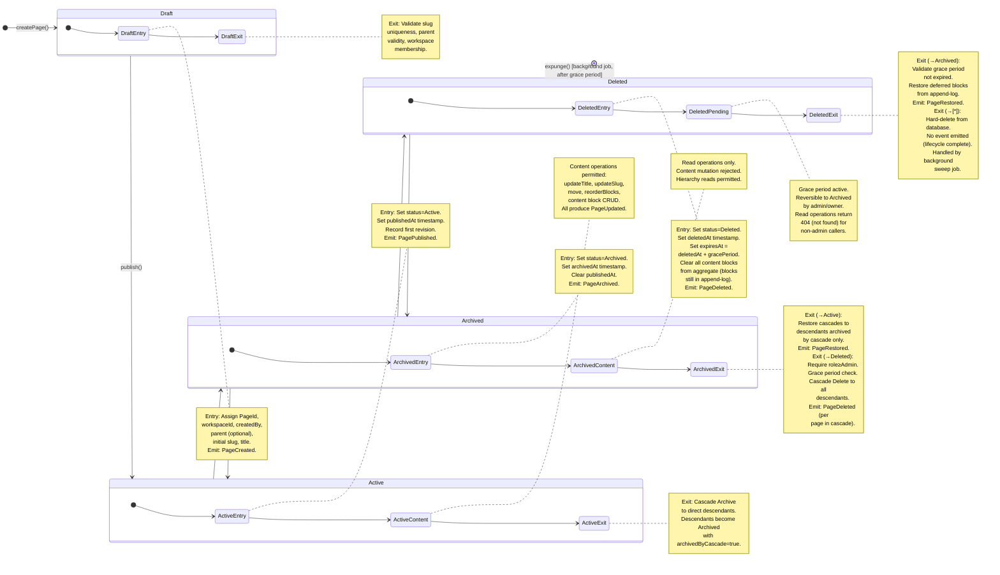

# Page Lifecycle State Machine

> **Artifact:** 03-page-lifecycle-state-machine.md  
> **Feature Slice:** Workspace + Page Lifecycle  
> **Status:** Planning — third mandatory artifact  
> **Preceded by:** [02-domain-model.md](./02-domain-model.md)  
> **Source of truth for:** API command handling, frontend lifecycle UI controls, event emission contracts, error message catalog.
> **Blocked by:** [02-domain-model.md](./02-domain-model.md) — all transitions reference concepts defined in the canonical domain model.

---

## 1. State Diagram



---

## 2. Lifecycle State Definitions

| State | Mutability | Visibility | Description |
|-------|-----------|------------|-------------|
| **Draft** | Full read/write (creator only) | Creator + workspace admins/owners | Initial state immediately after creation. Page has a title, slug, and content blocks but is not yet visible to regular workspace members. Only the creator and workspace admins/owners can view or edit. |
| **Active** | Full read/write (members with edit permission) | All workspace members (read) + edit-permitted actors | The standard operational state. Page is fully visible in the workspace tree, searchable, and editable by authorized members. Content operations (update title, slug, move, reorder blocks, block CRUD) are permitted. |
| **Archived** | Read-only (all actors), no content mutation | All workspace members (read) — hidden from default views | Soft-deleted state. The page is hidden from default tree views and search results but remains accessible via direct link or explicit "show archived" toggle. Content mutation is rejected. Reversible via restore. |
| **Deleted** | No access (404 for non-admin callers, aggregate blocks cleared) | Admins/owners only (within grace period) | Hard-deleted state pending permanent removal. A grace period (default 30 days) allows admin/owner recovery. After the grace period expires, a background job permanently expunges the page. Content blocks are cleared from the aggregate (retained in the append-only revision log for potential recovery). |

---

## 3. Transition Table

| ID | Trigger | From | To | Side Effects | Validation | Failure |
|----|---------|------|----|--------------|------------|---------|
| T01 | `createPage()` | `[*]` | `Draft` | Assign `PageId` (GUID v4). Set `workspaceId` (immutable). Set `createdBy`/`createdAt` via `AuditInfo`. Assign initial `Slug`. Set `PageParent` (optional). Initialize empty `ContentBlock[]` and `RevisionMetadata` (version 1). **Emit:** `PageCreated(pageId, workspaceId, createdBy, parentId?)`. | Actor is authenticated. Actor is member of target workspace (role ≥ Member). Slug is unique within workspace (INV-04). Parent (if set) exists, is in same workspace (INV-06), and hierarchy is acyclic (INV-05). Workspace allows new pages (no capacity/disable flag). | `UNAUTHORIZED` — unauthenticated request. `FORBIDDEN` — actor not a workspace member. `SLUG_CONFLICT` — slug not unique. `INVALID_PARENT` — parent not found, wrong workspace, or would create cycle. `WORKSPACE_LIMIT_REACHED` — workspace capacity exceeded. |
| T02 | `publish()` | `Draft` | `Active` | Set `status=Active`. Set `publishedAt` timestamp. Record first revision (version 1, changeType: Published). **Emit:** `PagePublished(pageId, workspaceId, publishedBy)`. | Actor is the page creator OR has role ≥ Admin in the workspace. Slug remains unique (no concurrent creation of duplicate slug). | `FORBIDDEN` — actor is not the creator and not admin/owner. `SLUG_CONFLICT` — slug was taken by another page during draft period. `NOT_FOUND` — page does not exist. |
| T03 | `updateTitle(title)` | `Active` | `Active` | Update `PageTitle`. Increment revision version (`RevisionMetadata.increment()`). Set `editedAt`/`editedBy` via `AuditInfo.touch(modifier)`. **Emit:** `PageUpdated(pageId, workspaceId, change: TitleChanged, revision)`. | Actor has edit permission on the page (role ≥ Member). New title passes `PageTitle` validation (VO-03: 1–500 chars, non-empty, non-whitespace). Page not locked by concurrent edit conflict. | `FORBIDDEN` — insufficient role. `INVALID_TITLE` — validation failed. `CONFLICT` — concurrent edit detected (optimistic concurrency). `INVALID_STATE` — page is not Active. |
| T04 | `updateSlug(slug)` | `Active` | `Active` | Update `Slug`. Increment revision version. Touch `AuditInfo`. **Emit:** `PageUpdated(pageId, workspaceId, change: SlugChanged, revision)`. | Actor has edit permission. New slug passes `Slug` validation (VO-01). Slug is unique within workspace (INV-04). | `FORBIDDEN` — insufficient role. `INVALID_SLUG` — validation failed. `SLUG_CONFLICT` — slug not unique. `INVALID_STATE` — page is not Active. |
| T05 | `move(newParent)` | `Active` | `Active` | Update `PageParent` to new parent reference. Increment revision version. Touch `AuditInfo`. **Emit:** `PageMoved(pageId, workspaceId, oldParentId, newParentId)`. | Actor has edit permission. New parent exists, is in same workspace (INV-06), and move does not create a cycle (INV-05). New parent is not Archived or Deleted. | `FORBIDDEN` — insufficient role. `INVALID_PARENT` — parent not found, wrong workspace, or would create cycle. `PARENT_INACTIVE` — target parent is not Active. `INVALID_STATE` — page is not Active. |
| T06 | `reorderBlocks(orderedIds)` | `Active` | `Active` | Replace `ContentBlock[]` with new ordering. Assign gap-free positions 0..n-1. Increment revision version. Touch `AuditInfo`. **Emit:** `PageUpdated(pageId, workspaceId, change: BlocksReordered, revision)`. | Actor has edit permission. All block IDs in `orderedIds` exist on the page. No duplicate or missing IDs. | `FORBIDDEN` — insufficient role. `INVALID_BLOCK_ORDER` — missing, duplicate, or unknown block IDs. `INVALID_STATE` — page is not Active. |
| T07 | `updateBlocks(blocks)` | `Active` | `Active` | Replace `ContentBlock[]` in full. Assign gap-free positions. Increment revision version. Touch `AuditInfo`. For each added/removed/changed block, determine `ChangeType` (BlockAdded, BlockRemoved, ContentChanged). **Emit:** `PageUpdated(pageId, workspaceId, change: ContentChanged, revision)`. | Actor has edit permission. Each block passes `BlockData.isValid()`. Total block count does not exceed page block limit. | `FORBIDDEN` — insufficient role. `INVALID_BLOCK` — one or more blocks failed validation. `BLOCK_LIMIT_EXCEEDED` — too many blocks. `INVALID_STATE` — page is not Active. |
| T08 | `archive()` | `Active` | `Archived` | Set `status=Archived`. Set `archivedAt` timestamp. Clear `publishedAt`. **Cascade:** `PageHierarchyService.cascadeToDescendants(pageId, CascadeOperation.Archive)` — all direct and indirect descendants become Archived with flag `archivedByCascade=true`. Increment revision version. Touch `AuditInfo`. **Emit:** `PageArchived(pageId, workspaceId, archivedBy)` for this page + one `PageArchived` per cascaded descendant. | Actor has role ≥ Member in the workspace. Page is not already archived (no-op guard). | `FORBIDDEN` — insufficient role. `INVALID_STATE` — page is not Active (e.g., already Archived or Deleted). `NOT_FOUND` — page does not exist. |
| T09 | `restore()` | `Archived` | `Active` | Set `status=Active`. Clear `archivedAt`. Set `publishedAt` to current time (re-published). **Cascade:** `PageHierarchyService.cascadeToDescendants(pageId, CascadeOperation.Restore)` — only descendants whose `archivedByCascade=true` are restored. Descendants that were independently archived are NOT auto-restored (must be restored individually). Increment revision version. Touch `AuditInfo`. **Emit:** `PageRestored(pageId, workspaceId, restoredBy)` for this page + one `PageRestored` per restored descendant. | Actor has role ≥ Member in the workspace. Page is in Archived state. | `FORBIDDEN` — insufficient role. `INVALID_STATE` — page is not Archived (e.g., Active or Deleted). `NOT_FOUND` — page does not exist. |
| T10 | `delete()` | `Archived` | `Deleted` | Set `status=Deleted`. Set `deletedAt` timestamp. Set `expiresAt = deletedAt + gracePeriod` (default: 30 days, configurable per workspace via `WorkspaceSettings.archiveAfterDays`). Clear `ContentBlock[]` from aggregate (blocks preserved in append-only revision log). **Cascade:** `PageHierarchyService.cascadeToDescendants(pageId, CascadeOperation.Delete)` — all descendants become Deleted with `expiresAt` inherited from root. Increment revision version. Touch `AuditInfo`. **Emit:** `PageDeleted(pageId, workspaceId, deletedBy)` for this page + one `PageDeleted` per cascaded descendant. | Actor has role ≥ Admin (Admin or Owner). Grace period confirmation: if `WorkspaceSettings.archiveAfterDays` > 0, caller must explicitly confirm (secondary confirmation step). Page is in Archived state. | `FORBIDDEN` — insufficient role (Member cannot delete). `INVALID_STATE` — page is not Archived (e.g., Active or Deleted). `CONFIRMATION_REQUIRED` — grace period is configured and caller did not provide explicit confirmation. `NOT_FOUND` — page does not exist. |
| T11 | `restoreFromDeleted()` | `Deleted` | `Archived` | Set `status=Archived`. Set `archivedAt` timestamp (re-archive timestamp). Clear `deletedAt` and `expiresAt`. Restore `ContentBlock[]` from append-only revision log (latest revision before deletion). **Cascade:** `PageHierarchyService.cascadeToDescendants(pageId, CascadeOperation.Restore)` — all descendants that were cascade-deleted are restored to Archived (not Active — prevents accidental mass un-archiving). Descendants independently deleted must be restored individually. Touch `AuditInfo`. **Emit:** `PageRestored(pageId, workspaceId, restoredBy)` for this page + one `PageRestored` per restored descendant. | Actor has role ≥ Admin (Admin or Owner). Page is in Deleted state. Current time < `expiresAt` (grace period has not elapsed). | `FORBIDDEN` — insufficient role. `INVALID_STATE` — page is not Deleted. `GRACE_PERIOD_EXPIRED` — grace period has elapsed; page must be recovered through data recovery procedure (out of band). `NOT_FOUND` — page does not exist. |
| T12 | `expunge()` | `Deleted` | `[*]` | Hard-delete page record and all associated data from database (page row, revision log, event outbox entries already consumed). **No cascade needed** — descendants already deleted and will also be expunged by individual sweep. **No event emitted** — lifecycle is complete. | System background job. Current time >= `expiresAt`. Page is in Deleted state. | `INVALID_STATE` — page is not Deleted (skip). `GRACE_PERIOD_NOT_ELAPSED` — grace period still active (skip and retry later). |
| T13 | `move(newParent)` | `Archived` | `Archived` | Update `PageParent` to new parent reference. **Note:** Moving an Archived page is permitted (for reorganization before bulk restore). Increment revision version. Touch `AuditInfo`. **Emit:** `PageMoved(pageId, workspaceId, oldParentId, newParentId)`. | Actor has role ≥ Admin. New parent exists, is in same workspace (INV-06), and move does not create a cycle (INV-05). New parent may be Active or Archived. | `FORBIDDEN` — insufficient role (Member cannot move archived pages). `INVALID_PARENT` — parent not found, wrong workspace, or would create cycle. `INVALID_STATE` — page is not Archived. |
| T14 | `restore()` | `Deleted` | `Archived` | (See T11 — alias for clarity in cross-references.) | | |

---

## 4. Content Operation Permissions by State

| Operation | Draft | Active | Archived | Deleted |
|-----------|-------|--------|----------|---------|
| **View** (read title, blocks, metadata) | Creator + Admin/Owner only | All workspace members | All workspace members | Admin/Owner only (within grace period), 404 for others |
| **Update title** | Creator + Admin/Owner | Member+ | ❌ Rejected | ❌ Rejected |
| **Update slug** | Creator + Admin/Owner | Member+ | ❌ Rejected | ❌ Rejected |
| **Move (change parent)** | Creator + Admin/Owner | Member+ | Admin+ only | ❌ Rejected |
| **Reorder blocks** | Creator + Admin/Owner | Member+ | ❌ Rejected | ❌ Rejected |
| **Add/remove/edit blocks** | Creator + Admin/Owner | Member+ | ❌ Rejected | ❌ Rejected |
| **Archive** | ❌ Must publish first | Member+ | ❌ N/A | ❌ Rejected |
| **Restore** | ❌ N/A | ❌ N/A | Member+ | Admin+ (within grace period) |
| **Delete** | Creator + Admin/Owner (→Deleted directly, skips Archived) | ❌ Must archive first | Admin+ | ❌ N/A (already deleted) |
| **Expunge** | ❌ N/A | ❌ N/A | ❌ N/A | System only (background job) |

> **Note on Draft → Deleted:** If a page is in Draft state and has never been published, a user with role ≥ Admin may delete it directly (transition Draft → Deleted), bypassing the Archive state. This is a special-case shortcut because an unpublished draft has no published visibility to protect via archiving.

---

## 5. Failures Table

| Failure Code | HTTP Status | Domain Condition | System Behavior | User-Facing Message |
|-------------|-------------|-----------------|----------------|---------------------|
| `UNAUTHORIZED` | 401 | Request lacks valid authentication credentials (missing/invalid JWT). | Reject immediately before any domain logic. No event emitted. | "You must sign in to perform this action." |
| `FORBIDDEN` | 403 | Authenticated actor does not have the required `WorkspaceRole` for the operation (e.g., Member attempting to delete). | Reject at authorization gate. No state change. Log warning. | "You don't have permission to [action] this page." |
| `NOT_FOUND` | 404 | Page with the given `PageId` does not exist, or caller is in a role/state that hides the page (e.g., non-admin viewing a Deleted page). | Reject. Do not reveal whether the page exists vs. is hidden (prevents enumeration). | "Page not found." |
| `SLUG_CONFLICT` | 409 | Proposed slug violates workspace-scoped uniqueness constraint (INV-04). | Reject. Suggest alternative slug via `SlugUniquenessService`. | "A page with this URL already exists. Use a different slug." |
| `INVALID_TITLE` | 422 | Title fails `PageTitle` validation (VO-03: empty, whitespace-only, or exceeds 500 characters). | Reject. Return validation errors. | "Title must be between 1 and 500 characters and cannot be empty." |
| `INVALID_SLUG` | 422 | Slug fails format validation (VO-01: invalid characters, leading/trailing hyphen, length out of bounds). | Reject. Return format rules. | "Slug must be lowercase letters, numbers, and hyphens only (1–200 characters)." |
| `INVALID_PARENT` | 422 | Parent page does not exist, belongs to a different workspace (INV-06), or move would create a cycle (INV-05). | Reject. No state change. | "Cannot move page to the selected parent. The parent may not exist, is in a different workspace, or would create a circular hierarchy." |
| `PARENT_INACTIVE` | 422 | Target parent page is not in Active state (e.g., Archived or Deleted). | Reject. No state change. | "Cannot move page under a parent that is archived or deleted." |
| `INVALID_STATE` | 422 | The current page status does not permit the requested transition (e.g., trying to archive an already-archived page, or update blocks on an Archived page). | Reject. No state change. | "This action is not available while the page is in its current state." |
| `INVALID_BLOCK_ORDER` | 422 | Provided block ID list contains missing, duplicate, or unknown IDs. | Reject. Return offending IDs. | "Invalid block order: some block IDs are missing or duplicated." |
| `INVALID_BLOCK` | 422 | One or more content blocks failed `BlockData.isValid()` validation (e.g., missing required fields, URL format invalid). | Reject. Return per-block validation errors. | "One or more blocks contain invalid data. Check the highlighted blocks." |
| `BLOCK_LIMIT_EXCEEDED` | 422 | Total block count exceeds the configured per-page limit. | Reject. No partial write. | "Page block limit reached. Remove some blocks before adding new ones." |
| `CONFIRMATION_REQUIRED` | 428 | Operation requires explicit confirmation (e.g., delete when grace period is configured, or mass-cascade delete). | Reject. Return `confirmationToken` or required confirmation fields. Frontend must prompt user. | "This action will permanently delete this page and all its subpages. Please confirm to proceed." |
| `CONFLICT` | 409 | Optimistic concurrency conflict — the page was modified by another session since the client last read it. | Reject. Return current `versionNumber` and `editedAt`. Client should refresh and retry. | "The page was modified by another user. Please reload and try again." |
| `GRACE_PERIOD_EXPIRED` | 410 | Attempt to restore a Deleted page whose grace period has elapsed. | Reject. Page is queued for expunge (or already expunged). | "The deletion grace period has expired and this page can no longer be restored." |
| `WORKSPACE_LIMIT_REACHED` | 422 | Workspace has reached its maximum page capacity. | Reject. No state change. | "This workspace has reached its page limit. Remove or archive pages before creating new ones." |
| `PARENT_NOT_FOUND` | 404 | Parent page specified during creation or move does not exist. | Reject. No state change. | "The selected parent page was not found." |
| `PARENT_INVALID_WORKSPACE` | 422 | Parent page belongs to a different workspace than the target page (INV-06 violation). | Reject. No state change. | "The parent page must be in the same workspace." |

### 5.1 Failure Mapping Strategy

All failures are designed as a closed `OneOf` / discriminated union for the API layer:

```typescript
type PageCommandError =
  | { code: 'UNAUTHORIZED' }
  | { code: 'FORBIDDEN'; requiredRole: WorkspaceRole }
  | { code: 'NOT_FOUND' }
  | { code: 'SLUG_CONFLICT'; suggestedSlug?: string }
  | { code: 'INVALID_TITLE'; validationErrors: string[] }
  | { code: 'INVALID_SLUG'; validationErrors: string[] }
  | { code: 'INVALID_PARENT'; reason: 'not_found' | 'wrong_workspace' | 'would_create_cycle' }
  | { code: 'PARENT_INACTIVE' }
  | { code: 'INVALID_STATE'; currentState: PageStatus; expectedStates: PageStatus[] }
  | { code: 'INVALID_BLOCK'; offendingBlockIds: string[]; validationErrors: Record<string, string[]> }
  | { code: 'BLOCK_LIMIT_EXCEEDED'; limit: number; current: number }
  | { code: 'CONFIRMATION_REQUIRED'; confirmationToken: string }
  | { code: 'CONFLICT'; currentVersion: number; editedAt: string }
  | { code: 'GRACE_PERIOD_EXPIRED'; deletedAt: string; expiresAt: string }
  | { code: 'WORKSPACE_LIMIT_REACHED'; limit: number }
  | { code: 'PARENT_NOT_FOUND' }
  | { code: 'PARENT_INVALID_WORKSPACE' };
```

This enables:
- **Type-safe API handlers** — exhaustiveness checking on `code` discriminator
- **Consistent UI messaging** — each code maps to a localized message template + optional contextual data
- **Idempotent retry** — `CONFLICT` includes current version for client refresh
- **Progressive disclosure** — validation errors carry structured details (offending IDs, field-level messages)

---

## 6. Illegal Transitions

| Transition | Justification for Illegality |
|-----------|------------------------------|
| **Draft → Archived** | A draft that has never been published cannot be archived. Archiving is a visibility-hiding mechanism for content that was once public. The page must first be published (→ Active) or deleted directly (→ Deleted, admin shortcut). |
| **Draft → Draft** | No-op. The system must reject duplicate `publish()` calls or detect idempotency via client-supplied idempotency key. |
| **Active → Draft** | Lifecycle is unidirectional forward. A published page cannot re-enter draft — content changes are tracked via revisions, not state rollback. If unpublishing is desired, use Archive (which is reversible). |
| **Active → Deleted** | Active pages must be archived first before deletion. This two-step process (Active → Archived → Deleted) provides a safety net — users must explicitly confirm the archive step before reaching the destructive delete action. Prevents accidental permanent deletion of live content. |
| **Archived → Draft** | Same rationale as Active → Draft. Archived pages can be restored (→ Active) but cannot re-enter draft. |
| **Deleted → Active** | A deleted page can only be restored to Archived (via T11/T14), not directly to Active. This prevents silent mass- reactivation of deleted content — restoring to Archived requires an explicit second `restore()` call if the user wants the page active again. This two-step recovery reduces accidental cascade restoration. |
| **Deleted → Deleted** | No-op. Reject duplicate `delete()` calls. |
| **Deleted → [*] (via user action)** | Expunge is a system-only operation. Users cannot permanently delete a page within the grace period — only the background sweep job may transition Deleted → [*]. This guarantees the grace period is always honored. |
| **[Any] → [*] (non-expunge)** | The terminal state `[*]` is only reachable via the `expunge()` system job. No user-facing command may transition to `[*]`. |

### 6.1 State Machine Transition Matrix

| From \ To | Draft | Active | Archived | Deleted | [*] |
|-----------|-------|--------|----------|---------|-----|
| **[new]** | ✅ `createPage()` | ❌ | ❌ | ❌ | ❌ |
| **Draft** | ❌ No-op | ✅ `publish()` | ❌ Illegal | ✅ `delete()` (admin shortcut) | ❌ |
| **Active** | ❌ Illegal | ❌ No-op | ✅ `archive()` | ❌ Illegal | ❌ |
| **Archived** | ❌ Illegal | ✅ `restore()` | ❌ No-op | ✅ `delete()` (admin+) | ❌ |
| **Deleted** | ❌ Illegal | ❌ Illegal | ✅ `restoreFromDeleted()` (admin+, within grace) | ❌ No-op | ✅ `expunge()` (system only) |
| **[*]** | ❌ | ❌ | ❌ | ❌ | ❌ |

---

## 7. Trigger Reference

| Trigger | Command Object | Affected States | Description |
|---------|---------------|-----------------|-------------|
| `createPage()` | `CreatePageCommand { workspaceId, title, slug, parentId?, createdBy }` | → Draft | Create a new page in the workspace. Returns `PageId`. |
| `publish()` | `PublishPageCommand { pageId, publishedBy }` | Draft → Active | Make the page visible to all workspace members. |
| `updateTitle()` | `UpdateTitleCommand { pageId, title, updatedBy, expectedVersion }` | Active → Active | Change the page title. |
| `updateSlug()` | `UpdateSlugCommand { pageId, slug, updatedBy, expectedVersion }` | Active → Active | Change the page slug. Increments revision. |
| `move()` | `MovePageCommand { pageId, newParentId, movedBy, expectedVersion }` | Active → Active, Archived → Archived | Reparent the page within the workspace hierarchy. Validates acyclicity (INV-05). |
| `reorderBlocks()` | `ReorderBlocksCommand { pageId, orderedBlockIds, reorderedBy, expectedVersion }` | Active → Active | Reorder existing content blocks. |
| `updateBlocks()` | `UpdateBlocksCommand { pageId, blocks, updatedBy, expectedVersion }` | Active → Active | Full replacement of content blocks. |
| `archive()` | `ArchivePageCommand { pageId, archivedBy }` | Active → Archived | Soft-delete the page. Hides from default views, cascades to descendants. |
| `restore()` | `RestorePageCommand { pageId, restoredBy }` | Archived → Active | Restore an archived page to active. Cascades to cascade-archived descendants only. |
| `delete()` | `DeletePageCommand { pageId, deletedBy, confirmationToken? }` | Archived → Deleted | Hard-delete the page (within grace period). Cascades to descendants. |
| `restoreFromDeleted()` | `RestoreFromDeletedCommand { pageId, restoredBy }` | Deleted → Archived | Recover a deleted page during grace period. Restores to Archived (not Active). |
| `expunge()` | System background sweep job | Deleted → [*] | Permanently remove expired pages from the database. |

---

## 8. Grace Period Semantics

| Property | Value | Notes |
|----------|-------|-------|
| **Default grace period** | 30 days | Measured in calendar days from `deletedAt`. |
| **Configurable per workspace** | Yes | `WorkspaceSettings.archiveAfterDays` (0 = no grace period, immediate eligibility for expunge). Value `0` still allows manual restore until the sweep job runs (≈ eventual consistency). |
| **Restore window** | `[deletedAt, deletedAt + gracePeriod)` | Window closes when the background sweep job processes the page (≈ periodic, not exact). |
| **Expunge eligibility** | `deletedAt + gracePeriod <= now` | Checked by background sweep job. |
| **Owner override** | No | Even an Owner cannot restore a page after the grace period expires. Recovery requires out-of-band data restoration by system administrators. |

---

## 9. Domain Event Emission Summary

| Transition | Events Emitted | Cascade Events |
|------------|---------------|----------------|
| `[*] → Draft` | `PageCreated` | None |
| `Draft → Active` | `PagePublished` | None |
| `Active → Active` (content) | `PageUpdated` (with appropriate `ChangeType`) | None |
| `Active → Active` (move) | `PageMoved` | None |
| `Active → Archived` | `PageArchived` | `PageArchived` per descendant (if cascade enabled) |
| `Archived → Active` | `PageRestored` | `PageRestored` per cascade-restored descendant |
| `Archived → Deleted` | `PageDeleted` | `PageDeleted` per cascaded descendant |
| `Deleted → Archived` | `PageRestored` | `PageRestored` per cascade-restored descendant |
| `Deleted → [*]` | None (lifecycle complete) | None |

### 9.1 Event Payload Mapping

| Event | Payload Fields | Maps To (Domain Model) |
|-------|---------------|------------------------|
| `PageCreated` | `{ pageId, workspaceId, createdBy, parentId?, occurredAt }` | `Page` constructor, `AuditInfo` |
| `PagePublished` | `{ pageId, workspaceId, publishedBy, occurredAt }` | `Draft → Active` transition |
| `PageUpdated` | `{ pageId, workspaceId, changeDescription, revisionMetadata, occurredAt }` | `RevisionMetadata`, `ChangeDescription`, `ChangeType` |
| `PageMoved` | `{ pageId, workspaceId, oldParentId, newParentId, occurredAt }` | `Page.move()`, `PageParent` |
| `PageArchived` | `{ pageId, workspaceId, archivedBy, occurredAt }` | `Page.archive()`, `PageStatus.Archived` |
| `PageRestored` | `{ pageId, workspaceId, restoredBy, occurredAt }` | `Page.restore()`, `PageStatus.Active` or `Archived` |
| `PageDeleted` | `{ pageId, workspaceId, deletedBy, occurredAt }` | `Page.delete()`, `PageStatus.Deleted` |

---

## 10. Cross-Reference: Domain Model Concepts

Every concept in this state machine maps to a defined element in [02-domain-model.md](./02-domain-model.md):

| State Machine Concept | Domain Model Element | Section |
|----------------------|---------------------|---------|
| PageStatus (Draft, Active, Archived, Deleted) | `PageStatus` value object (enum) | §2 Concepts Table, §4 State Machine |
| Draft state | Implied by `Page.create()` + deferred publish; `PageStatus` does not list Draft explicitly — extended here for MVP | §4 State Machine (this document) |
| createPage() | `Page.create(workspaceId, title, slug, parent, createdBy)` | §1 Class Diagram |
| publish() | New transition not in original model — introduced to distinguish Draft→Active from create | §4 State Machine (this document) |
| archive() | `Page.archive()` | §1 Class Diagram |
| restore() | `Page.restore()` (Archived→Active), `Page.restoreDeleted()` (Deleted→Archived) | §1 Class Diagram |
| delete() | `Page.delete()` | §1 Class Diagram |
| expunge() | Implicit in domain model ("hard-delete from database") | §4 State Machine |
| Cascade behavior | `PageHierarchyService.cascadeToDescendants(rootPageId, operation: CascadeOperation)` | §1 Class Diagram |
| CascadeOperation.Archive | `CascadeOperation.Archive` | §1 Class Diagram |
| CascadeOperation.Restore | `CascadeOperation.Restore` | §1 Class Diagram |
| CascadeOperation.Delete | `CascadeOperation.Delete` | §1 Class Diagram |
| Validation: slug uniqueness | `SlugUniquenessService.isPageSlugAvailable()` | §1 Class Diagram |
| Validation: acyclic hierarchy | `PageHierarchyService.validateMove(), isAcyclic()` | §1 Class Diagram |
| Validation: same workspace parent | INV-06, `PageParent` constructor | §6.1 Invariants |
| Domain events | `PageCreated`, `PageUpdated`, `PageArchived`, `PageRestored`, `PageDeleted`, `PageMoved` | §1 Class Diagram, §8 Event Spec |
| Revision tracking | `RevisionMetadata`, `ChangeDescription`, `ChangeType` | §1 Class Diagram |
| Audit trail | `AuditInfo.touch(modifier)` | §1 Class Diagram |
| Grace period | `WorkspaceSettings.archiveAfterDays` | §2 Concepts Table |
| Role-based authorization | `WorkspaceRole` (Owner, Admin, Member) | §2 Concepts Table |
| Content block operations | `ContentBlock`, `BlockData`, `Position` (value objects) | §1 Class Diagram |
| Page identity | `PageId` (GUID v4) | §9 Identity Strategy |
| Concurrent edit detection | `RevisionMetadata.versionNumber` (optimistic concurrency) | §1 Class Diagram, §6 Design Rules |

---

## 11. Consistency with NFRs

| NFR | How This Document Satisfies It |
|-----|-------------------------------|
| **State definitions are deterministic and mutually exclusive.** | The state machine defines four explicit states (Draft, Active, Archived, Deleted). At any point in time, a page occupies exactly one state. The transition matrix in §6.1 provides a complete enumeration of all possible transitions, with illegal transitions explicitly documented and justified. No two states overlap. |
| **Transition definitions avoid ambiguous guard logic.** | Every transition in §3 specifies exactly: trigger, source state, target state, side effects (with cascade semantics), validation preconditions (with invariant references), and failure codes. Guards are single-condition or clearly composed (e.g., "role ≥ Admin AND grace period not expired"). No implicit or "else" fallthrough logic. |
| **Failure mapping is suitable for OneOf-style error handling and consistent UI messaging.** | §5 defines a closed discriminated union (`PageCommandError`) with 16 error codes, each carrying structured context data. Every code maps to a deterministic HTTP status, domain condition, system behavior, and user-facing message template. Frontend can switch on `code` for localized rendering without parsing free-form error text. |
| **Mermaid diagram renders and remains synchronized with transition table.** | The `stateDiagram-v2` in §1 mirrors the transition table in §3: every arrow in the diagram has a corresponding row in the table. Entry/exit notes in the diagram are expanded in §3 side-effect columns. If the transition table changes, the diagram MUST be updated in the same commit (enforced by code review). |

---

## 12. Revision History

| Date | Author | Change |
|------|--------|--------|
| 2026-07-16 | AI Agent | Initial version — complete state machine with mermaid diagram, transition table, failures table, illegal transitions, event mapping, and cross-references to domain model. |
