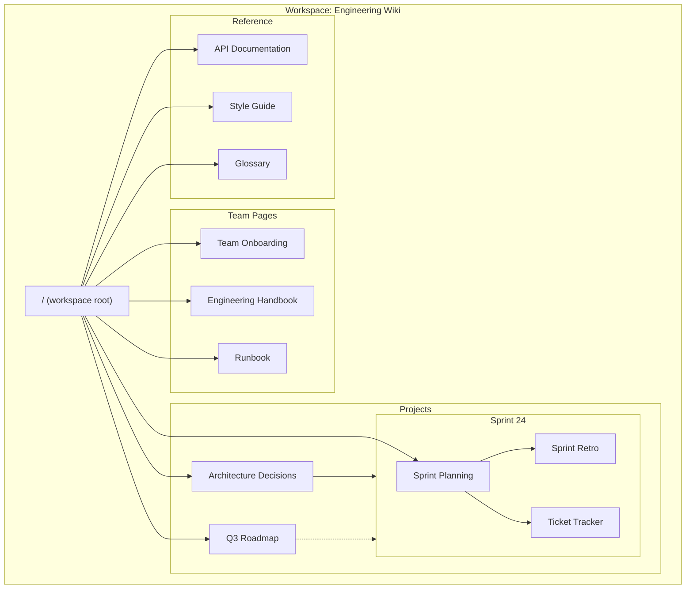
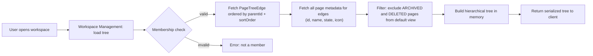
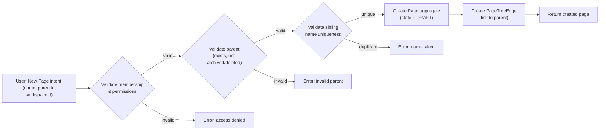
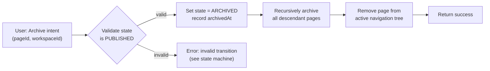
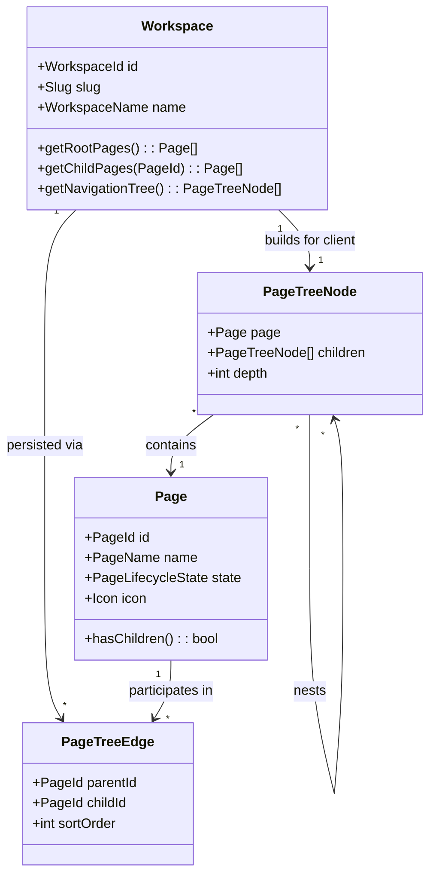

# Workspace Structure & Navigation

## Navigation Tree — Concrete Instance

## Read Path — Navigation Tree Loading

## Mutation Path — Create Page

## Mutation Path — Archive Page Flow

## Partial Domain Model — Navigation Focus

This diagram highlights the classes most relevant to workspace structure and navigation. It is a subset of the full domain model defined in `02-domain-model.md`.

## View Model Table

The following table describes the different views of the navigation tree and their content.

| View | Content | When Visible |
|------|---------|--------------|
| Active Tree | All pages with state `DRAFT` or `PUBLISHED`, organized hierarchically according to `PageTreeEdge` | Default view when a workspace is opened |
| Archive Tree | All pages with state `ARCHIVED`, organized hierarchically (preserving original parent-child structure) | When user explicitly opens archive view (e.g., "Trash" or "Archive" sidebar section) |
| Deleted List | All pages with state `DELETED`, flat list with deletion timestamp and remaining retention period | When user opens trash/deleted view; no hierarchy preserved |
| Search Results | Matching pages across all states (except `DELETED`), flat list ranked by relevance | When user performs a search query |
| Recent Pages | Pages the user has recently modified, flat list ordered by `updatedAt` descending | When user opens recent pages view or workspace switcher |
| Page Path (Breadcrumb) | Ancestor chain from workspace root to the current page, each with a link | When a single page is open; computed by walking parent edges upward |
