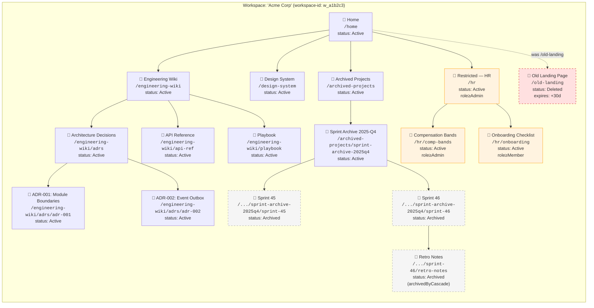
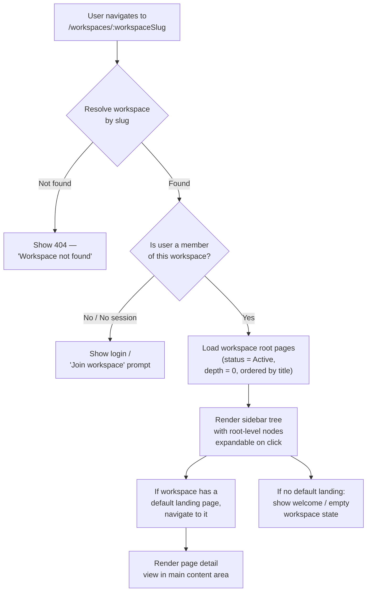
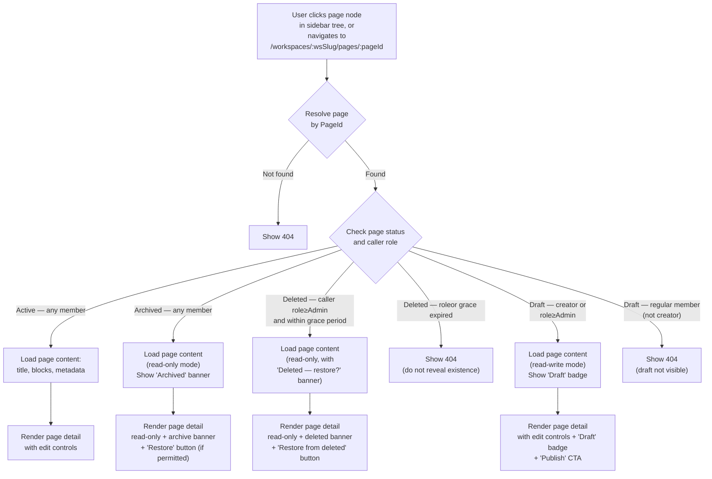
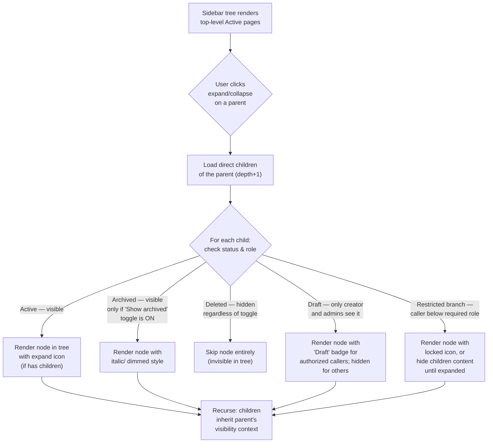
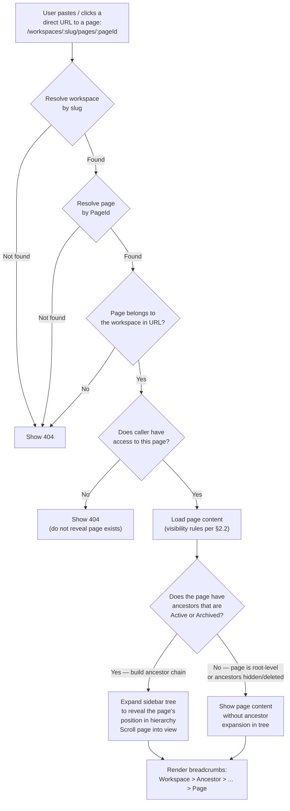
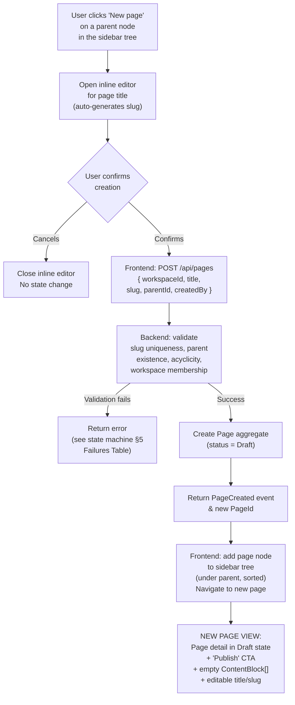
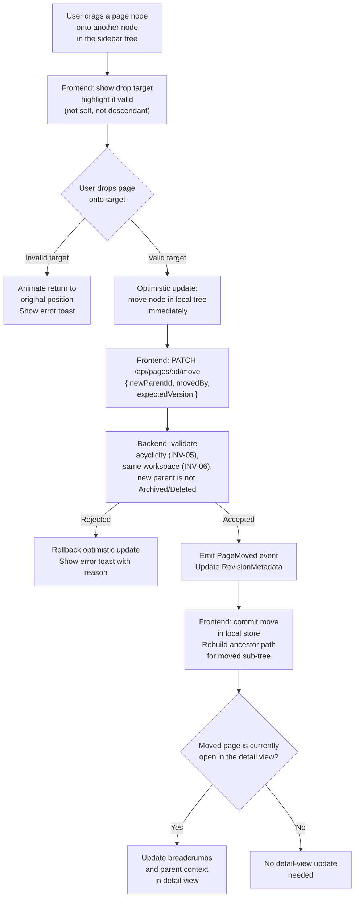
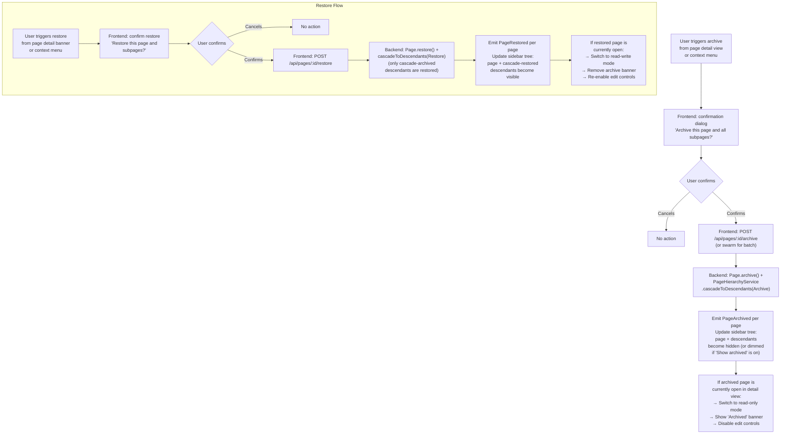
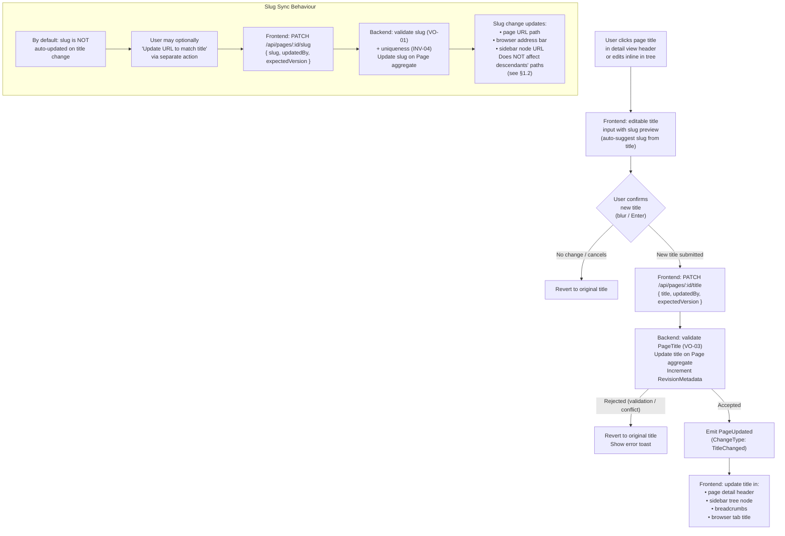
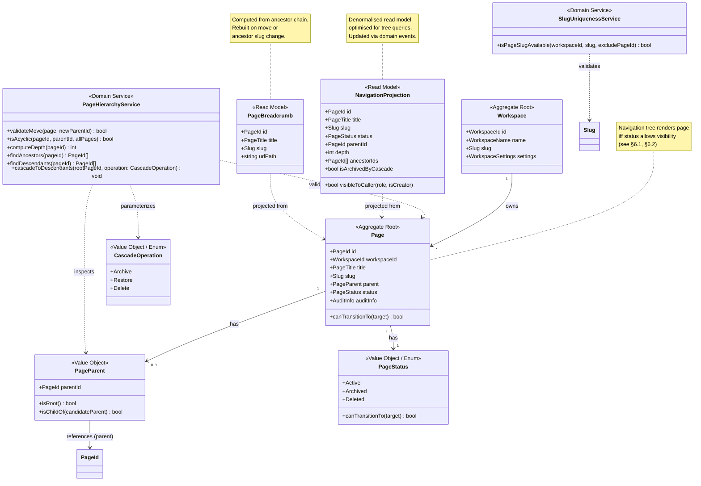

# Workspace Structure & Navigation

> **Artifact:** 04-workspace-structure-and-navigation.md  
> **Feature Slice:** Workspace + Page Lifecycle  
> **Status:** Planning — fourth mandatory artifact  
> **Preceded by:** [03-page-lifecycle-state-machine.md](./03-page-lifecycle-state-machine.md)  
> **Blocked by:** [03-page-lifecycle-state-machine.md](./03-page-lifecycle-state-machine.md) — navigation visibility and mutation pathways depend on lifecycle states defined in the state machine.  
> **Informs:** Frontend route/view composition, backend query shape requirements, accessibility annotations, E2E test scenarios.  
> **Source of truth for:** Navigation tree rendering rules, page finder/resolver logic, view state contracts.

---

## 1. Concrete Hierarchy Examples

The following diagram shows concrete structural instances of a workspace/page hierarchy. Each node represents a `Page` aggregate with its `PageStatus` (Active, Archived, Deleted) and an example slug. The tree illustrates root-level pages, nested children, an archived subtree, and a restricted branch.



### 1.1 Hierarchy Legend

| Visual Style | Meaning | Behaviour |
|-------------|---------|-----------|
| Solid border, white fill | `Active` page | Fully visible and navigable in the tree |
| Dashed border, grey fill | `Archived` page | Hidden from default tree; visible under "Show archived" toggle |
| Dashed border, red fill | `Deleted` page | Invisible to all but admins/owners within grace period |
| Orange border, light orange fill | Restricted branch | Requires `role ≥ Admin` or explicit permission to view/navigate |

### 1.2 Page Slug Paths

Each page's `slug` combined with its ancestor slugs forms a **URL path** that is unique within the workspace:

| Page | Slug | Full Path | Depth |
|------|------|-----------|-------|
| Home | `home` | `/home` | 0 |
| Engineering Wiki | `engineering-wiki` | `/engineering-wiki` | 0 |
| Architecture Decisions | `adrs` | `/engineering-wiki/adrs` | 1 |
| ADR-001 | `adr-001` | `/engineering-wiki/adrs/adr-001` | 2 |
| Sprint Archive 2025-Q4 | `sprint-archive-2025q4` | `/archived-projects/sprint-archive-2025q4` | 1 |
| Sprint 46 | `sprint-46` | `/archived-projects/sprint-archive-2025q4/sprint-46` | 2 |
| Retro Notes | `retro-notes` | `/archived-projects/sprint-archive-2025q4/sprint-46/retro-notes` | 3 |
| Compensation Bands | `comp-bands` | `/hr/comp-bands` | 1 |

> **Rule:** Paths are derived by joining ancestor slugs with `/`. The slug path is informational (for breadcrumbs and URL generation) but the `PageParent` reference (by `PageId`) is the authoritative hierarchy binding. Slug changes on ancestor pages do NOT automatically rename descendant paths — path recalculation is a read-model concern.

---

## 2. Read Navigation Flows

### 2.1 Landing the Workspace



### 2.2 Opening a Page



### 2.3 Traversing the Tree



### 2.4 Deep Link Behaviour



---

## 3. Mutation Flows

### 3.1 Create Child Page



### 3.2 Move Page (Reparent)



> **Constraint:** A page cannot be moved underneath itself or any of its descendants. The backend enforces this via `PageHierarchyService.isAcyclic()` (INV-05). The frontend prevents invalid drag targets by computing the set of descendant `PageId`s ahead of the drop.

### 3.3 Archive / Restore



### 3.4 Rename / Title Update



---

## 4. Partial Class Diagram (Navigation-Aligned)

This diagram highlights the subset of the domain model (from [02-domain-model.md](./02-domain-model.md)) that is directly relevant to navigation structure and tree computation. Only navigation-relevant types, fields, and relationships are shown.



### 4.1 Alignment with Full Domain Model

| Class in This Diagram | Source in 02-domain-model.md | Navigation-Specific Extension |
|----------------------|------------------------------|-------------------------------|
| `Workspace` | Same, §1 Class Diagram | Id, name, slug only — settings not needed for tree rendering |
| `Page` | Same, §1 Class Diagram | Full aggregate referenced; `canTransitionTo()` used for visibility gating |
| `PageParent` | Same, §1 Class Diagram | Unchanged — `isRoot()` directly informs tree depth computation |
| `PageStatus` | Same, §1 Class Diagram | Unchanged — three mutually exclusive states determine visibility |
| `PageHierarchyService` | Same, §1 Class Diagram | `computeDepth()`, `findAncestors()`, `findDescendants()` added (were implicit in full model) |
| `CascadeOperation` | Same, §1 Class Diagram | Unchanged |
| `SlugUniquenessService` | Same, §1 Class Diagram | Unchanged |
| `NavigationProjection` | **New** — read model | Denormalised for efficient tree queries. Not part of the write-side domain. |
| `PageBreadcrumb` | **New** — read model | Computed for breadcrumb rendering. Not part of the write-side domain. |

---

## 5. View States Table

| View | Content | When Visible |
|------|---------|-------------|
| **Workspace Landing** | Welcome message, quick-start tips, recent pages list, pinned pages | Workspace slug resolves, user is a member, no default landing page is set |
| **Workspace Landing (default page)** | Default page content (title, blocks, metadata) in the main content area | Workspace slug resolves, user is a member, owner has configured a default landing page |
| **Sidebar Tree (default)** | Root-level `Active` pages, expandable to reveal children | Workspace is loaded, user is a member, no "Show archived" toggle active |
| **Sidebar Tree (archived visible)** | Same as default + `Archived` pages rendered with dimmed/italic style below each parent | User toggles "Show archived" switch; workspace settings allow archived visibility |
| **Sidebar Tree (loading)** | Skeleton placeholders for tree nodes | Workspace slug resolved, page tree query is in-flight |
| **Sidebar Tree (empty)** | "No pages yet. Create your first page." with CTA | Workspace has zero `Active` pages (root-level or all children) |
| **Sidebar Tree (error)** | "Could not load pages. [Retry]" with error icon | Network failure or backend error during tree fetch |
| **Page Detail (Active)** | Page title, content blocks (editable), metadata footer, breadcrumbs | Page is `Active`, caller is a workspace member, page resolves |
| **Page Detail (Archived)** | Page title, content blocks (read-only), "Archived" banner, "Restore" button (if role permits) | Page is `Archived`, caller is a workspace member, page resolves |
| **Page Detail (Deleted — admin)** | Page title, metadata (read-only, blocks may be cleared), "Deleted" banner, "Restore from deleted" button | Page is `Deleted`, caller role ≥ Admin, grace period not expired |
| **Page Detail (Deleted — non-admin)** | 404 page — no content revealed | Page is `Deleted`, caller role < Admin (or grace period expired) |
| **Page Detail (Draft — creator/admin)** | Page title, content blocks (editable), "Draft" badge, "Publish" CTA | Page is `Draft`, caller is the creator or has role ≥ Admin |
| **Page Detail (Draft — non-creator member)** | 404 page — no content revealed | Page is `Draft`, caller is not the creator and has role < Admin |
| **Page Detail (loading)** | Skeleton placeholder for title + blocks + breadcrumbs | Page id is known (from URL or tree click), fetch is in-flight |
| **Page Detail (error)** | "Could not load page. [Retry]" with error icon | Network failure or backend error during page fetch |
| **Page Detail (404)** | "Page not found" with link back to workspace | Page or workspace does not resolve; or caller lacks access (Deleted/Draft hidden) |
| **Create Child (inline)** | Inline title input below parent node, auto-generated slug preview, confirm/cancel | User clicks "New page" on a parent node in the sidebar |
| **Move (drag)** | Drag ghost of page node, drop target highlights (valid/invalid) | User starts dragging a page node in sidebar |
| **Move (invalid target)** | Red drop highlight, tooltip "Cannot move here" | Drop target is the page itself, a descendant, or a non-Active/deleted page |
| **Archive Confirm Dialog** | "Archive this page and all subpages?" with "Archive" / "Cancel" buttons | User triggers archive action from detail view or context menu |
| **Delete Confirm Dialog** | "Permanently delete this page and all subpages? This can be undone within 30 days." with confirmation checkbox | User triggers delete action from Archived page detail or context menu |
| **Breadcrumbs** | Workspace name > [ancestor pages] > current page title | Page detail view is rendered; each ancestor is a clickable link to the ancestor's own detail view |
| **Empty Page** | Prompt to add first content block (e.g., "Press '/' for commands" or "Type here...") | Page is `Active` or `Draft`, has zero content blocks, no error/loading state |
| **Page Detail (permission-constrained — restricted parent)** | Page content shown, but parent in tree is locked/restricted | Caller has access to the page but not to all ancestors up to root; tree may show a "locked" placeholder for the restricted ancestor |
| **Workspace Not Found** | "Workspace not found" with link back to home | Workspace slug does not resolve to any workspace |
| **Restricted Branch — Tree View** | Parent node renders with a lock icon; children not visible until expanded by authorized caller | Caller's role is below the minimum required role for the branch root |
| **Restricted Branch — Expanded by authorized caller** | Normal tree rendering for the subtree | Caller's role meets the minimum required role for the branch root |
| **Deleted page shown in admin tree** | Dimmed red-tinted node, strikethrough title, tooltip "Deleted — expires in N days" | Caller has role ≥ Admin, page is `Deleted`, within grace period, "Show deleted" admin toggle is on |
| **Background page tree sync in progress** | Existing tree remains interactive; a subtle "Syncing..." indicator in sidebar footer | Domain events are being processed to update the read-model projection (non-blocking) |

---

## 6. Navigation Constraints & Hierarchy Rules

### 6.1 Tree Visibility Rules (Per-Node)

| Condition | Rendered in Default Tree | Rendered with "Show Archived" | Rendered with "Show Deleted" (Admin) | Notes |
|-----------|--------------------------|-------------------------------|--------------------------------------|-------|
| `PageStatus == Active` | ✅ Yes | ✅ Yes | ✅ Yes | Default state; always visible |
| `PageStatus == Archived` | ❌ No | ✅ Yes (dimmed) | ✅ Yes (dimmed) | Hidden by default; revealed via toggle |
| `PageStatus == Deleted` | ❌ No | ❌ No | ✅ Yes (red-tinted, admin only) | Only visible to admins/owners; requires explicit toggle |
| `PageStatus == Draft` (caller is creator or role≥Admin) | ✅ Yes (with "Draft" badge) | ✅ Yes | ✅ Yes | Visible to authorized actors regardless of toggle |
| `PageStatus == Draft` (caller is not creator, role<Admin) | ❌ No | ❌ No | ❌ No | Hidden from unauthorized actors |
| `PageStatus == Active` but parent is `Archived` | ❌ No | ✅ Yes | ✅ Yes | Child of archived parent inherits archive visibility |
| Caller role < min required role for branch | ❌ No (node collapsed) | ❌ No | ❌ No | Restricted branch node is visible but locked; children hidden |

### 6.2 Hierarchy Integrity Rules

| ID | Rule | Enforcement | Violation Behaviour |
|----|------|-------------|---------------------|
| NAV-01 | Every non-root page MUST have exactly one parent (by `PageId` reference). | Backend — `PageParent` is required or null (for root); no orphans allowed on creation. | Reject create/move with `INVALID_PARENT`. |
| NAV-02 | The hierarchy MUST be acyclic at all times. | Backend — `PageHierarchyService.isAcyclic()` on every move. | Reject move with `INVALID_PARENT` → `would_create_cycle`. |
| NAV-03 | A page's parent MUST belong to the same workspace. | Backend — `PageParent` validates `parent.workspaceId == page.workspaceId`. | Reject create/move with `INVALID_PARENT` → `wrong_workspace`. |
| NAV-04 | A page cannot be moved under a non-Active parent (Archived or Deleted). | Backend — `Page.move()` validates target parent status. | Reject move with `PARENT_INACTIVE`. |
| NAV-05 | Archived pages MAY be moved (by Admin+) under Active or Archived parents for reorganization. | Backend — `Page.move()` permits Archived→Archived moves for role≥Admin. | Reject if role < Admin with `FORBIDDEN`. |
| NAV-06 | Deleted pages MUST NOT be moved (parent change is rejected). | Backend — `Page.move()` rejects if `PageStatus == Deleted`. | Reject with `INVALID_STATE`. |
| NAV-07 | Deleting a parent page cascades the same status transition to all descendants. | Backend — `PageHierarchyService.cascadeToDescendants()` called on archive/restore/delete. | Cascaded pages emit individual domain events. |
| NAV-08 | Restoring a parent restores ONLY descendants that were cascade-archived/deleted (not independently archived pages). | Backend — Cascade operation tracks whether each descendant was affected by cascade vs. direct user action. | Independently Archived pages remain Archived after parent restore. |
| NAV-09 | The navigation tree read model is eventually consistent with the write model. Domain events from the write side update the projection asynchronously. | Backend — Eventual consistency; tree may lag behind writes by ≤ 1s (in-process) or longer (outbox). | Tree node may briefly show stale state; reconciling on page detail direct navigation is always authoritative. |
| NAV-10 | Pagination is NOT supported in the navigation tree — all accessible pages are loaded for the workspace. | Backend — Query returns full flat list; client assembles tree. | For extremely deep hierarchies (>10k pages) a lazy-load mechanism (load on expand) should be considered post-MVP. |
| NAV-11 | Breadcrumbs are computed from the ancestor chain. Ancestor slug changes do NOT cascade-descendant path updates — breadcrumbs recompute on read. | Read model — `PageBreadcrumb.urlPath` is derived from current ancestor slugs at query time. | If an ancestor slug changes, previously stored URLs for descendants remain valid via `PageId`-based resolution, but slug-based URLs change. |

### 6.3 Depth Constraints

| Property | Value | Rationale |
|----------|-------|-----------|
| Maximum hierarchy depth | **Undefined** (no hard limit) | Acyclic guarantee prevents infinite loops. Practical depth is bounded by UX (tree rendering performance, breadcrumb readability). Backend must handle deep recursion via iterative traversal (not stack-recursive). |
| Recommended max depth for UI | 7 levels | Jakob Nielsen's usability heuristic. The tree should visually distinguish depth levels via left padding. Levels beyond 7 may be truncated or scrolled. |
| Minimum depth | 0 (root-level pages) | A workspace always has at least one root-level page once any page is created. |
| Children per parent | No hard limit | Performance degrades gracefully with large flat lists. Client-side virtual scrolling for parents with >200 children is a post-MVP optimisation. |

---

## 7. Consistency Expectations: Navigation Tree ↔ Page Detail View

| Expectation | Navigation Tree | Page Detail View | Reconciliation |
|-------------|----------------|------------------|----------------|
| **Title** | Shows `Page.title` | Shows `Page.title` in header | Title update (PATCH) updates both immediately after backend confirmation. Optimistic update: tree updates instantly; detail view updates when it is the active view. If the detail view is not open, the tree is the source of truth until the page is visited. |
| **Status icon/badge** | Shows icon/badge colour per status (Active=default, Archived=dimmed, Deleted=red, Draft=badge) | Shows status banner (Archived/Deleted banner for non-Active; Draft badge for Draft) | Status transition (archive/restore/delete/publish) updates both immediately after backend confirmation. |
| **Parent / position** | Tree shows page under its parent | Detail view shows breadcrumbs with ancestor chain | After a `move()` operation, the tree updates immediately (optimistic with rollback). Detail view breadcrumbs update if the moved page is currently open. |
| **Slug / URL** | Tree node links use current slug | Browser address bar shows current slug path | Slug change updates the URL displayed in address bar. Tree link targets are not individually updated — they use `PageId`-based resolution internally; slug-based URLs are generated on click. |
| **Access permissions** | Tree may collapse/hide restricted branches | Detail view shows full content for resolved page | If the tree hides a restricted branch (caller below required role), the tree shows a locked icon. If the caller navigates directly to a restricted page via deep link, the detail view renders normally (access is granted at the page level, not the branch level). |
| **Empty state** | Tree shows "No pages yet" prompt | Page detail shows empty block state "Press '/' for commands" | When the workspace has zero Active pages, the tree shows the empty state and no page detail is shown (or a welcome page is shown). |
| **Loading state** | Tree shows skeleton placeholders | Page detail shows skeleton placeholders | Each view loads independently. The tree may be ready before the detail view, or vice versa. |
| **Error state** | Tree shows error with retry CTA | Page detail shows error with retry CTA | Each view has independent error handling. A tree fetch failure does not prevent detail view loading (they are separate API calls). |

### 7.1 Optimistic Update Guarantees

| Operation | Optimistic? | Rollback Behaviour | Consistency Guarantee |
|-----------|-------------|-------------------|-----------------------|
| **Title update** | ✅ Yes (tree + detail) | Revert to original title on error | Eventual — backend confirms; if error, tree and detail revert |
| **Slug update** | No | — | Strong — backend validation required before URL update |
| **Move (reparent)** | ✅ Yes (tree only) | Animate node back to original parent | Eventual — backend confirms; if error, tree reverts |
| **Archive** | ✅ Yes (tree removes node) | Re-insert node on error | Eventual — backend cascades confirm |
| **Restore** | ✅ Yes (tree re-inserts node) | Remove node on error | Eventual — backend cascades confirm |
| **Delete** | No (confirmation required) | — | Strong — backend confirmation with grace period check |
| **Create child** | ✅ Yes (add node to tree immediately) | Remove node on error | Eventual — backend creates Page aggregate; if error, remove node |
| **Create child (failure)** | Node removed | Show error toast | Tree never contains phantom nodes |

### 7.2 Idempotency and Stale State Handling

| Scenario | Detection | Resolution |
|----------|-----------|------------|
| User opens page detail after tree shows stale title | Detail view fetches authoritative data from backend | Detail view always shows the authoritative title. Tree will catch up via event projection or next fetch. |
| User archives a page; tree hides it, but detail view was open | Detail view detects status change via WebSocket (future) or on next user interaction | Detail view switches to read-only mode with "Archived" banner. If no real-time channel, the next page save attempt will fail with `INVALID_STATE`. |
| Two users move the same page simultaneously | Optimistic concurrency check via `expectedVersion` | Second user's move fails with `CONFLICT`. Tree reverts to server state. User must refresh to see the updated hierarchy. |
| Page is deleted by admin while a non-admin has it open in detail view | Non-admin's next API call returns `NOT_FOUND` (page hidden) | Detail view shows 404 page. Tree removes the node after event projection. |

---

## 8. Navigation API Contract (Query Shape)

### 8.1 Tree Query

```typescript
// GET /api/workspaces/:workspaceId/pages/tree
// Returns a flat list of all pages with navigation-relevant fields.
// Client assembles the tree structure client-side using parentId references.

type PageTreeNode = {
  id: string;                // PageId (GUID)
  title: string;             // PageTitle
  slug: string;              // Slug
  status: 'draft' | 'active' | 'archived' | 'deleted';
  parentId: string | null;   // null for root-level pages
  depth: number;             // 0-based depth (0 = root-level)
  hasChildren: boolean;      // true if any other page references this page as parent
  createdAt: string;         // ISO 8601 UTC
  updatedAt: string;         // ISO 8601 UTC
  createdBy: string;         // UserId
  isArchivedByCascade: boolean;  // true if archived due to parent archive
  isRestricted: boolean;     // true if caller lacks permission to view children
  isCreator: boolean;        // true if caller is the page creator
};

type TreeResponse = {
  pages: PageTreeNode[];
  total: number;
};
```

### 8.2 Ancestor Query (Breadcrumbs)

```typescript
// GET /api/workspaces/:workspaceId/pages/:pageId/ancestors
// Returns ordered ancestor chain from root to the page's parent (exclusive of the page itself).

type BreadcrumbNode = {
  id: string;
  title: string;
  slug: string;
  status: 'draft' | 'active' | 'archived' | 'deleted';
  urlPath: string;  // Full slug path, e.g., "/engineering-wiki/adrs"
};

type AncestorResponse = {
  ancestors: BreadcrumbNode[];  // Ordered from root → nearest parent
};
```

### 8.3 Page Detail Query

```typescript
// GET /api/workspaces/:workspaceId/pages/:pageId
// Returns full page content for the detail view.

type PageDetailResponse = {
  id: string;
  title: string;
  slug: string;
  status: 'draft' | 'active' | 'archived' | 'deleted';
  workspaceId: string;
  parentId: string | null;
  blocks: ContentBlock[];
  revision: {
    versionNumber: number;
    editedAt: string;
    editedBy: string;
  };
  auditInfo: {
    createdAt: string;
    createdBy: string;
    updatedAt: string;
    updatedBy: string;
  };
  permissions: {
    canEdit: boolean;
    canArchive: boolean;
    canDelete: boolean;
    canRestore: boolean;
    canPublish: boolean;
  };
};
```

---

## 9. E2E Test Scenarios

| Scenario | Steps | Expected Outcome |
|----------|-------|------------------|
| **Land workspace as member** | 1. Navigate to `/workspaces/acme-corp` | Sidebar tree renders root-level Active pages. Breadcrumbs show "Acme Corp". Welcome/default page in main area. |
| **Open Active page from tree** | 1. Click "Engineering Wiki" in tree | Page detail renders with title, content blocks, edit controls. Breadcrumbs: "Acme Corp > Engineering Wiki". Tree node is highlighted. |
| **Expand/collapse tree node** | 1. Click expand icon on "Engineering Wiki" | Children ("Architecture Decisions", "API Reference", "Playbook") appear indented below. Click collapse → children hidden. |
| **Navigate to child page via deep link** | 1. Paste URL `/workspaces/acme-corp/pages/<ADR-001-page-id>` | Page detail renders. Tree expands "Engineering Wiki" → "Architecture Decisions" → "ADR-001" is highlighted and scrolled into view. Breadcrumbs: "Acme Corp > Engineering Wiki > ADRs > ADR-001". |
| **Create child page** | 1. Click "New page" on "ADR-001"<br/>2. Type "ADR-003: Migration Plan"<br/>3. Press Enter | New page node appears under "ADR-001". Detail view navigates to new page in Draft state. "Publish" CTA visible. |
| **Archive page and verify tree** | 1. Open "Sprint 45" detail view<br/>2. Click "Archive" → Confirm | "Sprint 45" disappears from default tree. Toggle "Show archived" → "Sprint 45" appears dimmed under "Sprint Archive". Detail view shows "Archived" banner, read-only. |
| **Restore archived page** | 1. Toggle "Show archived"<br/>2. Click "Restore" on "Sprint 45" (from detail banner or context menu) | "Sprint 45" appears in default tree (non-dimmed). Detail view switches to read-write, removes "Archived" banner. |
| **Move page via drag-and-drop** | 1. Drag "API Reference" onto "Architecture Decisions" | "API Reference" moves under "Architecture Decisions" in tree. Breadcrumbs on "API Reference" detail view update to include the new parent chain. |
| **Move page to invalid target** | 1. Drag a page onto itself<br/>2. Drag a page onto one of its descendants | Drop target shows red highlight. Tooltip: "Cannot move here". Page snaps back to original position on drop. |
| **Update page title** | 1. Click page title in detail header<br/>2. Type new title → blur | Title updates in detail header, sidebar tree node, breadcrumbs, and browser tab. |
| **View page as non-admin — restricted branch** | 1. User with role "Member" navigates to workspace | "Restricted — HR" node shows with lock icon. Cannot expand to see "Compensation Bands". Direct link to "Compensation Bands" → 404. |
| **View page as admin — restricted branch** | 1. User with role "Admin" navigates to workspace | "Restricted — HR" node shows without lock. Expand reveals "Compensation Bands" and "Onboarding Checklist". Direct link renders normally. |
| **Deep link to restricted page as non-admin** | 1. Paste URL to a page under a restricted branch | 404 page displayed. Page existence is not revealed. |
| **Deep link to archived page** | 1. Paste URL to an archived page (member role) | Page detail renders in read-only mode with "Archived" banner. Tree does NOT expand to reveal the page (unless "Show archived" is on) |
| **Admin views deleted page** | 1. Toggle "Show deleted" (admin sidebar toggle)<br/>2. Click deleted page node | Page detail renders read-only with "Deleted" banner and "Restore from deleted" button. |
| **Non-admin attempts to view deleted page** | 1. Paste direct URL to a deleted page (member role) | 404 page displayed. |
| **Delete archived page (admin)** | 1. Open archived page detail<br/>2. Click "Delete" → Check confirmation checkbox → Confirm | Page + descendants transition to Deleted. Page removed from default tree and from "Show archived" tree. Admin toggle "Show deleted" reveals it in red. |
| **Workspace with zero pages** | 1. Navigate to brand-new workspace | Sidebar shows "No pages yet. Create your first page." with CTA. Main area shows workspace welcome page. |
| **Concurrent title edit conflict** | 1. User A and B open same page<br/>2. A updates title → success<br/>3. B updates title (stale version) → error | B receives `CONFLICT` error. B's title field reverts to A's updated title. Toast: "The page was modified by another user. Please reload and try again." |
| **Breadcrumb stability after ancestor slug change** | 1. Admin changes slug of "Architecture Decisions" to "arch-decs"<br/>2. Navigate to ADR-001 via direct PageId URL | Breadcrumbs show "Acme Corp > Engineering Wiki > arch-decs > ADR-001". The old URL path (`/engineering-wiki/adrs/adr-001`) stops working; the page is reachable via the updated path or PageId. |

---

## 10. Cross-Reference: Domain Model & State Machine

| Navigation Concept | Domain Model Element (02-domain-model.md) | State Machine Concept (03-page-lifecycle-state-machine.md) |
|--------------------|-------------------------------------------|------------------------------------------------------------|
| `PageStatus.Active` visibility | `PageStatus.Active` enum member (§1, §2) | Active state — full read/write, visible in tree (§2) |
| `PageStatus.Archived` visibility | `PageStatus.Archived` enum member (§1, §2) | Archived state — hidden from default views, read-only (§2) |
| `PageStatus.Deleted` visibility | `PageStatus.Deleted` enum member (§1, §2) | Deleted state — 404 for non-admins (§2, §5) |
| `PageStatus.Draft` visibility | Not in original domain model; introduced as `Draft` via state machine (§2, §10 of 03) | Draft state — creator + admin only (§2) |
| Tree node expand/collapse | `PageHierarchyService.findDescendants()` (§1) | — (read model concern) |
| Breadcrumb computation | `PageHierarchyService.findAncestors()` (§1) | — (read model concern) |
| Move validation | `PageHierarchyService.validateMove()`, `isAcyclic()` (§1) | `move()` transition: Active→Active, Archived→Archived (§3, T05, T13) |
| Archive cascade visibility | `PageHierarchyService.cascadeToDescendants(CascadeOperation.Archive)` (§1) | `archive()` transition: Active→Archived with cascade (§3, T08) |
| Restore cascade visibility | `PageHierarchyService.cascadeToDescendants(CascadeOperation.Restore)` (§1) | `restore()` transition: Archived→Active with cascade-restore flag (§3, T09) |
| Delete cascade visibility | `PageHierarchyService.cascadeToDescendants(CascadeOperation.Delete)` (§1) | `delete()` transition: Archived→Deleted with cascade (§3, T10) |
| `archivedByCascade` flag | Implicit in cascade semantics; explicit flag added for navigation | Tracked at transition time in T09 — only cascade-archived descendants auto-restore (§3, T09 notes) |
| Slug uniqueness in tree | `SlugUniquenessService.isPageSlugAvailable()` (§1) | Used in `createPage()` and `updateSlug()` (§3, T01, T04) |
| Page detail permissions | `WorkspaceRole` enum (Owner, Admin, Member) (§2) | Content Operation Permissions by State table (§4) |
| Tree empty state | `Workspace` aggregate root existence check (§1) | `createPage()` is the first page trigger (T01) |
| `canEdit` / `canArchive` / etc. | Derived from `PageStatus` + `WorkspaceRole` | Content Operation Permissions by State (§4) + Failure codes (§5) |
| NavigationProjection (read model) | New — not in original domain model | — (decoupled from write-side state machine) |
| PageBreadcrumb (read model) | New — not in original domain model | — (decoupled from write-side state machine) |

---

## 11. Consistency with NFRs

| NFR | How This Document Satisfies It |
|-----|-------------------------------|
| **Navigation model must minimize ambiguity and orphaned-state risk.** | Every mutation flow includes error handling and rollback behaviour (Sections 3.1–3.4). The hierarchy integrity rules (Section 6.2) guarantee no orphan pages: a page always has exactly one parent or is root-level (NAV-01). Cascade semantics ensure that archiving/deleting a parent never orphans descendants (NAV-07). |
| **View-state definitions must support accessibility-aware UI behaviour and predictable loading/empty/error patterns.** | The View States table (Section 5) explicitly defines loading, empty, error, and success states for every view. Each state lists exactly which content is shown and the condition under which it appears. Accessible patterns (ARIA live regions for loading, role="alert" for errors) can be mapped from these definitions. |
| **Flows must be implementation-agnostic yet testable in integration and E2E scenarios.** | All read and mutation flows are described as behavioural sequences (user action → frontend action → backend validation → outcome) without reference to specific UI frameworks or database technologies. Section 9 provides 17 concrete E2E scenarios that directly test the flows against the expected outcomes. |
| **Mermaid diagrams must render correctly.** | All diagrams use valid `mermaid` syntax: `graph TB` for hierarchy examples, `flowchart TD` for read/mutation flows, and `classDiagram` for the navigation-aligned domain model. No custom rendering directives or platform-specific extensions are used. |

---

## 12. Revision History

| Date | Author | Change |
|------|--------|--------|
| 2026-07-16 | AI Agent | Initial version — concrete hierarchy examples, read navigation flows, mutation flows, partial class diagram, view states table, navigation constraints, consistency expectations, API contracts, E2E scenarios, and cross-references to domain model and state machine. |
