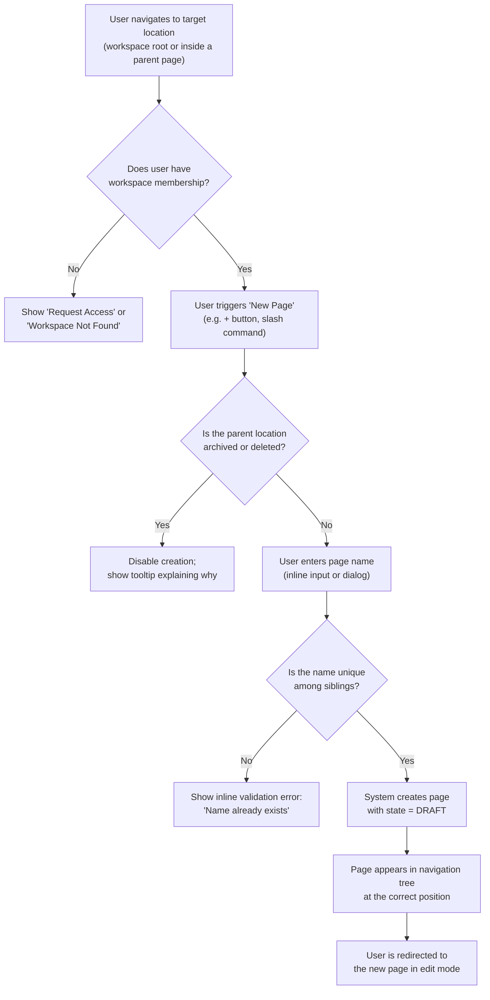
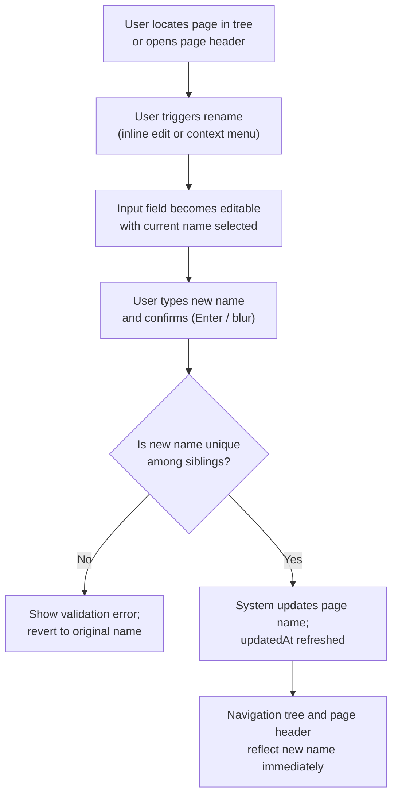
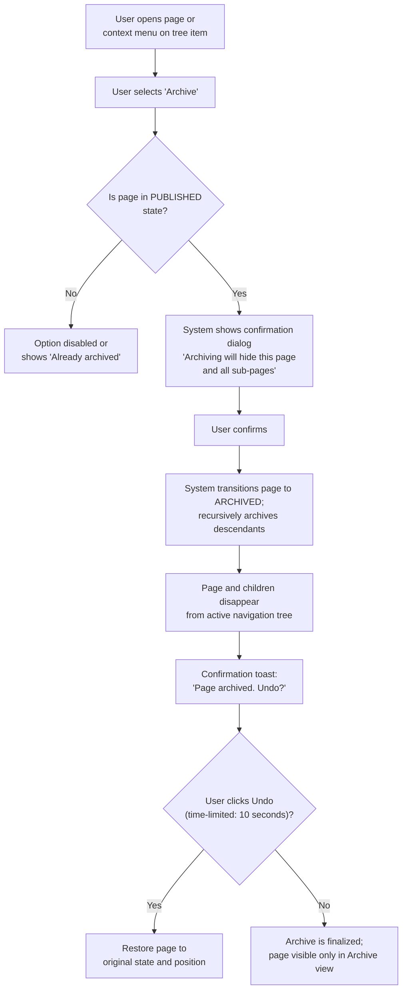
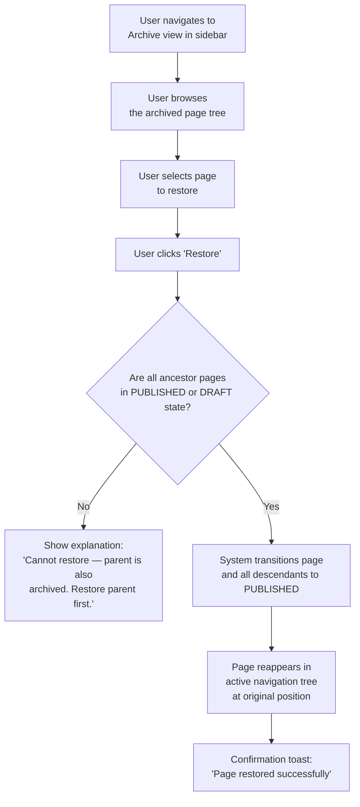
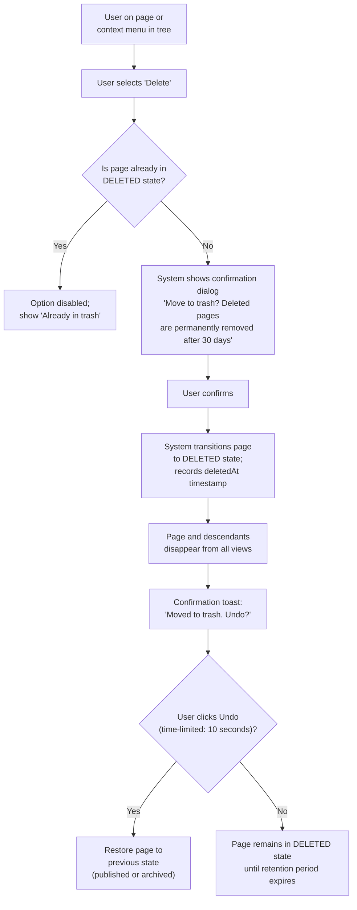

# User Journey & Behavior

## Core Operations — Flowcharts

### Create a New Page

### Rename a Page

### Archive a Page

### Restore a Page

### Delete a Page

## Failure Scenarios — Expected User Experience

| Scenario | Expected User Experience |
|----------|--------------------------|
| Create under archived parent | User clicks "New page" inside an archived page (state = ARCHIVED). New Page button is disabled, or action produces inline error: "Cannot create pages under archived content." |
| Duplicate sibling name | User names a new page the same as an existing sibling. Inline field error: "A page with this name already exists." Field is not saved; user must change the name. |
| Archive already-archived page | User selects "Archive" on page already in ARCHIVED state. Archive option is grayed out in context menu. Tooltip: "This page is already archived." |
| Restore with archived ancestor | User clicks "Restore" but parent is still archived (state = ARCHIVED). Dialog appears: "This page cannot be restored because its parent folder is archived. Please restore the parent first." |
| Delete already-deleted page | User selects "Delete" on page already in DELETED state. Delete option is grayed out. Tooltip: "This page is already in the trash." |
| Non-member tries to create page | User without Membership uses workspace URL and attempts creation. Page displays 403-style message: "You don't have access to this workspace. Request access from the workspace owner." |
| Navigate to deleted page via direct URL | User enters or bookmarks a direct URL to a deleted page (state = DELETED). User sees a dedicated "This page has been deleted" screen with a link back to the workspace. No edit capability. |
| Navigate to archived page via direct URL | User enters direct URL to an archived page (state = ARCHIVED). User can view the page but a banner reads: "This page is archived. Restore to edit." Edit controls are disabled. |
| Reorder during conflict | User drags a page to a new position; another user changed the tree simultaneously. Optimistic UI updates immediately; server rejects stale version. Tree reverts to server state with toast: "Tree was updated by another user. Please try again." |
| Delete workspace root page (only page) | User attempts to delete the sole root page (workspace would become empty). Operation succeeds. Toast: "Page moved to trash." Workspace shows empty state illustration with CTA to create first page. |
