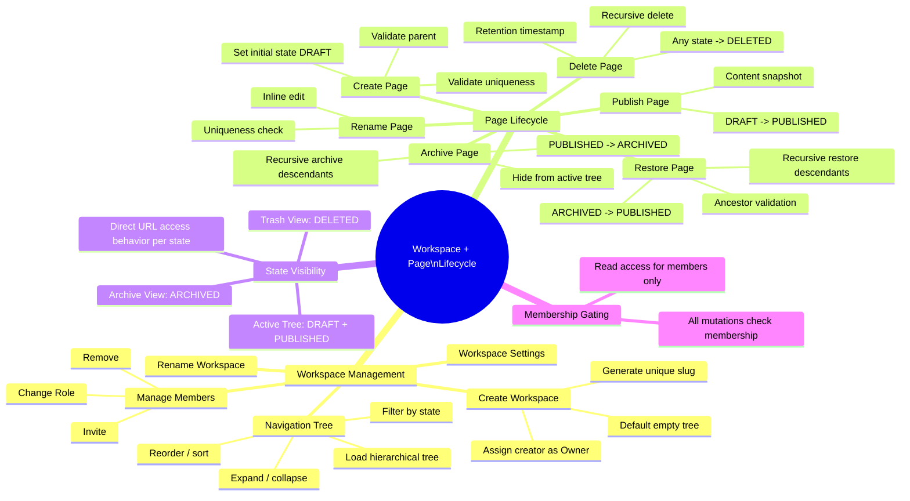
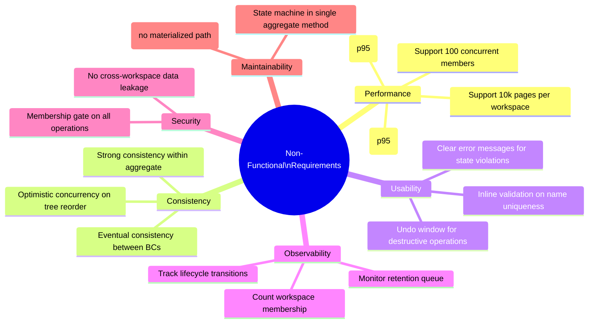

# Requirements

## Functional Requirements — Mind Map

### Functional Requirements Table

| ID | Requirement | Related Concept | Acceptance Criteria |
|----|-------------|-----------------|---------------------|
| FR-01 | The system SHALL allow an authenticated user to create a workspace with a unique name and slug. | Workspace | Workspace is created; creator is assigned as Owner with default Membership; slug is URL-safe and unique. |
| FR-02 | The system SHALL allow workspace members to create a page within any non-archived, non-deleted parent location. | Page | Page is created with state = DRAFT; a PageTreeEdge links it to the parent; it appears in the navigation tree. |
| FR-03 | The system SHALL enforce unique page names among siblings within the same parent container. | Page, Invariant | Creating or renaming to a duplicate name is rejected with an appropriate error message. |
| FR-04 | The system SHALL allow a page to transition from DRAFT to PUBLISHED. | PageLifecycleState | State is set to PUBLISHED; page becomes visible to all workspace members in the active tree. |
| FR-05 | The system SHALL allow a page to transition from PUBLISHED to ARCHIVED. | PageLifecycleState | State is set to ARCHIVED; `archivedAt` is recorded; all descendants are recursively archived. |
| FR-06 | The system SHALL allow a page to transition from ARCHIVED to PUBLISHED. | PageLifecycleState | Restore succeeds only if all ancestors are PUBLISHED or DRAFT; page and all descendants return to PUBLISHED. |
| FR-07 | The system SHALL allow a page to transition from any non-deleted state to DELETED. | PageLifecycleState | State is set to DELETED; `deletedAt` is recorded; page and descendants are hidden from all user-facing views. |
| FR-08 | The system SHALL provide an active navigation tree showing all DRAFT and PUBLISHED pages. | Workspace, Page | Tree is built from PageTreeEdge records; pages with ARCHIVED or DELETED states are excluded. |
| FR-09 | The system SHALL provide an archive view showing all ARCHIVED pages preserving their hierarchy. | Workspace, Page | Archived pages are displayed in their original tree structure; no edit capability; restore action is available. |
| FR-10 | The system SHALL validate workspace membership before permitting any page mutation. | Membership | Non-members receive a descriptive access-denied response. |
| FR-11 | The system SHALL provide an undo capability for archive and delete operations within a configurable time window. | PageLifecycleState | After archive or delete, the action is reversible for 10 seconds. Undo restores the page to its prior state. |
| FR-12 | The system SHALL render a dedicated experience when a user navigates to an archived or deleted page via direct URL. | PageLifecycleState | Archived page: view-only banner. Deleted page: "This page has been deleted" screen. |

## Non-Functional Requirements — Mind Map

### Non-Functional Requirements Table

| ID | Requirement | Category | Target / Constraint |
|----|-------------|----------|---------------------|
| NFR-01 | The active navigation tree SHALL be loadable within 500 milliseconds at the 95th percentile for workspaces with up to 10,000 pages. | Performance | p95 < 500ms for tree hydration from PageTreeEdge records. |
| NFR-02 | Page mutation operations (create, rename, archive, restore, delete) SHALL respond within 200 milliseconds at the 95th percentile. | Performance | p95 < 200ms end-to-end from user action to confirmed response (excluding optimistic UI). |
| NFR-03 | The system SHALL support workspaces with up to 10,000 pages without degradation of navigation tree performance. | Performance | PageTreeEdge queries scale linearly; no materialized path strategies. |
| NFR-04 | The system SHALL support at least 100 concurrently active members within a single workspace. | Performance | Tree mutations use optimistic concurrency; conflict resolution does not block read access. |
| NFR-05 | Workspace Management and Page Lifecycle SHALL be eventually consistent with a maximum propagation delay of 1 second. | Consistency | Changes to workspace membership are reflected in page lifecycle within 1 second. |
| NFR-06 | All page mutation operations SHALL enforce strong consistency within the Page aggregate boundary. | Consistency | No two concurrent requests may place a page into conflicting lifecycle states. |
| NFR-07 | Tree reorder operations SHALL use optimistic concurrency control with client-side conflict detection. | Consistency | Stale version tokens are rejected; client must refresh and retry. |
| NFR-08 | The undo window for archive and delete operations SHALL default to 10 seconds. | Usability | User sees "Undo?" toast; window is configurable per workspace settings. |
| NFR-09 | All error messages SHALL be user-facing, non-technical, and actionable. | Usability | Messages: "Cannot restore — parent is archived." Not: "FK violation on page_tree_edge.parent_id." |
| NFR-10 | Workspace membership SHALL be validated before any page mutation operation. | Security | No bypass path; membership check is a precondition, not an afterthought. |
| NFR-11 | No API or query SHALL leak page data across workspace boundaries. | Security | Every query carries a WorkspaceId filter; cross-workspace access returns empty results or an error. |
| NFR-12 | Page lifecycle transitions SHALL be observable via structured logging with actor, timestamp, from-state, and to-state. | Observability | Every transition produces a structured log event for debugging and analytics. |
| NFR-13 | The page lifecycle state machine logic SHALL be encapsulated in a single aggregate method (`canTransitionTo`) and not duplicated across the codebase. | Maintainability | No other module or service may set page state directly; all transitions go through the aggregate. |
| NFR-14 | The navigation tree SHALL be derived from `PageTreeEdge` records at query time; no materialized path or nested set column SHALL be stored on the Page record. | Maintainability | The tree structure is a first-class domain artifact (PageTreeEdge), not a denormalized column. |

## Regarding Speculative Abstractions

This document set explicitly rejects speculative abstractions. The following are **not defined** in this planning pack:

- Generic "tree node" or "hierarchical item" abstractions that could be shared with future hierarchy concepts (e.g., databases, kanban boards).
- Repository, unit-of-work, or CQRS patterns at the planning level — these are implementation concerns.
- Event schemas, message bus topics, or integration contracts between bounded contexts — those belong in a technical architecture document downstream.
- UI component hierarchies, data store schemas, or API route definitions.

This planning pack captures **only** the business domain knowledge required to align the team before implementation. Every abstraction, interface, and pattern introduced during implementation must be justified by a concrete business rule in these documents — not by anticipation of future requirements.
